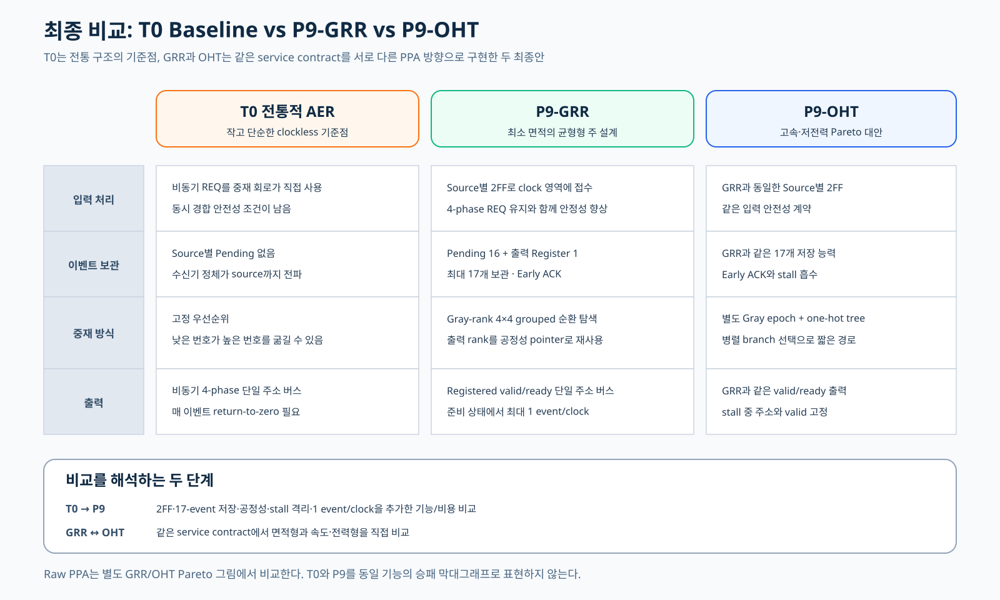

# 16개 뉴런의 발화 이벤트를 하나의 주소 버스로 전달하는 AER 컨트롤러

이 저장소는 최종 발표에 필요한 세 설계만 남긴 정리본이다.

- **T0**: 공통 clock 없이 4-phase handshake로 움직이는 전통적 AER baseline
- **P9-GRR**: 면적을 줄인 균형형 개선 설계이자 최종 주 설계
- **P9-OHT**: 면적을 조금 더 사용해 속도와 전력을 개선한 대안

중간 후보와 실패 실험은 최신 파일 목록에서 제거했지만 Git 이력에는 남아 있다.

## 무엇을 만드는가

뉴런 16개가 각각 전용 주소 버스를 가지면 배선이 크게 늘어난다. AER(Address-Event
Representation)은 발화한 뉴런의 번호만 공용 주소 버스로 전송한다.

    뉴런 6 발화
        → 16개 요청 중 하나를 선택
        → 공용 4-bit 주소 버스에 6 출력
        → 수신기가 6번 뉴런의 이벤트로 해석

여러 뉴런이 동시에 발화할 수 있으므로 어떤 이벤트를 먼저 보낼지 정하는
**중재기(arbiter)**가 필요하다.

## 최종 결과

서버 제공 Cadence GPDK045/GSCLIB045 환경에서 합성, 배치·배선, timing, 전력,
DRC, 연결 검사와 RTL-to-netlist 등가성 검증을 완료했다.

| 설계 | 역할 | Instances | Cell area | Vectorless power | SAIF power | Core setup 여유 |
|---|---|---:|---:|---:|---:|---:|
| T0 | 전통적 비동기 baseline | 92 | 214.092 µm² | 0.002127 mW | 해당 없음 | clockless |
| **P9-GRR** | **균형형 주 설계** | **263** | **669.294 µm²** | 0.020641 mW | 0.014382 mW | +6.824 ns |
| P9-OHT | 고속·저전력 대안 | 278 | 709.308 µm² | **0.019218 mW** | **0.013780 mW** | **+7.555 ns** |

T0가 가장 작고 전력이 낮지만 P9가 제공하는 2FF 입력 보호, source별 이벤트 보관,
공정한 순환 선택과 1 event/clock 출력 기능이 없다. 따라서 T0와 P9의 숫자는
“기능을 추가하는 데 얼마가 들었는가”를 보여 주며, 동일 기능의 직접적인 PPA 승패는
P9-GRR과 P9-OHT 사이에서 판단한다.

P9-OHT는 P9-GRR보다 면적이 5.98% 크지만 실제 시험 동작 기반 SAIF 전력은 4.19%
낮고 core timing 여유는 0.731 ns 크다. 면적을 우선하면 GRR, 속도와 전력을
우선하면 OHT가 적합하다.

## P9에 들어간 핵심 기술

1. **Source별 2FF 동기화**  
   비동기 요청이 clock 순간과 겹칠 때 첫 번째 FF가 잠시 불안정해질 수 있다.
   두 번째 FF가 한 clock 뒤에 다시 읽어 불안정한 값이 전체 회로로 퍼질 확률을
   매우 낮춘다.

2. **Pending 16개와 출력 Register 1개의 2단 저장 구조**  
   Pending은 source별 이벤트 보조 주머니이고 출력 Register는 수신기 앞의 전송
   쟁반이다. 최대 17개 이벤트를 보관하며, 내부 보관이 확정되면 수신기 처리를
   기다리지 않고 source에 ACK를 보낸다.

3. **굶주림을 막는 Gray 순번 순환 중재**  
   마지막으로 처리한 위치 다음부터 돌기 때문에 지속 요청도 수신기 정체를 제외한
   최대 16번의 처리 결정 안에 선택된다. 이웃 순번은 Gray 관계라 주소 전환 bit 수도
   줄일 수 있다.

4. **PPA 목적의 두 구현 방식**

   - GRR은 REQ·ACK·Pending을 Gray 순번으로 배치하고 출력 rank를 다음 중재
     pointer로 재사용해 별도 공정성 상태 4 FF를 없앤다.
   - OHT는 별도 Gray epoch 4 FF를 유지하는 대신 위에서 아래로 내려가는 one-hot
     선택 tree를 사용해 critical path와 switching을 줄인다.

자세한 설명은 [최종 기술 보고서](docs/FINAL_REPORT_KR.md)에 정리했다.

## 발표 자료를 만들 때

[PPT 자산 안내](docs/PPT_ASSET_GUIDE_KR.md)에 권장 슬라이드 순서, 복사해서 사용할
핵심 문장, 구조도와 실제 post-route 이미지 위치를 모아 두었다.

- [4-phase handshake](docs/figures/aer_4phase_handshake.svg)
- [T0 구조](docs/figures/t0_structure.svg)
- [P9-GRR 구조](docs/figures/p9_grr_structure.svg)
- [P9-OHT 구조](docs/figures/p9_oht_structure.svg)
- [세 설계 비교](docs/figures/final_comparison.svg)
- [T0 45nm post-route](docs/figures/t0_45nm_postroute.png)
- [P9-GRR 45nm post-route](docs/figures/p9_grr_45nm_postroute.png)
- [P9-OHT 45nm post-route](docs/figures/p9_oht_45nm_postroute.png)

## 저장소 구조

    rtl/final/                  세 최종 RTL
    tb/final/                   최종 기능 시험
    scripts/run_final_...ps1    세 RTL 일괄 검증
    scripts/cadence/final45/    GPDK45 재현 스크립트
    reports/final_45nm/         최종 합성·P&R·LEC 근거
    docs/figures/               PPT에 바로 넣을 SVG와 PNG

로컬 RTL 검증:

    powershell -ExecutionPolicy Bypass -File scripts/run_final_rtl_verification.ps1

GPDK045는 교육·비교용 generic PDK다. 이 결과는 세 구조의 상대 비교 근거이며 특정
파운드리 제조 sign-off나 실리콘 측정값을 뜻하지 않는다.
