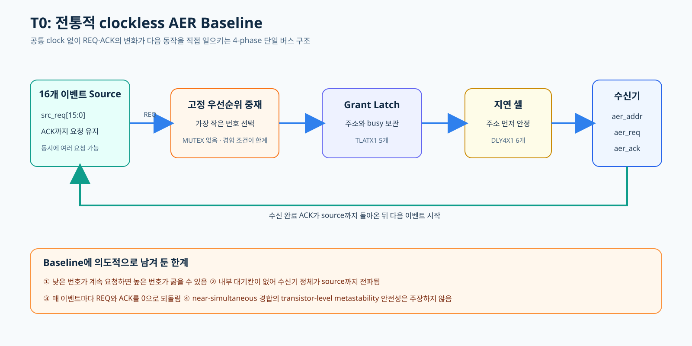
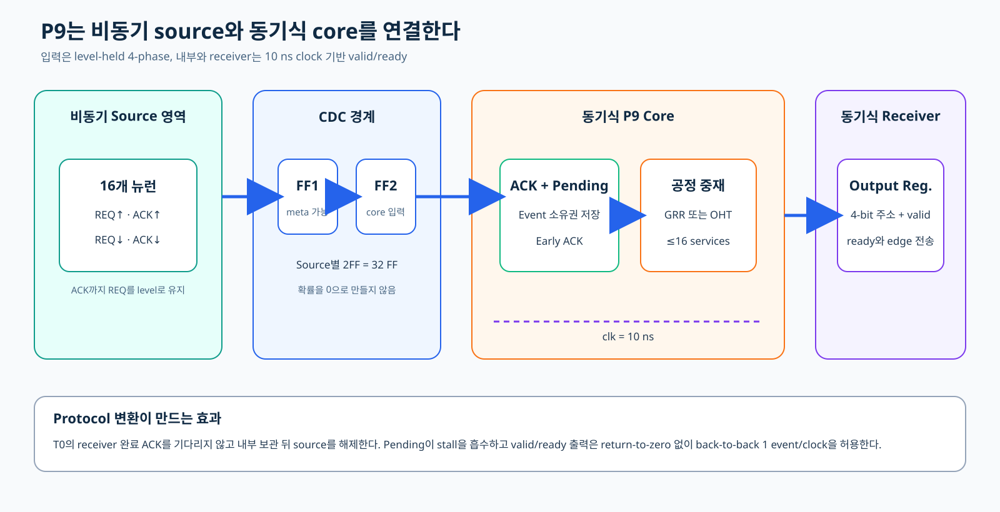
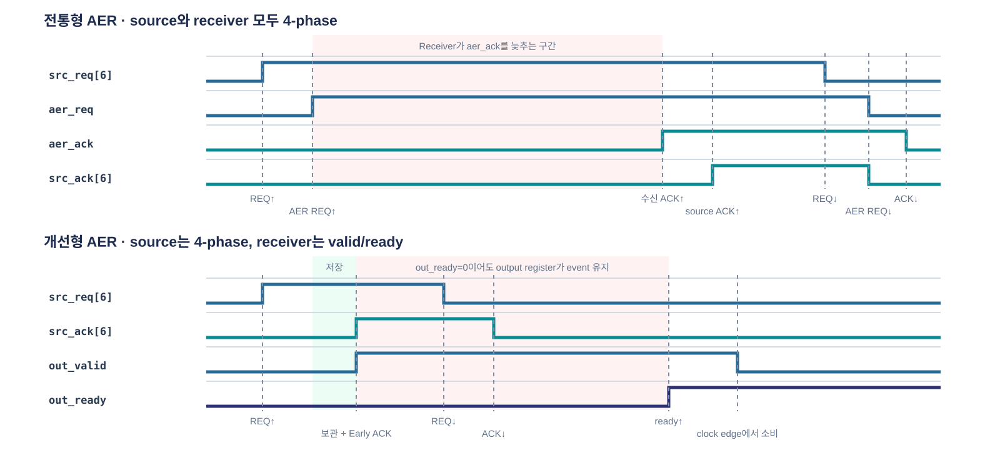
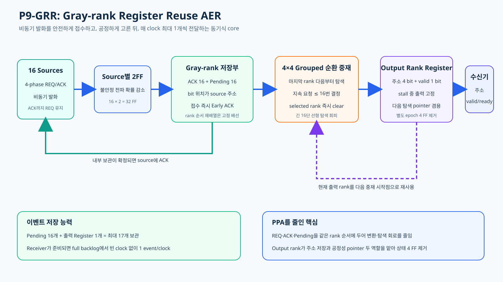
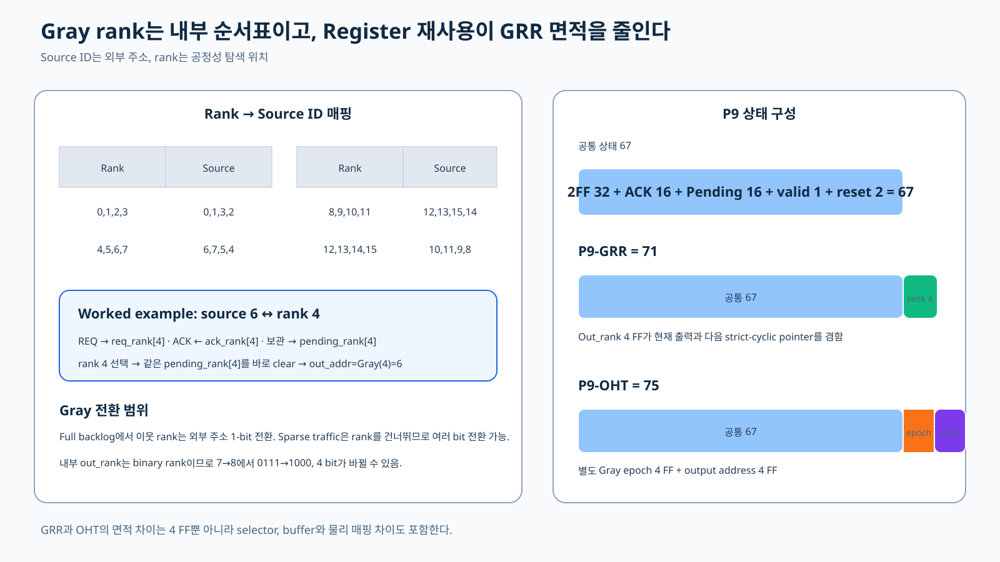
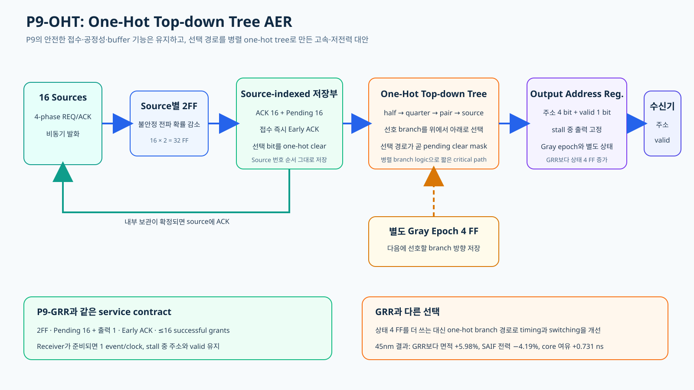
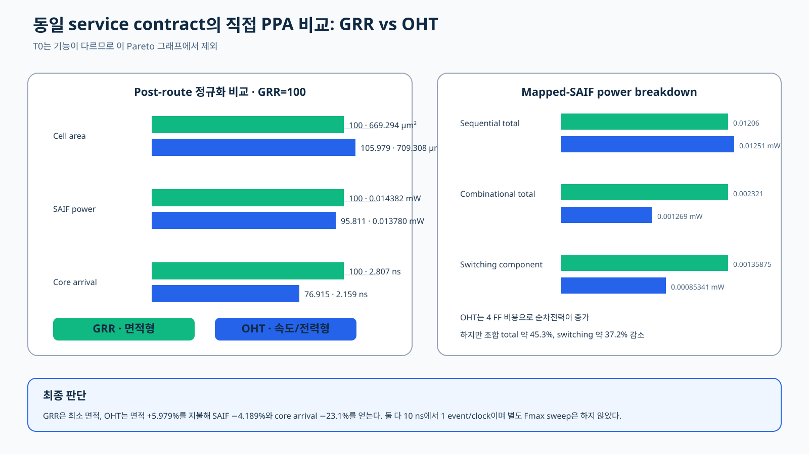
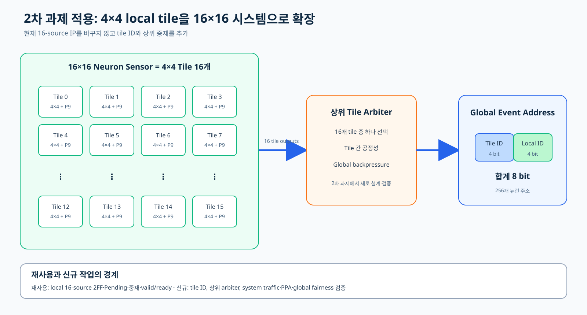

# 16개 뉴런의 발화를 하나의 주소 버스로 전달하는 AER 컨트롤러

본 문서에서는 2026 AI SEMI 1차 설계 과제를 다룬다.

## 1. AER이란 무엇인가?

AER(Address-Event Representation)은 event가 발생한 source의 번호를 주소로
바꾸어 전달하는 방식이다. 뉴런 회로에서는 “몇 번 뉴런이 발화했는가”를 보내는
통신 규격으로 사용된다.

본 설계는 16개의 뉴런 source를 가정한다. Source 번호는 0부터 15까지이므로 4 bit로
표현할 수 있다.

    source 6 발화
        → src_req[6] = 1
        → controller가 여러 요청 중 하나를 선택
        → 공용 주소 버스에 4'b0110 출력
        → receiver가 source 6 event로 해석

뉴런마다 별도의 주소 버스를 만들면 source가 늘어날수록 핀과 배선이 반복된다.
AER은 source별 요청선은 받되 실제 event 정보는 하나의 공용 주소 버스로 보낸다.
즉, 이전 요청이 끝나야 다음 요청을 처리할 수 있는 구조이다.

이 회로가 보내는 값은 source ID다. 막전위, 발화 크기와 timestamp는 포함하지
않는다. 또한 AER controller는 단순 encoder가 아니다. 여러 뉴런이 동시에 발화할 수
있으므로 다음 두 기능이 필요하다.

1. 동시에 들어온 요청 중 이번에 보낼 source 하나를 선택한다.
2. 선택되지 않은 요청이 사라지지 않도록 protocol이나 내부 상태로 관리한다.

이 선택 기능을 중재(arbitration)라고 한다.

| 기본 규격 | 값 |
|---|---:|
| Source 수 | 16 |
| 요청선 | Source별 1 bit |
| 주소 폭 | 4 bit |
| 공용 주소 버스 | 1개 |
| 주소 의미 | 원래 source 번호 |
| 포함하지 않는 정보 | 막전위, 발화 크기, timestamp |

## 2. 동기식과 비동기식

### 2.1 동기식 회로

동기식 회로는 공통 clock을 시간 기준으로 사용한다. 동기식 회로는 Flip-flop과 조합논리로 구성되는데,
Flip-flop은 clock edge에서 입력을 저장하고, 조합논리는 다음 edge가 오기 전까지 계산을 완료한다.

    clock edge N
        → 입력 상태 저장
        → 조합논리 계산
        → clock edge N+1에서 결과 저장

clock을 공통된 시간 축으로서 사용하기 때문에 동기식 회로는 계산이 실제로 끝났는지를 매번 감지할 필요가 없다. 
대신 설계자가 가장 느린 경로도 한 clock 안에 안정되도록 주기를 정해야한다. 이때 사용되는 방법이 STA(Stack Timing Analysis)로,
각 논리소자와 배선을 통과하는 데 걸리는 시간을 계산하여 데이터가 저장 시점보다 충분히 일찍 도착하고 너무 빨리 바뀌지는 않는지 확인한다.

장점:

- 합성, STA와 배치배선 tool flow가 잘 정립돼 있다.
- 큰 회로를 clock 단위 pipeline으로 나누기 쉽다.
- 상태가 언제 바뀌는지 명확하다.

단점:

- Event가 없어도 clock tree는 돌아가기 때문에 회로가 쉬지 않아 전력 손실이 발생한다.
- 계산이 일찍 끝나도 다음 edge까지 기다려야한다.
- 비동기 외부 입력은 별도의 clock-domain crossing 회로를 거쳐야 한다.

### 2.2 비동기식 회로

비동기식 회로에는 전체를 지휘하는 공통 clock이 없다. 그렇기 때문에 Flip-flop 대신 latch가 사용되며,
동기식 회로처럼 clock을 base로 작동하는 대신 입력에 대한 상대 회로 응답의 종결을 base로 다음 동작을 일으킨다.

    요청 발생
        → 조합논리와 저장소가 반응
        → 상대 회로가 수신 완료를 응답
        → 다음 transaction 시작

Clock이 없다는 말은 시간이 없거나 계산이 즉시 끝난다는 뜻이 아니다. Transistor와
배선에는 실제 지연이 있고, data가 먼저 안정된 뒤 request가 올라가야 하는
상대시간 조건도 필요하다.

장점:

- Event가 있을 때만 회로가 움직이기 때문에 전력면에서 이점이 있다.
- clock 배선이 필요하지 않다.
- 각 블록이 실제 응답 속도에 맞춰 진행할 수 있다.

단점:

- 여러 요청이 거의 동시에 들어오면, 회로가 어느 요청을 먼저 처리할지 안정적으로 결정하기 어렵다.
- 공통 clock이 없으므로 신호가 올바른 순서와 충분한 시간 간격을 두고 움직이는지 별도로 확인해야 한다.
- 대부분의 ASIC 설계 도구는 clock 기반 회로에 맞춰져 있어, 비동기 회로의 모든 동작 안전성을 기존 도구만으로 검증하기 어렵다.

### 2.3 한 시스템에서 함께 사용할 수 있다

동기식과 비동기식은 서로 배타적이지 않다. 외부 interface는 비동기를
사용하고 내부 계산은 clock으로 처리할 수 있다. 대신 두 영역 사이에는 비동기 signal을
안전하게 넘기는 clock-domain crossing 회로가 필요하다.

| 항목 | 동기식 | 비동기식 |
|---|---|---|
| 공통 시간 기준 | Clock | 없음 |
| 상태 변화 기준 | Clock edge | Request/ACK와 회로 지연 |
| 완료 기준 | 다음 edge 전 timing 만족 | ACK 또는 완료 신호 |
| 검증 중심 | Setup, hold, clock tree | Protocol, relative timing, arbitration |

## 3. 4-phase handshake 방식이란?

4-phase handshake는 두 회로가 공통 clock을 사용하지 않아도 event 전달 완료를
확인할 수 있는 protocol이다. 전통적인 AER에서 이 방식이 사용된다.

1. 송신기가 REQ를 0에서 1로 올린다.
2. 수신기가 REQ와 data를 확인하고 ACK를 0에서 1로 올린다.
3. 송신기가 ACK를 확인한 뒤 REQ를 1에서 0으로 내린다.
4. 수신기가 ACK를 1에서 0으로 내려 idle 상태로 복귀한다.

    REQ↑ → ACK↑ → REQ↓ → ACK↓

Source는 ACK가 올 때까지 REQ를 유지해야 한다. REQ는 짧은 pulse가 아니라 event의
소유권을 넘기는 protocol 상태다. ACK 전에 REQ를 내리면 controller가 요청을
보지 못하거나 주소가 안정되기 전에 transaction이 사라질 수 있다.

REQ와 ACK가 모두 0으로 돌아가야 다음 event를 시작할 수 있으므로
return-to-zero 방식이라고도 부른다.

장점:

- 공통 clock 없이도 전달 완료를 명확히 확인한다.
- Receiver가 느리면 일부러 ACK를 늦게 보내, 송신기가 다음 데이터를 보내지 않고 기다리게 할 수 있다.
- REQ가 유지되므로 짧은 pulse보다 event 유실 위험이 낮다.

단점:

- Event마다 REQ와 ACK를 모두 0으로 복귀시켜야 한다.
- 복귀 중에는 새 주소를 보내지 못하는 bubble이 생긴다.
- Handshake는 전달 규약일 뿐, 여러 요청 중 누구를 고를지는 별도 중재기가
  해결해야 한다.

## 4. 전통적인 AER, T0의 구현

전통적인 AER을 설계하여 T0라고 명명, 앞으로 만들 개선 모델과 비교하기 위한 baseline으로서 의미를 가진다.

### 4.1 구현 구조

T0에는 공통 clock이 없다. Source request가 바뀌면 조합논리, latch와 delay
cell의 실제 지연을 따라 transaction이 진행된다.

전체 흐름:

    src_req
      → fixed-priority selector
      → grant/address latch
      → 주소 안정
      → delay cell
      → aer_req 상승
      → receiver aer_ack
      → 선택된 source src_ack

#### Fixed priority

T0는 가장 작은 번호의 요청을 먼저 고른다. Source 1, 6, 12가 동시에 요청하면
source 1을 선택한다.

#### Latch

선택 주소가 transaction 중 바뀌지 않도록 grant 주소 4 bit와 busy 1 bit를
TLATX1 latch 5개에 저장한다. 여기서 grant는 여러 요청 중 이번에 처리하도록 선택된 source를,
busy는 “현재 이 event를 전송하는 중인가?”를 나타내는 1-bit 상태를 뜻한다.
busy가 1인 동안에는 새로운 요청을 선택하지 않고 기존 주소를 유지한다.

#### Delay cell과 bundled-data

Receiver는 aer_req 상승을 보고 주소를 읽으므로 주소가 먼저 안정돼야 한다.
그러기 위해 경로를 다음과 같이 구성하였다

    Data path: REQ → priority → grant latch → aer_addr
    Control path: REQ → DLY4X1 chain → busy → aer_req

GPDK45 구현에는 capture delay 5개와 request launch delay 1개, 총 DLY4X1 6개가
보존됐다. 선택한 5 ns I/O max-delay 검사에서는 post-route slack +4.126 ns를
만족했다.

### 4.2 장점

1. **전역 clock이 없다.** Event가 없을 때 clock tree를 계속 전환하지 않는다.
2. **상태가 적다.** Grant 4 bit와 busy 1 bit, 총 latch 5개만 저장한다.
3. **구조가 직접적이다.** Source와 receiver가 모두 4-phase로 transaction을
   끝낸다.
4. **작은 baseline을 제공한다.** Post-route 92 instances, cell area
   214.092 µm², vectorless power 0.002127 mW였다.

### 4.3 단점과 한계

1. **Starvation**: Fixed priority를 사용하기 때문에 낮은 번호가 반복 요청하면 높은 번호의 대기 시간 상한이 없다.
2. **내부 이벤트 대기 공간 부재**: 선택되지 않은 source는 ACK를 받을 때까지 REQ를 계속 유지해야 한다.
   이 상태에서는 같은 source에서 새로운 이벤트가 발생해도 REQ가 이미 1이므로 두 이벤트를 구분할 수 없다.
   따라서 source 쪽에 별도의 counter나 FIFO가 없다면 대기 중 발생한 추가 이벤트가 합쳐지거나 유실될 수 있다.
3. **Backpressure 직접 전파**: Receiver가 현재 주소를 처리하지 못해 aer_ack를 늦게 보내면 T0는 busy와 aer_req를 유지한 채 기다린다.
   이 동안 선택 주소가 공유 버스를 계속 차지하므로 다른 source의 요청을 처리할 수 없고, 선택된 source도 ACK를 받을 때까지 REQ를 내릴 수 없다.
   즉 Receiver의 정체가 별도의 buffer 없이 공유 link와 source까지 그대로 전달된다.
4. **Return-to-zero bubble**: 매 event 사이에 REQ와 ACK 복귀 시간이 필요하다.
5. **Timing 검증 범위**: Clock이 없어 일부 내부 self-timed 경로의 도착시간 기준을 정하기 어렵다.

T0는 이 한계를 숨기지 않고 전통적 AER의 baseline으로 사용한다.

## 5. P9-GRR과 P9-OHT

### 5.1 T0로부터의 개선 아이디어

T0의 한계를 해결하려면 다음 네 가지가 필요하다.

| T0의 문제 | 개선 아이디어 |
|---|---|
| 비동기 request를 중재기가 직접 사용 | Source별 2FF로 clock 영역에 전달 |
| Source별 대기칸 없음 | Pending과 output register에 event 저장 |
| Fixed priority starvation | Gray 기반 공정한 순환 중재 |
| Receiver 4-phase bubble | Registered valid/ready 출력 |

이 네 가지를 결합한 개선 controller를 P9라고 부른다. Source 쪽은 4-phase를
유지하지만 내부와 receiver 출력은 10 ns clock으로 처리한다.

#### 2FF

비동기 REQ가 clock edge와 겹치면 FF1 내부가 잠시 0과 1 사이의 metastable
상태가 될 수 있다. FF2가 다음 clock에 다시 읽어 FF1이 안정될 시간을 확보한다.
확률을 0으로 만들지는 않으며 Source가 ACK까지 REQ를 유지해야 한다.

    16 sources × 2 FF = 32 FF

#### Pending과 Early ACK

Pending은 source별 event 보조 주머니다.

    accept = req_sync AND NOT ack AND NOT pending
    ack_next = (ack AND req_sync) OR accept

Accept가 발생하면 event를 Pending이나 output에 기록하고 Source에 Early ACK를
보낸다. 이 ACK는 receiver 처리 완료가 아니라 controller가 event를 책임지고
보관했다는 의미다.

    Pending 16 + Output register 1 = 최대 17 events

Receiver가 stall이면 현재 output 주소와 valid를 유지하고, 비어 있는 다른
Pending에는 새 event를 받을 수 있다.

#### Valid/ready

Receiver 전송은 clock edge에서 out_valid=1과 out_ready=1이 함께 성립할 때다.
Backlog가 충분하고 ready=1이면 현재 event를 소비하는 edge에 다음 event를
채워 최대 1 event/clock을 유지한다.

#### Gray 공정성

내부 우선순위는 다음 Gray 관계를 이용한다.

    0 → 1 → 3 → 2 → 6 → 7 → 5 → 4
      → 12 → 13 → 15 → 14 → 10 → 11 → 9 → 8 → 0

Gray는 timestamp나 payload가 아니라 내부 우선순위 순서표다. 지속 요청은
receiver stall을 제외한 최대 16회의 성공적인 service 안에 기회를 얻는다.

### 5.2 P9-GRR

GRR은 Gray-rank Register Reuse의 약자다.

Source 6은 Gray rank 4에 대응한다.

    source 6 REQ     → req_rank[4]
    source 6 ACK     ← ack_rank[4]
    source 6 Pending → pending_rank[4]

Rank 4를 선택하면 같은 pending_rank[4]를 바로 지운다. Rank를 source 번호로
바꾸고 clear 위치를 다시 찾는 feedback 회로를 줄일 수 있다.

16개 rank는 네 개씩 네 group으로 나눈다. 현재 group에서 마지막 rank 뒤쪽을
먼저 보고, 없으면 다음 non-empty group을 찾는다. Out_rank 4 FF는 현재 출력과
다음 strict-cyclic 탐색 pointer를 겸한다.

    공통 상태 67 + out_rank 4 = 71 state points

GRR의 면적 이점은 Gray를 썼다는 사실 하나가 아니라 rank-indexed storage,
4×4 grouped selector와 output-rank 재사용을 합친 결과다.

### 5.3 P9-OHT

OHT는 One-Hot Top-down Tree의 약자다.

OHT는 16개 후보를 다음처럼 병렬 tree에서 좁힌다.

    Candidate 16
      → Pair valid 8
      → Quarter valid 4
      → Half valid 2
      → Selected source one-hot

One-hot은 선택된 위치 하나만 1인 16-bit 표현이다. 최종 one-hot vector는 출력
주소를 만드는 동시에 Pending clear mask가 된다.

OHT는 별도 Gray epoch 4 FF와 output address 4 FF를 가진다.

    공통 상태 67 + epoch 4 + output address 4 = 75 state points

Epoch는 방금 고른 source 다음 번호를 가리키는 pointer가 아니다. Successful
grant마다 Gray schedule을 한 단계 진행시키고 tree 각 단계의 선호 branch를
정한다. 따라서 GRR과 같은 service contract와 starvation bound를 제공하지만
sparse contention의 source 간 출력 순서가 완전히 같지는 않다.

### 5.4 개선 결과

공통 101-event 시험은 sparse 16, receiver stall 8, saturation 64와 hotspot
13개 event로 구성했다.

| 설계 | Event | Error | LEC | DRC/Connectivity |
|---|---:|---:|---|---:|
| P9-GRR | 101 | 0 | 21 outputs + 71 states | 0/0 |
| P9-OHT | 101 | 0 | 21 outputs + 75 states | 0/0 |

Saturation phase의 64 events는 630 ns output span으로 처리됐다. 63개의 전송
간격이 각각 10 ns이므로 pipeline이 찬 뒤 1 event/clock과 일치한다.

OHT의 주소 bit 전환 합은 106회, GRR은 114회였다. 이 차이만으로 전체 전력을
설명할 수는 없지만 OHT의 낮은 switching 방향과 일치한다.

### 5.5 P9와 T0의 PPA 분석

측정 조건:

- Generic GPDK045/GSCLIB045
- Setup slow 0.9 V, 125℃
- Hold fast 1.1 V, 0℃
- P9 clock 10 ns
- Placement density 60%
- Signal routing Metal1~Metal9

| 항목 | T0 | P9-GRR | P9-OHT |
|---|---:|---:|---:|
| Instances | 92 | **263** | 278 |
| Cell area | 214.092 µm² | **669.294 µm²** | 709.308 µm² |
| Vectorless power | 0.002127 mW | 0.020641 mW | **0.019218 mW** |
| Mapped-SAIF power | 없음 | 0.014382 mW | **0.013780 mW** |
| Core setup slack | Clockless | +6.824 ns | **+7.555 ns** |
| P9 hold slack | N/A | +0.024 ns | +0.024 ns |

T0는 가장 작고 전력이 낮다. 그러나 2FF, 17-event 저장, 공정성, stall 격리와
1 event/clock 기능이 없는 최소 baseline이다. 따라서 T0와 P9의 표는 “추가 기능에
얼마의 하드웨어 비용이 들었는가”를 보여 주며 동일 기능의 승패가 아니다.

동일 service contract인 두 P9는 직접 비교할 수 있다.

- OHT area: GRR보다 5.979% 증가
- OHT vectorless power: 6.892% 감소
- OHT mapped-SAIF power: 4.189% 감소
- OHT core arrival: 23.1% 감소
- OHT core slack: 0.731 ns 증가

OHT는 별도 epoch 4 FF 때문에 sequential power가 증가했지만 combinational
total이 약 45.3%, switching component가 약 37.2% 감소해 총전력이 낮아졌다.

최종 선택:

- 면적과 반복 배치를 우선하면 P9-GRR
- Timing과 switching 전력을 우선하면 P9-OHT
- 전통 구조의 기준점은 T0

## 6. 향후 2차 과제에 적용

현재 개선 IP 한 개는 16개 source를 처리한다. 이는 4×4 뉴런 배열의 local event
수집기로 재사용할 수 있다. 4×4는 최종 센서 크기가 아니라 큰 배열을 나누는 기본
tile이다.

### 6.1 16×16 배열

16×16 배열은 뉴런 256개다. 이를 4×4 tile로 나누면 16개의 tile이 된다.

    16×16 sensor
      → 4×4 tile 16개
      → tile마다 개선 controller 1개
      → 상위 tile arbiter
      → global event address

Global 주소:

| 필드 | 폭 |
|---|---:|
| Tile ID | 4 bit |
| Local source ID | 4 bit |
| 합계 | 8 bit |

Local controller는 현재 검증한 16-source request, Pending, 공정성과 valid/ready
interface를 그대로 재사용한다. 상위 arbiter는 16개 tile output 중 하나를
선택한다.

### 6.2 선택 기준

- Tile 수가 많아 면적이 중요하면 GRR형을 기본으로 사용한다.
- Traffic이 높거나 clock 여유가 중요하면 OHT형을 사용할 수 있다.
- Traffic이 높은 일부 tile만 OHT형으로 구성하는 혼합 배치도 후속 비교 대상이다.

### 6.3 새로 검증해야 할 것

1. 여러 tile이 동시에 포화될 때의 상위 공정성
2. Local Pending이 찬 상태의 동일-source burst
3. Tile ID와 local source ID의 주소 조합
4. 상위 receiver stall의 tile 전파
5. Tile별 reset과 clock-domain crossing
6. 실제 SNN traffic의 event rate와 SAIF power
7. Timestamp가 필요한 경우 별도 payload/FIFO
8. 16×16 top-level 배선 혼잡과 PPA
9. 공식 PDK sign-off

2차 과제에 그대로 가져가는 것은 전체 시스템 기능이 아니라 검증된 16-source
event 수집·중재 IP다. 상위 시스템은 local IP 내부를 다시 설계하지 않고 tile
주소와 상위 중재를 추가한다.

## 자세한 문서와 근거

1. [최종 설계 보고서](docs/FINAL_REPORT_KR.md)
2. [회로 동작 상세 설명](docs/CIRCUIT_OPERATION_KR.md)
3. [주장-검증 근거 대응표](docs/CLAIM_EVIDENCE_MATRIX_KR.md)
4. [PPT 제작 안내](docs/PPT_ASSET_GUIDE_KR.md)
5. [45nm 정량 근거](reports/final_45nm/SUMMARY.md)

로컬 RTL 검증:

    powershell -ExecutionPolicy Bypass -File scripts/run_final_rtl_verification.ps1

GPDK045는 교육·비교용 generic PDK다. 현재 결과는 구조 비교를 위한 합성·P&R
근거이며 foundry sign-off나 실리콘 실측값이 아니다.
