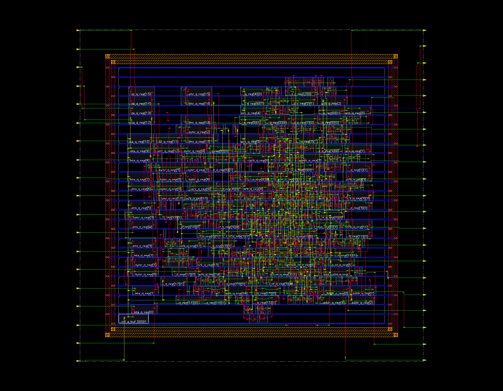

# 2026 AI 반도체 회로 설계 경진대회 — AER 디지털 설계

팀 **최태원의 검**의 디지털 1차 설계 수행과제 저장소다. Bio-mimic Neuron을 위한 전통적 AER 통신 구조를 분석하고, 병목을 한 단계씩 개선한 뒤 동일 조건에서 기능·성능·PPA를 비교한다.

- 1차 제출일: **2026년 8월 28일**
- 현재 기준점: **B0-v1 physical reference**, **T0 clockless failure baseline**, **P3 depth-1 개선본**
- 합성 대상: AER 컨트롤러 RTL
- testbench model: 뉴런 event source와 receiver
- 범위 밖: ECG, SNN ECG Classifier, 이전 ECG SoC의 RTL과 구조

## 1. 지금 무엇을 할 것인가

하나의 완성 구조만 제시하지 않고, 전통적 baseline에서 설계 요소를 하나씩 바꾸어 각 개선의 효과를 분리한다.

| 단계 | 변경점 | 확인할 핵심 효과 |
|---|---|---|
| `B0-v1` | fixed priority + FIFO 없음 + 4-phase link | 전통적 기준점과 병목 측정 |
| `A0-functional` | 같은 4-phase 동작을 global clock 없이 진행 | Clockless protocol 기능과 async signoff 경계 확인 |
| `B1` | arbiter만 round-robin으로 교체 | starvation 제거, 최대 arbitration wait와 latency tail |
| `B2` | source별 depth-2 FIFO만 추가 | burst 흡수, source-side backpressure 완화 |
| `B3` | registered elastic `valid/ready` output | 4-phase return-to-zero bubble 제거 |
| `T0` | 구조적 latch 기반 clockless fixed-priority AER | 전통 구조의 실제 안정성·합성 한계 측정 |
| `P1` | 비동기 4-phase 입력 + CDC + round-robin + depth-2 queue + elastic output | 안정성·공정성·burst·throughput·PPA 종합 개선 |
| `P2` | P1의 flat 16-way scheduler를 병렬 4×4 계층형으로 교체 | 기능 유지, arbiter timing·area 최적화 |
| `P3` | P2의 source별 depth-2 queue를 1-bit pending buffer로 축소 | throughput 유지, register·area·power 감소 |

단계별 비교에서 source 수, 주소 폭, 단일 output lane, event traffic, receiver backpressure trace와 검증 기준을 고정한다. B1에서는 FIFO나 receiver protocol을 함께 바꾸지 않는다.

최종 ASIC area·timing·Fmax·power는 동일 standard-cell library/PVT/SDC 조건의 Cadence 결과로 판단한다. Vivado 결과는 RTL의 FPGA 합성 가능성을 확인하는 sanity check일 뿐 ASIC PPA가 아니다.

## 2. 전통적인 AER이란

**AER(Address-Event Representation)**은 뉴런이 spike를 발생시켰을 때 뉴런별 전용 데이터 선을 모두 연결하는 대신, 공유 통신 채널로 **이벤트를 발생시킨 뉴런의 주소**를 전송하는 방식이다.

예를 들어 source 5가 spike를 만들면 데이터 값 전체가 아니라 주소 `5`를 전송한다. 수신기는 주소 5에 대응하는 뉴런 또는 synapse 위치로 이벤트를 전달한다. 이벤트가 없을 때는 별도의 event transfer가 발생하지 않는다.

역사적으로 AER에는 여러 회로와 handshake 변형이 존재한다. 이 프로젝트에서 말하는 **전통적 baseline**은 비교 가능하도록 다음 구조로 명시적으로 한정한다.

- event source 16개, source address 4비트
- receiver 1개와 단일 공유 주소 버스
- source 0이 가장 높은 fixed-priority arbitration
- source별 FIFO 없음, source당 outstanding event 최대 1개
- source-side `src_req/src_ack`
- receiver-facing active-high 4-phase `aer_req/aer_ack`
- receiver 응답이 source acknowledge까지 직접 전달되는 end-to-end backpressure
- `B0-v1`: 일반적인 standard-cell flow에서 재현할 수 있는 clock 기반 RTL
- `A0-functional`: request/acknowledge 변화로 진행하는 clockless latch RTL

## 3. B0-v1 baseline 컨트롤러 구조


1. 각 뉴런은 이벤트가 생기면 해당 `src_req[i]`를 올리고 `src_ack[i]`가 올 때까지 요청을 유지한다. 별도 입력 FIFO는 없다.
2. combinational fixed-priority encoder가 요청 중 가장 작은 source index를 선택한다. 따라서 source 0이 최고 우선순위다.
3. 선택 주소는 `grant_q`에 저장되어 한 transaction 동안 `aer_addr`로 유지된다.
4. 4-state FSM이 `aer_req`, `src_ack`, source release와 `aer_ack`의 순서를 제어한다.
5. 수신기가 주소를 받아 `aer_ack`을 올린 뒤에야 선택 source의 `src_ack`이 올라간다. 수신기가 멈추면 공유 link와 모든 대기 source가 영향을 받는다.

실제 RTL은 [`rtl/baseline/aer_traditional.sv`](rtl/baseline/aer_traditional.sv), 동결된 구조 정의는 [`docs/architecture/BASELINE_FREEZE.md`](docs/architecture/BASELINE_FREEZE.md)에 있다.

## 4. 4-Phase handshake 동작


Receiver-facing AER link는 idle 상태 `aer_req=0`, `aer_ack=0`에서 시작한다.

1. **REQ assert:** 컨트롤러가 `aer_addr`를 고정하고 `aer_req`를 올린다.
2. **ACK assert:** 수신기가 주소를 캡처한 뒤 `aer_ack`을 올린다.
3. **REQ release:** 컨트롤러는 선택 source가 요청을 내린 것을 확인한 뒤 `aer_req`를 내린다.
4. **ACK release:** 수신기가 `aer_ack`을 내리면 link가 idle로 돌아가 다음 이벤트를 시작할 수 있다.

전체 source-to-receiver 순서는 다음과 같다.

```text
src_req[i] ↑
  → aer_addr=i, aer_req ↑
  → aer_ack ↑
  → src_ack[i] ↑
  → src_req[i] ↓
  → src_ack[i] ↓, aer_req ↓
  → aer_ack ↓
```

“4-phase”는 네 번의 **신호 전이**를 뜻하며 모든 구현에서 반드시 4 clock cycle이라는 뜻은 아니다. 다만 B0-v1의 clock 기반 FSM과 zero-delay synchronous receiver model에서는 새 이벤트 사이 간격이 실제로 4 cycles로 측정되어, 무정체 steady throughput이 `0.25 event/cycle`이었다.

## 5. 전통적 baseline에서 확인할 문제

- **공정성:** fixed priority 때문에 높은 우선순위 traffic이 계속되면 낮은 우선순위 source가 오래 기다리거나 starvation될 수 있다.
- **처리율:** 한 이벤트가 끝날 때마다 REQ와 ACK를 0으로 복귀시켜야 하므로 새 이벤트 사이에 return-to-zero bubble이 생긴다.
- **burst 대응:** 입력 FIFO가 없어 source가 한 이벤트만 직접 붙잡을 수 있다.
- **backpressure:** 수신기 stall이 현재 transaction을 점유하고 단일 공유 link 전체를 막는다.
- **확장성:** source 수가 커질수록 flat priority encoder와 공유 주소/control net의 fan-in·fan-out이 증가한다.

이 항목은 모든 역사적 AER 회로의 보편적 결함이라는 주장이 아니다. 이 저장소가 명시한 B0-v1 RTL에서 측정하고, 이후 variant와 같은 조건으로 비교할 설계 변수다.

## 6. 동결된 baseline 결과

### Vivado XSIM 기능 검증

| 지표 | B0-v1 결과 |
|---|---:|
| issued / received | `431 / 431` |
| event loss / duplicate / assertion failure | `0 / 0 / 0` |
| no-stall inter-event gap | `4 cycles` |
| no-stall steady throughput | `0.25 event/cycle` |
| suite average latency | `29.658 cycles` |
| worst observed latency | `901 cycles` |
| source-15 hotspot max latency | `49 cycles` |
| pass marker | `TEST_PASS baseline issued=431 received=431` |

검증은 단일 이벤트, 16-source 동시 요청, burst, receiver stall, saturation, fixed-priority hotspot, reset, 16개 independent random stream, scoreboard, procedural assertion과 concurrent SVA를 포함한다.

### Vivado synthesis sanity

- Vivado 2020.2, `xc7a35tcpg236-1`
- 41 LUT, 10 FF
- 10 ns sanity constraint에서 estimated WNS `+1.401 ns`
- combinational loop 0, unconstrained internal endpoint 0
- marker: `BASELINE_SANITY_PASS`

위 수치는 FPGA 구조 합성 확인용이며 대회 최종 ASIC area·power·timing·Fmax로 사용하지 않는다.

### A0-functional clockless baseline

`A0-functional`은 `clk` port가 없고 4-phase handshake 조건이 변할 때 latch state가 다음 단계로 진행한다.

> **현재 판정:** RTL 기능 모델로는 통과했지만 post-synthesis netlist에서 state progression이 보존되지 않아 physical implementation baseline으로는 탈락했다.

| 지표 | A0-functional 결과 |
|---|---:|
| issued / received | `139 / 139` |
| loss / duplicate / assertion failure | `0 / 0 / 0` |
| average latency | `26.877 ns` |
| worst latency | `241 ns` |
| XSIM marker | `TEST_PASS async_baseline issued=139 received=139` |
| Vivado structural probe | 42 LUT, latch primitive 6개 |

Latency와 event gap의 ns 값은 testbench가 부여한 receiver/source delay에 의해 결정된 기능 지표다. ASIC 성능이나 maximum events/s가 아니다.

Vivado는 latch 구조로 변환했지만 no-clock endpoint, unconstrained endpoint와 latch loop를 보고했다. 또한 현재 Cadence library에 characterized MUTEX/C-element가 없으므로 near-simultaneous physical request의 metastability-safe arbitration과 asynchronous ASIC signoff는 주장하지 않는다.

- RTL: [`rtl/async_baseline/aer_traditional_async.sv`](rtl/async_baseline/aer_traditional_async.sv)
- 범위와 안전성 경계: [`docs/architecture/ASYNC_BASELINE_SCOPE.md`](docs/architecture/ASYNC_BASELINE_SCOPE.md)
- 결과: [`results/ASYNC_BASELINE_SIMULATION_2026-08-19.md`](results/ASYNC_BASELINE_SIMULATION_2026-08-19.md)
- Race/post-synthesis 판정: [`results/ASYNC_RACE_STRESS_2026-08-19.md`](results/ASYNC_RACE_STRESS_2026-08-19.md)
- Race evidence hash: [`results/ASYNC_RACE_MANIFEST_2026-08-19.md`](results/ASYNC_RACE_MANIFEST_2026-08-19.md)

## 7. T0와 P1 최종 비교

`T0`는 MUTEX 없이 구조적 cross-coupled NOR latch로 만든 진짜 clockless baseline이다. Vivado RTL과 post-synthesis functional test는 139/139 event를 통과했지만, Cadence Xcelium finite-delay simulation에서 transaction 중 주소가 반복 전이했고 Genus timing은 feedback loop 때문에 유효한 Fmax를 만들지 못했다. 이 실패는 감추지 않고 전통 baseline의 개선 대상으로 남겼다.

`P1`은 source-facing 비동기 4-phase handshake를 유지하고, 내부를 2-flop synchronizer, source별 depth-2 queue, round-robin scheduler와 registered `valid/ready` output으로 구성한다.

| 항목 | T0 | P1 |
|---|---:|---:|
| main event accounting | 139 / 139 | 139 / 139 |
| Cadence Xcelium | finite-delay 발진 | 139 / 139, assertion 0 |
| 공정성 | fixed priority | round-robin |
| burst 저장 | 없음 | source별 depth-2 |
| no-stall output | 4-phase TB delay 지배 | 1 event/cycle |
| Genus cell area | 1,353.845 | 11,605.810 |
| valid synthesis timing | 없음 | 10 ns slack +6.202 ns; 2 ns 도달 |

T0의 작은 area/power는 정상 timing closure가 가능한 동일 기능 구현의 PPA가 아니므로 P1과 단순 비율로 우열을 정하지 않는다. P1은 면적을 더 사용해 일반 standard-cell flow에서 검증 가능한 timing, buffering, fairness와 peak throughput을 얻는다.

- T0 상세: [`results/TRADITIONAL_STRUCTURAL_T0_2026-08-19.md`](results/TRADITIONAL_STRUCTURAL_T0_2026-08-19.md)
- P1 상세: [`results/P1_IMPROVED_AER_2026-08-19.md`](results/P1_IMPROVED_AER_2026-08-19.md)
- 비교표: [`results/T0_P1_COMPARISON_2026-08-19.md`](results/T0_P1_COMPARISON_2026-08-19.md)
- evidence hash: [`results/T0_P1_MANIFEST_2026-08-19.md`](results/T0_P1_MANIFEST_2026-08-19.md)

## 8. P2 계층형 arbiter 최적화

P2는 P1의 CDC, depth-2 queue, round-robin 정책과 elastic output을 유지하고 scheduler 구현만 바꿨다. 네 개 group이 local winner를 병렬 계산하고 global round-robin이 group 하나를 고른다.

| 항목 | P1 | P2 |
|---|---:|---:|
| 기능 / CDC error | 0 | 0 |
| steady throughput | 1 event/cycle | 1 event/cycle |
| FPGA LUT | 207 | 148 |
| FPGA 10 ns WNS | -0.813 ns | +1.735 ns |
| Genus 10 ns area | 11,605.810 | 11,386.267 |
| Genus 10 ns vectorless power | 1.66431 mW | 1.64037 mW |
| Genus 2 ns area | 15,511.003 | 13,229.093 |
| fastest tested synthesis point | 2.0 ns | 1.8 ns |

P2는 FPGA 100 MHz sanity를 만족했고, 동일 2 ns ASIC 합성점에서 area를 14.7% 줄였다. 1.8 ns 합성점은 약 555.6 MHz에 해당하지만 post-layout signoff 값은 아니다.

- P2 상세: [`results/P2_HIERARCHICAL_AER_2026-08-19.md`](results/P2_HIERARCHICAL_AER_2026-08-19.md)
- P1/P2 비교: [`results/P1_P2_COMPARISON_2026-08-19.md`](results/P1_P2_COMPARISON_2026-08-19.md)
- P2 evidence hash: [`results/P2_MANIFEST_2026-08-19.md`](results/P2_MANIFEST_2026-08-19.md)

## 9. P3 depth-1 queue 최적화

4-phase source가 acknowledge까지 request를 유지한다는 점을 이용해, source별 queue를 2 events에서 1 event로 줄였다. slot이 차면 event를 버리는 대신 source가 기다린다.

| 항목 | P2 | P3 |
|---|---:|---:|
| throughput | 1 event/cycle | 1 event/cycle |
| average / max latency | 18.438 / 44 cycles | 16.517 / 29 cycles |
| FPGA LUT / FF | 148 / 95 | 70 / 79 |
| post-route cells | 476 | 311 |
| post-route area | 11,812.046 µm² | 8,981.280 µm² |
| post-route power | 1.151400 mW | 0.924919 mW |
| setup / hold slack | +2.721 / +0.033 ns | +3.131 / +0.027 ns |

P3는 P2의 throughput·fairness·CDC 안정성을 유지하면서 area 24.0%, power 19.7%를 줄여 현재 주 설계 후보로 채택했다.

추가 flat-pointer 후보는 FF 6개를 줄였지만 LUT가 70→171로 증가하고 data path가 4.016→9.033 ns로 악화되어 탈락했다. queue-free 후보는 receiver-stall decoupling을 잃어 동일 기능 비교에서 제외했다.

- P3 상세: [`results/P3_DEPTH1_AER_2026-08-19.md`](results/P3_DEPTH1_AER_2026-08-19.md)
- B0/P2/P3 비교: [`results/B0_P2_P3_180NM_COMPARISON_2026-08-19.md`](results/B0_P2_P3_180NM_COMPARISON_2026-08-19.md)
- P3 evidence hash: [`results/P3_MANIFEST_2026-08-19.md`](results/P3_MANIFEST_2026-08-19.md)
- 추가 최적화 탐색: [`results/P3_FURTHER_OPTIMIZATION_SEARCH_2026-08-19.md`](results/P3_FURTHER_OPTIMIZATION_SEARCH_2026-08-19.md)

## 10. TSMC 180 nm physical implementation

대회 서버의 Liberty header에서 `TSMC 0.18um`, typical `1.8 V / 25°C`를 확인했고, Metal1~Metal6 LEF와 `t018` QRC kit로 B0, P2, P3 core를 동일 조건에서 Innovus 배치배선했다.

| 항목 | 결과 |
|---|---:|
| placed cells / cell area | 476 / 11,812.046 µm² |
| die / core | 182.160×176.400 / 141.240×136.080 µm |
| placement density | 61.45% |
| routing overflow | 0.00% |
| slow-corner setup slack | +2.721 ns |
| fast-corner hold slack | +0.033 ns |
| coupled SPEF nets | 504 |
| Innovus route DRC / connectivity problem | 0 / 0 |

이 결과는 core-only physical implementation이다. pad ring/package, foundry GDS stream-out, signoff DRC/LVS와 post-route gate simulation은 현재 제공 자료만으로 완료하지 못했다.



### 동일 physical flow 비교

| 항목 | B0-v1 | P2 | P3 |
|---|---:|---:|---:|
| cell area | 1,573.387 µm² | 11,812.046 µm² | 8,981.280 µm² |
| default-activity power | 0.082858 mW | 1.151400 mW | 0.924919 mW |
| setup / hold slack | +6.704 / +0.103 ns | +2.721 / +0.033 ns | +3.131 / +0.027 ns |
| peak throughput | 0.25 event/cycle | 1 | 1 event/cycle |
| maximum latency | 901 cycles | 44 cycles | 29 cycles |

P3는 B0보다 area와 power를 더 사용하지만 throughput·fairness·latency·16-event buffering을 얻는다. P2 대비로는 기능을 유지하면서 area와 power를 모두 줄였다.

- 상세 결과: [`results/P2_180NM_PNR_2026-08-19.md`](results/P2_180NM_PNR_2026-08-19.md)
- sanitized summary: [`reports/improved_hierarchical/cadence/pnr_180nm/SUMMARY.txt`](reports/improved_hierarchical/cadence/pnr_180nm/SUMMARY.txt)
- evidence hash: [`results/P2_180NM_PNR_MANIFEST_2026-08-19.md`](results/P2_180NM_PNR_MANIFEST_2026-08-19.md)
- B0/P2 physical 비교: [`results/B0_P2_180NM_PHYSICAL_COMPARISON_2026-08-19.md`](results/B0_P2_180NM_PHYSICAL_COMPARISON_2026-08-19.md)
- B0 physical evidence hash: [`results/B0_180NM_PNR_MANIFEST_2026-08-19.md`](results/B0_180NM_PNR_MANIFEST_2026-08-19.md)

## 11. 재현 방법

PowerShell에서 저장소 root를 기준으로 실행한다.

```powershell
.\scripts\run_baseline.ps1
.\scripts\run_vivado_synth_baseline.ps1
.\scripts\run_async_baseline.ps1
.\scripts\run_vivado_synth_async_probe.ps1
.\scripts\run_async_race.ps1
.\scripts\run_traditional_structural.ps1
.\scripts\run_traditional_structural_race.ps1
.\scripts\run_vivado_synth_traditional_structural.ps1
.\scripts\run_traditional_structural_gate.ps1 -Suite main
.\scripts\run_traditional_structural_gate.ps1 -Suite race
.\scripts\run_improved.ps1
.\scripts\run_vivado_synth_improved.ps1
.\scripts\run_improved_gate.ps1
.\scripts\run_improved_cdc_phase.ps1 -Mode rtl
.\scripts\run_improved_cdc_phase.ps1 -Mode gate
.\scripts\run_improved_hierarchical.ps1
.\scripts\run_vivado_synth_improved_hierarchical.ps1
.\scripts\run_improved_hierarchical_gate.ps1
.\scripts\run_improved_hierarchical_cdc_phase.ps1 -Mode rtl
.\scripts\run_improved_hierarchical_cdc_phase.ps1 -Mode gate
.\scripts\run_improved_hierarchical_order.ps1 -Mode rtl
.\scripts\run_improved_hierarchical_order.ps1 -Mode gate
.\scripts\run_improved_depth1.ps1
.\scripts\run_vivado_synth_improved_depth1.ps1
.\scripts\run_improved_depth1_gate.ps1
.\scripts\run_improved_depth1_cdc_phase.ps1 -Mode rtl
.\scripts\run_improved_depth1_cdc_phase.ps1 -Mode gate
```

Cadence 서버의 180 nm physical flow:

```text
genus -batch -files scripts/p2_genus_pnr.tcl
innovus -no_gui -batch -files scripts/p2_innovus.tcl
genus -batch -files scripts/p3_genus_pnr.tcl
innovus -no_gui -batch -files scripts/p3_innovus.tcl
```

- 시뮬레이션 결과: `sim/logs/`, `sim/waves/`
- Vivado sanity report: `reports/baseline/vivado_sanity/`
- 결과 요약: [`results/BASELINE_SIMULATION_2026-08-18.md`](results/BASELINE_SIMULATION_2026-08-18.md)
- 동결 hash: [`results/BASELINE_MANIFEST_2026-08-18.md`](results/BASELINE_MANIFEST_2026-08-18.md)
- A0-functional 동결 hash: [`results/ASYNC_BASELINE_MANIFEST_2026-08-19.md`](results/ASYNC_BASELINE_MANIFEST_2026-08-19.md)

일상적인 재검증은 manifest-bound 원본을 덮어쓰지 않도록 격리 작업공간에서 수행한다. RTL 버그 수정이 필요하면 `B0-v2`와 새 dated manifest를 만든다.

## 12. 저장소 구성

```text
rtl/baseline/       B0-v1 합성 가능 RTL
rtl/async_baseline/ A0-functional clockless latch RTL
rtl/traditional_async/ T0 구조적 clockless RTL
rtl/improved/       P1 hybrid 개선 RTL
                    P2 계층형 scheduler 최적화 RTL
tb/                 self-checking testbench
scripts/            XSIM·Vivado·Cadence 환경 확인 스크립트
docs/requirements/  고정 비교 조건과 평가 지표
docs/architecture/  AER 설명, baseline freeze, 구조/시퀀스 SVG
docs/references/    참고문헌과 claim map
results/            검증 결과 요약과 manifest
reports/            보존할 핵심 text report와 synthesis checkpoint
```

상세 범위와 확인/미확인 상태는 [`PROJECT_CONTEXT.md`](PROJECT_CONTEXT.md), 설계 선택의 근거는 [`DESIGN_DECISIONS.md`](DESIGN_DECISIONS.md), 실행 이력은 [`WORKLOG.md`](WORKLOG.md)에 기록한다.

## 13. 결과 해석 원칙

- 확인된 측정값, 설계 결정, 가정, 미확인 사항을 구분한다.
- simulation 기능 정확도와 synthesis PPA를 섞지 않는다.
- baseline과 개선 구조는 동일 traffic·backpressure·constraints·library/PVT 조건에서 비교한다.
- vectorless power와 VCD/SAIF 기반 power를 구분하고 activity window와 mapping coverage를 기록한다.
- raw log/report와 요약 표를 함께 보존한다.
