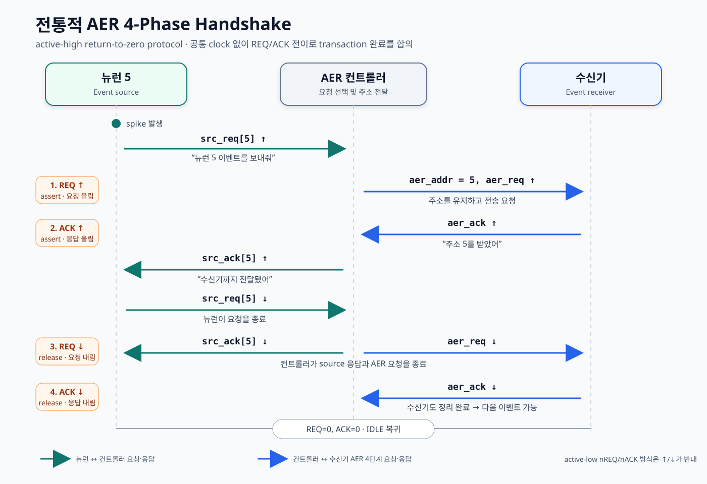
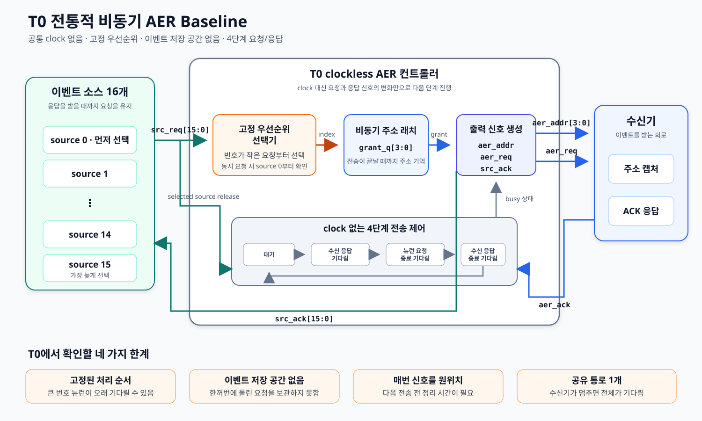
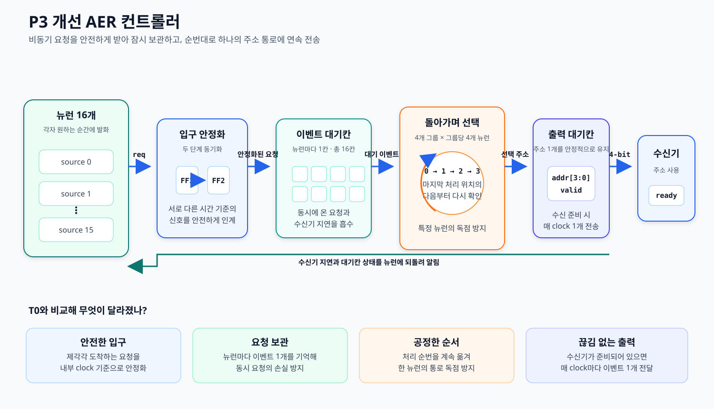
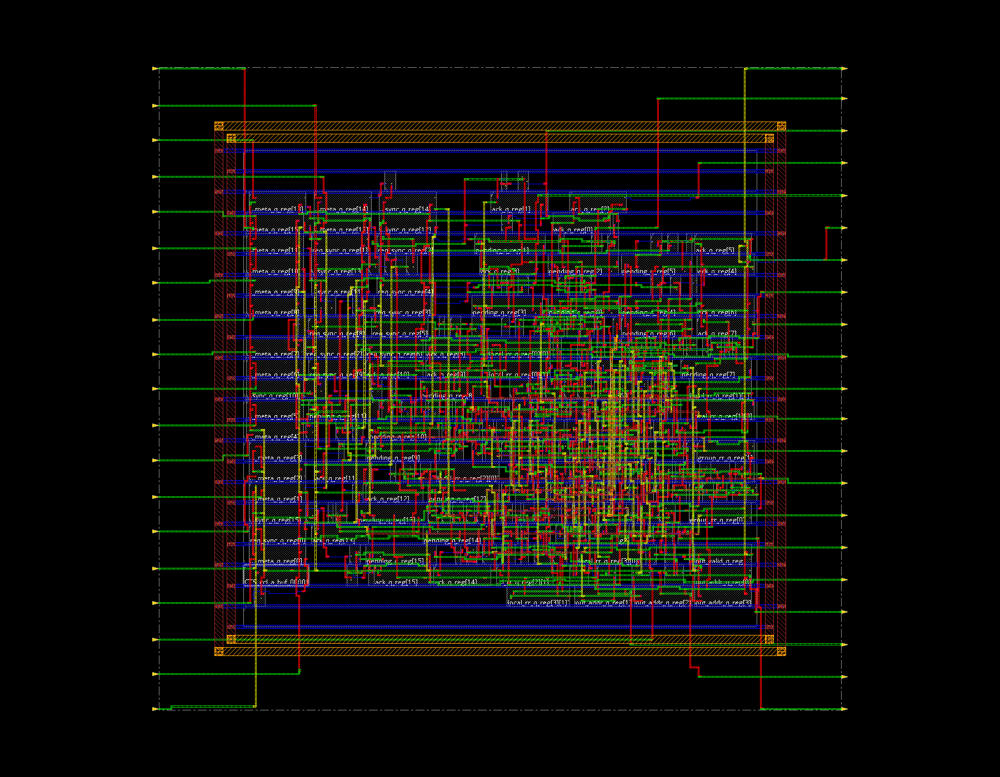

# 뉴런의 발화 신호를 빠르고 공정하게 전달하는 AER 컨트롤러

이 프로젝트는 여러 뉴런이 제각각 발생시키는 발화 신호를 **하나의 주소 통로**로 모아 전달하는 회로를 설계한다. 먼저 공통 clock 없이 움직이는 전통적 AER 구조 **T0**를 구현해 한계를 확인하고, 그 문제를 보완한 **P3**를 최종 설계로 제안한다.

> 한 문장 요약: T0는 먼저 보이는 요청 하나를 즉시 전달하는 단순한 구조이고, P3는 요청을 안전하게 받아 잠시 보관한 뒤 모든 뉴런에 차례가 돌아가도록 전송하는 구조다.

자세한 설계 과정과 검증 결과는 [대회 보고서](reports/AER_COMPETITION_REPORT_KR.md)에 정리했다.

## AER은 무엇인가?

AER(Address-Event Representation)은 뉴런의 발화처럼 **발생 시점이 일정하지 않은 이벤트를 주소 형태로 전달하는 통신 방식**이다. 핵심은 모든 뉴런의 출력값을 계속 보내는 것이 아니라, 이벤트가 생긴 순간에 “어느 뉴런이 발화했는가”를 나타내는 source ID만 버스에 싣는 것이다.

예를 들어 5번 뉴런이 발화하면 `주소 5`를 전송한다. 이 주소는 발화의 크기나 membrane potential을 담는 데이터가 아니라 **발화한 위치의 식별자**다. 발화 시점은 별도 timestamp 대신 AER transaction이 발생한 시간 자체로 표현된다.

확장형 AER은 polarity, event type 또는 timestamp를 payload에 추가할 수 있지만, 본 설계의 전송 word는 source address만 포함한다. 따라서 이 프로젝트가 개선하는 대상은 뉴런 연산식이 아니라 **여러 spike의 주소를 충돌 없이 운반하는 interconnect/controller**다.

16개 source를 구분하는 데 필요한 주소 폭은 `ceil(log2(16)) = 4 bit`다. 따라서 T0와 P3는 모두 16개의 요청선을 입력으로 받고, 선택된 source 번호를 **4-bit 주소 버스 1개**로 직렬화해 출력한다. 전용 배선 수를 줄이는 대신 여러 이벤트가 겹치면 arbiter가 전송 순서를 정해야 한다.

```text
5번 뉴런 발화 → AER 컨트롤러 → 주소 5 전송 → 수신기가 5번 뉴런의 발화로 해석
```

| 신호 | 정확한 역할 |
|---|---|
| `src_req[15:0]` | 각 뉴런이 자신의 이벤트 발생을 알리는 요청 |
| `src_ack[15:0]` | 선택된 이벤트가 접수됐음을 해당 뉴런에 회신 |
| `aer_addr[3:0]` | 현재 전송 중인 source ID |
| `aer_req` | 주소가 유효하므로 수신기가 읽어도 된다는 요청 |
| `aer_ack` | 수신기가 주소를 정상적으로 받아들였다는 응답 |

AER 자체는 주소 표현과 전송 규약을 말한다. 여러 요청 중 하나를 고르는 **중재기(arbiter)**, 주소를 유지하는 저장 회로, 요청·응답 회로를 어떤 방식으로 구현할지는 별도의 설계 문제다.

## 전통적 AER의 4단계 요청·응답

4-phase handshake는 송신기와 수신기가 공통 clock 없이도 한 번의 전송이 정확히 끝났음을 합의하는 **return-to-zero 요청·응답 규약**이다. 여기서는 active-high 신호를 사용하므로 idle 상태는 `REQ=0, ACK=0`이다.

1. **REQ 상승:** 컨트롤러가 `aer_addr`를 먼저 안정시킨 뒤 `aer_req`를 1로 올린다. 주소는 수신기가 받을 때까지 바뀌면 안 된다.
2. **ACK 상승:** 수신기는 `aer_req=1`을 감지해 주소를 capture한 뒤 `aer_ack`를 1로 올린다. 이 상승은 “현재 주소를 받았다”는 완료 통보다.
3. **REQ 하강:** 컨트롤러는 `aer_ack=1`을 확인한 뒤 `aer_req`를 0으로 내린다. T0는 transaction이 끝날 때까지 선택 주소를 유지한다.
4. **ACK 하강:** 수신기는 `aer_req=0`을 확인한 뒤 `aer_ack`를 0으로 내린다. 다시 `REQ=0, ACK=0`이 되면 다음 transaction을 시작할 수 있다.



이 프로토콜에는 세 가지 중요한 조건이 있다.

- source는 `src_ack`를 받을 때까지 `src_req`를 유지해야 한다.
- 컨트롤러는 유효한 주소를 먼저 만든 뒤 요청을 올리고, 수신 완료 전에는 주소를 바꾸면 안 된다. 이를 bundled-data timing 조건이라고 한다.
- 수신기가 응답을 늦추면 송신기도 그대로 기다린다. 별도 stall 신호 없이 `ACK` 지연 자체가 backpressure가 된다.

장점은 상대 회로가 실제로 끝났다는 응답을 보고 다음 단계로 진행하므로 고정된 clock 주기를 가정할 필요가 없다는 것이다. 단점은 이벤트 하나마다 네 번의 신호 전이가 필요하고, 동시에 들어온 요청을 고르는 비동기 arbiter는 metastability를 안전하게 해소할 수 있어야 한다는 점이다.

## T0: 전통적 비동기 baseline

T0에는 전체 회로를 움직이는 공통 clock이 없다. 뉴런의 요청이 들어오면 번호가 작은 뉴런부터 확인하여 하나를 고르고, 그 주소를 비동기 래치에 기억한다. 수신기와 4단계 요청·응답을 마치면 다음 요청을 처리한다.



이 구조는 단순하지만 네 가지 문제가 있다.

- **Fixed-priority starvation:** 0번 요청이 계속 들어오면 낮은 우선순위인 15번 요청은 처리 기회를 얻지 못할 수 있다.
- **FIFO 또는 pending storage 부재:** 여러 뉴런이 동시에 발화하면 선택되지 않은 요청은 source가 계속 유지해야 하며, 짧은 pulse 이벤트는 유실될 수 있다.
- **Return-to-zero overhead:** 한 번 보낼 때마다 `REQ`와 `ACK`를 원위치로 돌려야 하므로 다음 이벤트 전송 전 bubble이 생긴다.
- **비동기 중재 안정성:** 거의 동시에 변하는 요청을 안전하게 중재하는 MUTEX cell이 없는 일반 standard-cell 환경에서는 교차 결합 되먹임 회로의 안정성을 보장하기 어렵다.

RTL 기능 시험에서는 139개 이벤트가 모두 전달됐다. 그러나 실제 게이트 지연을 넣은 Cadence 시험에서는 전송 도중 주소가 반복해서 바뀌었다. 따라서 T0는 전통 구조의 원리와 한계를 보여주는 비교 기준이며, 안정적으로 제작 가능한 최종안으로 보지는 않는다.

## P3: 요청을 보관하고 순번대로 처리하는 개선안

P3는 뉴런 쪽의 비동기 요청 방식은 유지하되, 컨트롤러 내부는 검증과 칩 제작에 적합한 clock 기반 구조로 바꿨다.



P3의 동작은 접수 창구에 비유할 수 있다.

1. **2FF synchronizer:** 제각각 도착하는 뉴런 요청을 두 개의 플립플롭에 연속 통과시켜 내부 clock domain으로 안전하게 넘긴다. 첫 단계는 metastability가 조합논리로 전파될 가능성을 낮추고, 두 번째 단계의 값만 기능 로직이 사용한다.
2. **Source별 1-bit pending storage:** 뉴런마다 이벤트 대기칸 하나를 두어 동시에 들어온 요청을 기억한다. 이미 칸이 찬 source에는 acknowledge를 늦춰 덮어쓰기를 막는다.
3. **4×4 hierarchical round-robin:** 16개 source를 네 그룹으로 나누어 각 그룹 후보를 병렬로 찾고, 그룹 사이에서도 마지막 선택의 다음부터 확인한다. 논리 경로를 줄이면서 starvation을 방지한다.
4. **Registered valid/ready elastic output:** 출력 주소와 `valid`를 register에 보관한다. 수신기의 `ready`가 1이면 현재 이벤트를 넘기는 동시에 다음 이벤트를 채워 매 clock 1 event의 peak throughput을 만든다.

P3도 출력 버스는 여전히 4-bit 1개다. 통로를 여러 개로 늘려 성능을 얻은 것이 아니라, **통로가 비는 시간을 줄이고 요청을 고르는 방식을 개선**했다.

## 검증 결과

| 확인 항목 | T0 | P3 | 쉽게 말하면 |
|---|---:|---:|---|
| 요청한 이벤트 / 받은 이벤트 | 139 / 139 | 139 / 139 | 기능 시험에서는 둘 다 분실 없음 |
| 실제 게이트 지연을 넣은 시험 | 실패 | 통과 | T0 주소는 흔들렸고 P3는 안정적 |
| 여러 도착 시점 반복 시험 | 해당 없음 | 192 / 192 통과 | 요청 시점이 달라도 한 번씩만 처리 |
| 최대 전송 속도 | 신뢰할 수 있는 수치 없음 | clock당 1개 | 수신기가 준비된 경우의 최고 속도 |
| 평균 / 최대 대기 시간 | 비교 불가 | 16.517 / 29 clock | 시험 입력에서 요청 후 전송까지 걸린 시간 |
| 칩 배치 후 셀 수 | 정상 계산 불가 | 311개 | P3를 구성하는 표준 논리 셀 수 |
| 칩 내부 회로 면적 | 정상 계산 불가 | 8,981.280 µm² | 입출력 패드를 제외한 셀 면적 합계 |
| 배선 오류 / 연결 오류 | 미완료 | 0 / 0 | 자동 배치·배선 검사 통과 |

## 실제 Innovus 배치·배선 결과

아래 이미지는 그림을 새로 그린 것이 아니라, P3의 최종 배치·배선 데이터베이스를 **Cadence Innovus에서 다시 열어 직접 출력한 화면**이다. 가운데의 작은 사각형들은 논리 셀이고, 여러 색의 선은 전원선과 신호 배선이다.



P3는 TSMC 180 nm 표준 셀 조건에서 논리 합성부터 배치·배선, 배선 저항·용량 반영, 동작 시간 검사까지 완료했다. 목표 clock 주기는 10 ns였으며 가장 느린 조건에서 3.131 ns, 가장 빠른 조건에서 0.027 ns의 시간 여유를 확보했다.

## 어디까지 완료했는가?

현재 완료 범위는 **디지털 코어의 RTL 설계부터 칩 내부 배치·배선까지**다. 실제 반도체를 제작한 것은 아니며, 입출력 패드 배치, 패키지 설계, 제조용 최종 검증과 실리콘 측정은 남아 있다.

## 주요 파일

| 내용 | 경로 |
|---|---|
| 대회 보고서 | [reports/AER_COMPETITION_REPORT_KR.md](reports/AER_COMPETITION_REPORT_KR.md) |
| T0 RTL | [rtl/traditional_async/aer_traditional_structural.sv](rtl/traditional_async/aer_traditional_structural.sv) |
| P3 RTL | [rtl/improved/aer_improved_depth1.sv](rtl/improved/aer_improved_depth1.sv) |
| P3 검증 결과 | [results/P3_DEPTH1_AER_2026-08-19.md](results/P3_DEPTH1_AER_2026-08-19.md) |
| P3 180 nm 결과 요약 | [reports/improved_depth1/cadence/pnr_180nm/SUMMARY.txt](reports/improved_depth1/cadence/pnr_180nm/SUMMARY.txt) |
| Innovus 화면 추출 스크립트 | [scripts/cadence/p3_innovus_capture.tcl](scripts/cadence/p3_innovus_capture.tcl) |

## 결과 해석 시 주의점

- T0의 RTL 통과는 실제 비동기 칩의 안정성을 증명하지 않는다.
- P3의 192회 시험은 디지털 시뮬레이션 결과이며, 물리적인 준안정성 확률을 직접 측정한 값은 아니다.
- P3의 전력 수치는 기본 신호 활동률을 사용한 도구 추정값이다. 실제 뉴런 발화 패턴에서 측정한 소비전력과는 구분해야 한다.
- `clock당 1개`는 수신기가 계속 준비되어 있고 보낼 이벤트가 남아 있을 때의 최고 처리율이다.
