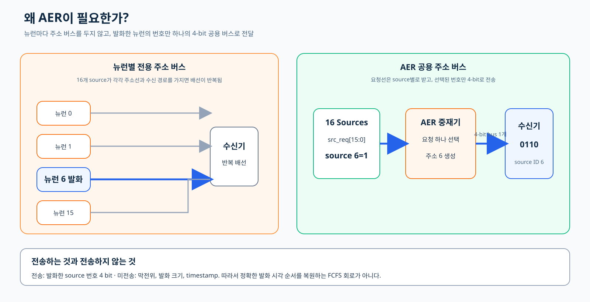
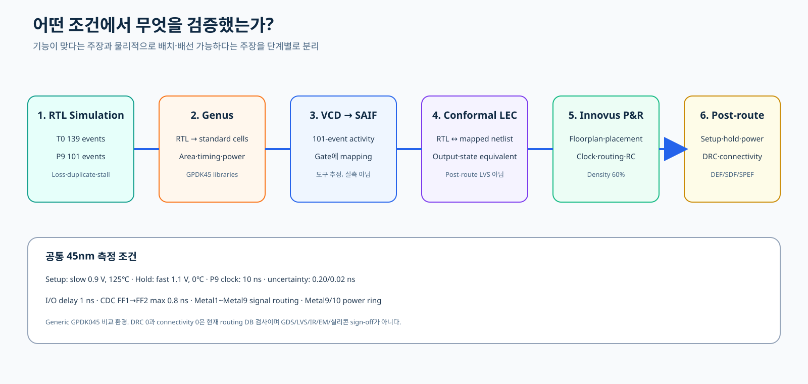
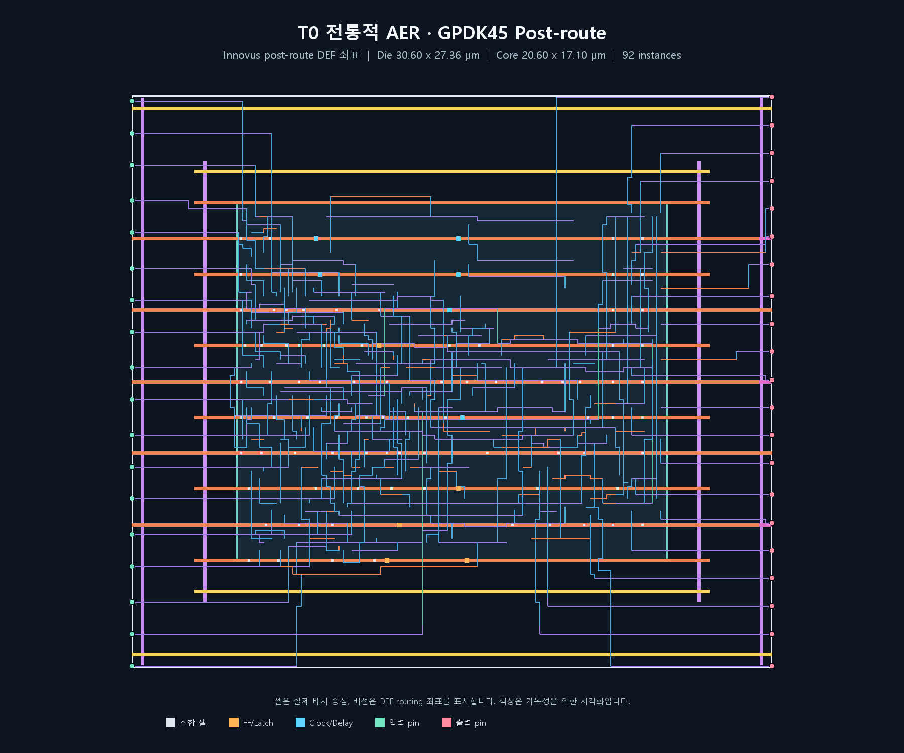
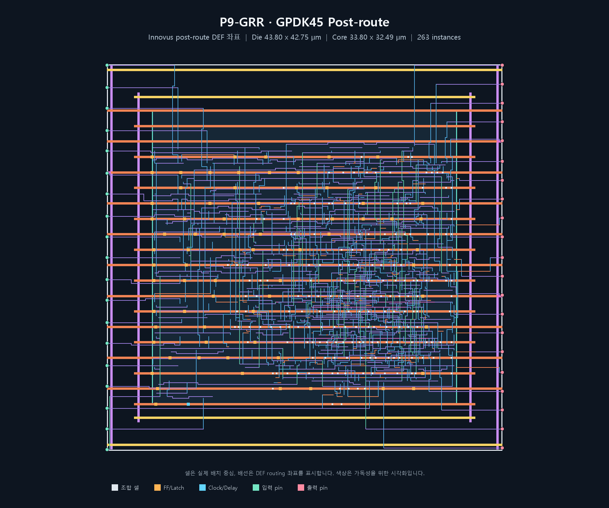
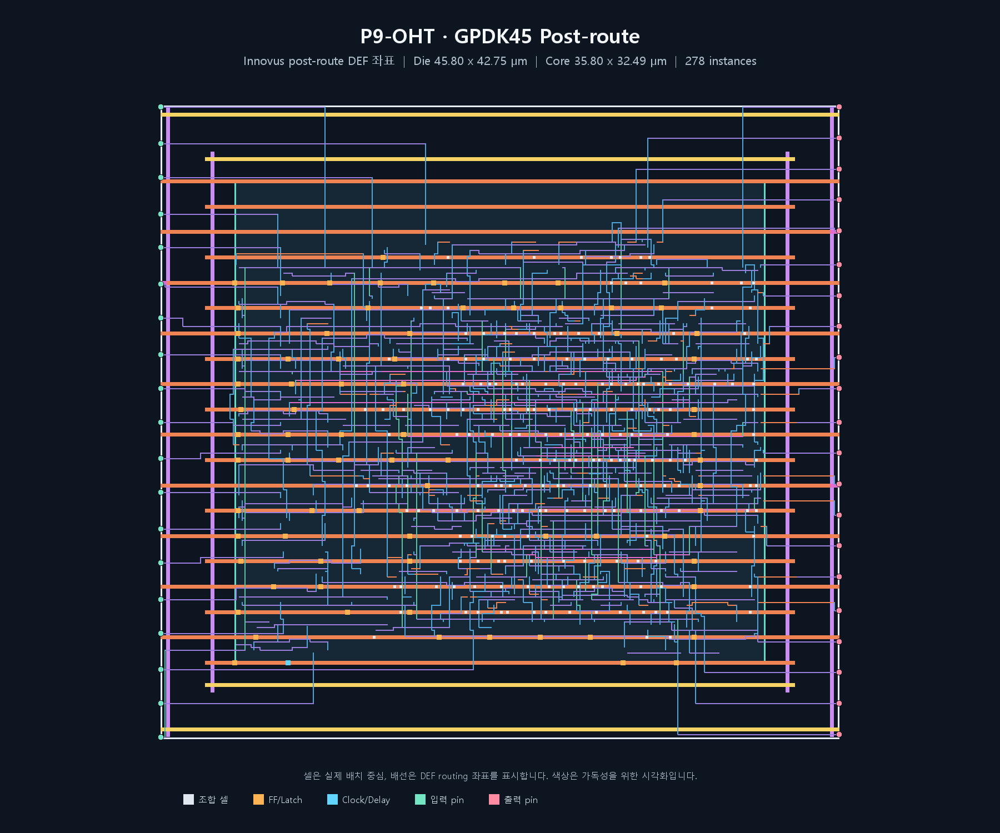
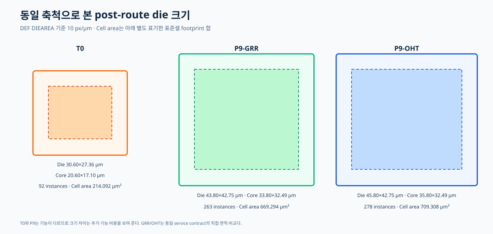

# AER 컨트롤러 최종 설계 보고서

이 보고서는 독자가 AER을 처음 접한다는 전제에서 작성한다. 앞에서 뒤로 읽으면
개념이 하나씩 쌓이도록 구성했으며, 뒤에서 정의할 회로 이름이나 결과를 앞장에서
미리 사용하지 않는다.

## 1. AER이란 무엇인가?

### 1.1 뉴런의 발화를 주소로 표현한다

뉴런이 발화하면 다음 회로는 “몇 번 뉴런에서 event가 발생했는가”를 알아야 한다.
뉴런마다 별도의 데이터 버스를 두면 source 수가 증가할수록 핀과 배선이 빠르게
늘어난다. AER(Address-Event Representation)은 발화한 source의 번호를 주소로
바꾸어 하나의 공용 버스로 전달하는 통신 방식이다.

본 설계는 16개의 event source를 대상으로 한다. Source 번호는 0부터 15까지이므로
4 bit면 모두 표현할 수 있다.

    source 6 발화
        → src_req[6] 상승
        → controller가 여러 요청 중 하나를 선택
        → 공용 주소 버스에 4'b0110 출력
        → receiver가 source 6의 event로 해석

*그림 1. 뉴런별 전용 주소 경로와 AER 공용 4-bit 주소 버스. 오른쪽은 source 6의
발화가 주소 0110으로 전달되는 예다.*

### 1.2 AER이 보내는 정보와 보내지 않는 정보

이 회로가 전송하는 값은 source ID다. 막전위, 발화 크기와 timestamp는 포함하지
않는다. Timestamp는 event가 발생한 시각을 나타내는 별도 정보다. 따라서 출력된
주소의 순서만 보고 서로 다른 source의 정확한 발화 시각 차이를 복원할 수는 없다.

AER controller는 단순 encoder와도 다르다. 단순 encoder는 입력 하나만 1이라고
가정하지만, 실제 뉴런은 여러 개가 동시에 발화할 수 있다. Controller는 동시에
들어온 요청 중 하나를 고르고, 선택되지 않은 요청이 사라지지 않게 관리해야 한다.
이 선택 기능을 중재(arbitration)라고 한다.

### 1.3 이 프로젝트에서 고정한 기본 규격

| 항목 | 규격 |
|---|---|
| Event source | 16개 |
| 요청 입력 | Source별 1-bit request |
| 공용 주소 출력 | 4 bit |
| 주소 의미 | 원래 source 번호 0~15 |
| 공유 버스 | 1개 |
| 제외 정보 | 막전위, 발화 크기, timestamp |
| 중재 필요성 | 여러 source의 동시 요청 중 하나를 선택 |

## 2. 동기식과 비동기식

### 2.1 동기식 회로에서 clock이 하는 일

Clock은 회로 전체가 같은 시간 기준을 공유하도록 반복되는 edge를 제공한다.
Flip-flop은 clock edge에서 입력을 저장하고, 조합논리는 다음 edge 전까지 계산을
완료한다.

    clock edge N
        → 입력 상태 저장
        → 조합논리 계산
        → clock edge N+1에서 결과 저장

동기식 회로는 계산이 실제로 끝났는지를 매번 감지하지 않는다. 설계자는 가장 느린
경로가 한 clock 주기 안에 안정되도록 timing을 맞춘다. 예를 들어 clock 주기가
10 ns라면 data가 setup time을 포함해 다음 edge 전에 도착해야 한다. STA(Static
Timing Analysis)는 가능한 경로의 지연을 계산해 이 조건을 확인한다.

장점은 큰 회로를 clock 단위로 나누어 합성·검증·배치배선하기 쉽다는 것이다.
단점은 event가 없어도 clock tree가 전환되고, 실제 계산이 빨리 끝나도 다음
정해진 edge를 기다린다는 것이다.

### 2.2 비동기식 회로에서 다음 동작을 정하는 기준

비동기식 회로에는 전체를 지휘하는 공통 clock이 없다. 입력 변화, gate/latch의
실제 지연과 상대 회로의 응답이 다음 동작을 일으킨다.

    요청 발생
        → 조합논리와 저장소가 반응
        → 상대 회로가 수신 완료를 응답
        → 다음 transaction 시작

“Clock이 없다”는 말은 시간이 없거나 모든 동작이 즉시 끝난다는 뜻이 아니다.
Transistor와 배선에는 실제 지연이 있으며, 주소가 안정된 뒤 요청이 올라가야 하는
순서 같은 상대시간 조건도 필요하다.

비동기식은 event가 있을 때만 동작하게 만들기 쉽고 전역 clock 배선이 필요하지
않다는 장점이 있다. 반면 거의 동시에 들어오는 요청의 metastability-safe 중재,
상대시간 검증과 일반 ASIC tool flow 적용이 더 어렵다.

### 2.3 두 방식은 한 시스템 안에서 함께 사용할 수 있다

동기식과 비동기식은 서로 배타적인 제품 종류가 아니다. 한 interface는 비동기
handshake를 사용하고, 그 뒤의 계산 core는 clock으로 동작할 수 있다. 이때 두
영역 사이에는 신호를 안전하게 넘기는 clock-domain crossing 회로가 필요하다.

중요한 점은 handshake 신호를 사용한다고 내부 전체가 자동으로 비동기 회로가 되는
것은 아니라는 것이다. 회로의 상태가 무엇에 맞춰 바뀌는지, 즉 global clock
edge인지 request/acknowledge 전이인지로 판단해야 한다.

| 항목 | 동기식 | 비동기식 |
|---|---|---|
| 공통 시간 기준 | Clock | 없음 |
| 상태 갱신 기준 | Clock edge | Request/ACK와 회로 지연 |
| 완료 판단 | 다음 edge 전 timing 만족 | 상대 회로의 ACK 또는 완료 신호 |
| 검증 중심 | Setup, hold, clock tree | Protocol, relative timing, arbitration |
| 대표 장점 | Tool flow와 큰 시스템 구성이 용이 | Event-driven 동작, 전역 clock 불필요 |
| 대표 난점 | Clock power와 고정 주기 | 중재·상대시간·metastability 검증 |

## 3. 4-phase handshake 방식이란?

### 3.1 네 번의 신호 변화로 한 event를 전달한다

Handshake는 두 회로가 “보냈다”와 “받았다”를 신호 변화로 확인하는 약속이다.
Active-high 4-phase handshake는 다음 네 단계를 가진다.

1. 송신기가 REQ를 0에서 1로 올린다.
2. 수신기가 REQ와 data를 확인하고 ACK를 0에서 1로 올린다.
3. 송신기가 ACK를 확인한 뒤 REQ를 1에서 0으로 내린다.
4. 수신기가 ACK를 1에서 0으로 내려 idle 상태로 돌아간다.

    REQ↑ → ACK↑ → REQ↓ → ACK↓

*그림 2. Source, AER controller와 receiver 사이의 active-high return-to-zero
transaction.*

REQ와 ACK가 모두 0으로 돌아온 뒤에야 같은 link가 다음 event를 시작하므로
return-to-zero 방식이라고 부른다.

### 3.2 Source는 ACK까지 REQ를 유지해야 한다

REQ는 짧은 알림 pulse가 아니라 event의 소유권을 넘기는 protocol 상태다.
Source가 ACK 전에 REQ를 내리면 controller가 요청을 보지 못하거나 주소가
안정되기 전에 transaction이 사라질 수 있다. 따라서 다음 규칙이 필요하다.

    REQ를 올린 source
        → ACK가 1이 될 때까지 REQ=1 유지
        → ACK를 본 뒤 REQ=0
        → ACK=0까지 기다린 뒤 다음 요청

### 3.3 장점과 비용

4-phase handshake는 두 회로가 공통 clock을 공유하지 않아도 data 전달 완료를
명확히 확인할 수 있다. Receiver가 느리면 ACK를 늦게 보내 backpressure를 걸 수도
있다.

반면 event마다 REQ와 ACK를 모두 0으로 되돌려야 한다. 이 return-to-zero 구간에는
새 주소를 전달하지 못하므로 연속 event 사이에 빈 전송 구간, 즉 bubble이 생긴다.
Handshake 자체는 안전한 전달 규약이지, 여러 request가 동시에 들어왔을 때 누구를
고를지 해결하는 중재기는 아니다.

## 4. 전통적인 AER T0의 구현

### 4.1 T0의 회로 구성

*그림 3. T0의 fixed-priority, grant/busy latch, delay cell과 receiver-facing
4-phase 경로. 아래 반환선은 receiver ACK가 source까지 돌아가는 흐름이다.*

#### 4.1.1 고정 우선순위 선택

T0는 요청 vector를 작은 source 번호부터 검사한다. 가장 먼저 발견한 1을 선택하고
그 뒤 번호는 이번 transaction에서 보지 않는다.

    source 1, 6, 12가 요청
        → source 1 선택

    source 0이 계속 재요청
        → 높은 번호 source가 계속 밀릴 수 있음

이 현상을 starvation이라고 한다. T0에는 priority를 회전시키는 pointer가 없으므로
대기 시간 상한이 없다.

#### 4.1.2 Latch가 주소를 기억하는 원리

조합논리의 선택 결과는 입력 요청이 바뀌면 즉시 바뀔 수 있다. Receiver가 주소를
읽는 동안 값이 흔들리지 않도록 T0는 grant 4 bit와 busy 1 bit를 transparent
latch에 저장한다.

일반적인 latch의 저장 원리는 교차 결합 되먹임으로 설명할 수 있다. 한쪽 node가
조금 높아지면 반대쪽을 낮추고, 낮아진 반대쪽이 다시 첫 번째 쪽을 높인다.
이 양의 되먹임이 0과 1의 차이를 확대하여 gate 입력이 닫힌 뒤에도 값을 기억한다.
다만 이는 latch의 개념적 저장 원리이며, 현재 공개 Liberty/RTL만으로 TLATX1 내부
transistor topology가 정확히 어떤 교차 결합 형태인지 확인했다는 주장은 아니다.

GPDK45 port는 GSCLIB045의 TLATX1 5개를 사용한다.

- grant 주소: 4 latch
- busy 상태: 1 latch

GSCLIB045에는 resettable transparent latch가 없으므로 reset 동안 latch gate를
열고 D=0을 넣어 상태를 비운다. 외부 출력은 reset이 풀릴 때까지 0으로 격리한다.

#### 4.1.3 Bundled-data relative timing

T0에는 공통 clock edge가 없으므로 “몇 번째 clock에 주소를 잡는다”는 기준이 없다.
대신 주소 data path와 control request path의 상대적인 도착 순서를 맞춘다.

    Source REQ
      ├─ 빠른 경로: fixed-priority → grant latch D → 주소 저장
      └─ 느린 경로: DLY4X1 chain → busy → aer_req

Receiver가 aer_req 상승을 보고 주소를 읽으므로 aer_addr가 먼저 안정되고 aer_req가
나중에 올라가야 한다. 이를 위해 capture 경로에 DLY4X1 5개, request launch에
DLY4X1 1개를 사용한다.

이 방식은 무작정 RTL에 #delay를 넣은 것이 아니다. 합성·배치배선 library가 알고
있는 특성화 delay cell을 실제 netlist에 보존한다. T0는 선택한 5 ns I/O
max-delay 검사에서 post-route slack +4.126 ns를 만족했다. 그러나 busy latch의
G/D를 포함한 내부 self-timed path 일부는 Genus에서 unconstrained다. 따라서 이
수치는 전체 bundled-data 상대시간과 metastability 안전성을 sign-off한 결과가
아니라, 선택한 외부 경로 제약을 통과했다는 제한된 근거다.

#### 4.1.4 Event 하나의 전체 동작

Source 6만 요청한다고 가정하면 다음 순서로 움직인다.

1. src_req[6]이 올라간다.
2. Fixed-priority logic이 주소 6과 valid를 만든다.
3. Busy가 비어 있으므로 grant latch가 주소 6을 저장한다.
4. Delay chain을 지난 뒤 aer_req가 올라간다.
5. Receiver가 aer_addr=6을 읽고 aer_ack를 올린다.
6. T0가 선택된 source 6에 src_ack[6]을 올린다.
7. Source 6이 REQ를 내린다.
8. T0가 aer_req를 내린다.
9. Receiver가 aer_ack를 내린다.
10. Busy가 풀리며 다음 요청을 받을 수 있다.

REQ와 ACK를 모두 0으로 되돌리는 동안 새 주소를 전송하지 못하는 빈 구간이 생긴다.
이런 빈 cycle 또는 빈 전송 구간을 bubble이라고 부른다.

#### 4.1.5 T0의 유효 동작 조건

T0 기능이 유효하려면 다음 조건이 필요하다.

1. Source는 src_ack를 받을 때까지 src_req를 유지한다.
2. Grant capture aperture 동안 request 집합이 안정돼 있어야 한다.
3. Receiver는 주소를 읽은 뒤에만 aer_ack를 올린다.
4. Receiver가 aer_req를 받으면 4-phase 반환 절차를 끝낸다.

현재 library에는 characterized MUTEX가 없다. MUTEX는 거의 동시에 들어온 두
요청 중 하나가 안정적으로 먼저 이기도록 transistor-level에서 설계·특성화한
중재 소자다. T0가 디지털 simulation에서 X 없이 동작했다는 사실만으로 임의의
near-simultaneous edge에 대한 metastability MTBF를 증명할 수는 없다.

T0는 이 한계를 숨기지 않고 전통 구조의 baseline으로 사용한다.

### 4.2 장점

T0의 가장 큰 장점은 구조가 작고 직접적이라는 점이다.

1. **전역 clock이 없다.** Event가 없을 때 중재 상태를 갱신하기 위한 clock
   tree 전환이 없다.
2. **상태가 적다.** 주소 4 bit와 busy 1 bit, 총 latch 5개만 기억한다.
3. **Protocol이 명확하다.** Source와 receiver가 모두 4-phase로 한 transaction의
   시작과 종료를 직접 확인한다.
4. **작은 baseline PPA를 제공한다.** GPDK45 post-route에서 92 instances,
   cell area 214.092 µm², vectorless power 0.002127 mW였다.
5. **전통 구조의 문제를 분리해 측정할 수 있다.** 개선 회로가 추가하는 입력 보호,
   저장, 공정성과 처리율의 비용을 비교하는 기준점이 된다.

이 장점은 기능이 적어서 얻은 부분도 포함한다. T0가 작다는 사실을 뒤의 개선
회로와 동일 기능에서 더 효율적이라는 의미로 해석하면 안 된다.

### 4.3 단점과 한계

1. **Starvation**: Fixed priority이므로 낮은 번호가 반복 요청하면 높은 번호의
   대기 시간 상한이 없다.
2. **내부 event 저장 부재**: 선택되지 않은 source는 REQ를 계속 유지해야 한다.
3. **Backpressure 직접 전파**: Receiver가 ACK하지 않으면 현재 source와 공유
   link 전체가 함께 멈춘다.
4. **Return-to-zero bubble**: 매 event마다 REQ와 ACK를 모두 0으로 되돌려야 해
   연속 전송 사이에 빈 구간이 생긴다.
5. **경합 안전성 한계**: Characterized MUTEX가 없어 거의 동시에 바뀐 request의
   transistor-level metastability MTBF를 증명하지 않았다.
6. **Timing 검증 범위**: 선택한 5 ns I/O max-delay는 통과했지만 busy latch의
   내부 self-timed path 일부는 unconstrained다. 전체 비동기 timing sign-off가
   아니다.
7. **도착 순서 정보 부재**: Timestamp를 저장하지 않으므로 FCFS를 보장하지 않는다.

이 단점들은 다음 절에서 입력 경계, 내부 저장, 공정한 중재와 출력 protocol을
왜 새로 설계해야 하는지를 결정한다.

## 5. P9-GRR과 P9-OHT

### 5.0 T0의 한계에서 개선 요구를 도출한다

앞 장의 T0 분석에서 네 가지 개선 요구가 나온다.

| T0에서 확인한 문제 | 필요한 개선 |
|---|---|
| 비동기 요청을 중재 논리가 직접 사용 | Clock 영역에 안전하게 전달하는 입력 경계 |
| Source별 대기칸이 없음 | Receiver가 막혀도 event를 보관하는 내부 저장 |
| Fixed priority starvation | 모든 source에 기회를 주는 공정한 중재 |
| Receiver 4-phase와 return-to-zero bubble | 주소를 보관하는 registered 출력과 연속 전송 |

이 요구를 구현한 개선 controller를 P9라고 부른다. P9는 source 쪽의 4-phase
protocol을 유지하면서 내부와 receiver 쪽을 clock 기반으로 구성한다. 공통 기능은
같지만 중재기를 구현하는 방법에 따라 두 최종안으로 나뉜다.

- P9-GRR: 상태와 feedback 회로를 줄여 면적을 우선한 구조
- P9-OHT: one-hot tree로 조합경로와 switching을 줄인 구조

P9라는 이름과 아래 기술은 이 절에서 처음 정의한다. 앞 절의 AER, 동기/비동기,
handshake와 T0를 바탕으로 읽으면 각 변화의 이유가 이어진다.

### 5.1 개선 회로의 전체 구조

P9는 source 쪽의 비동기 4-phase handshake를 유지하지만 내부 중재와 receiver
출력을 clock 기반으로 구성한 하이브리드 구조다.

*그림 4. 비동기 source, 2FF CDC 경계, 동기식 P9 core와 valid/ready receiver의
영역 구분. 이 protocol 변환과 elastic storage가 1 event/clock의 기반이다.*

    비동기 source REQ
      → Source별 2FF
      → ACK/Pending event buffer
      → 공정한 중재기
      → registered address + valid/ready
      → synchronous receiver

완전 비동기 중재를 흉내 낸 구조가 아니라, 비동기 event 입력을 명시적인
clock-domain crossing 회로로 받아 일반 ASIC flow에서 검증 가능한 synchronous
core로 처리하는 구조다.

#### 5.1.1 Source별 2FF

Flip-flop은 clock edge에서 입력 전압을 저장한다. 입력이 setup/hold 구간 안에서
변하면 내부 node가 잠시 중간 전압에 머물 수 있다. 저장 동작은 시작됐지만 아직
유효한 0이나 1로 해석할 수 없는 metastable 상태다.

    정상 상태: Q≈VDD, Q-bar≈0 또는 Q≈0, Q-bar≈VDD
    불안정 상태: Q≈0.5VDD, Q-bar≈0.5VDD

미세한 transistor 차이와 noise가 작은 전압 차이를 만들면 교차 되먹임이 그 차이를
확대하여 결국 0 또는 1로 안정시킨다. 그러나 안정되는 시간은 매번 같지 않다.

P9는 각 source에 FF 두 개를 직렬로 둔다.

    src_req_async[i] → req_meta[i] → req_sync[i] → core

- FF1(req_meta)은 비동기 입력을 직접 받아 metastability가 생길 수 있다.
- FF1 출력은 넓은 조합논리가 아니라 FF2 하나에만 연결된다.
- FF2(req_sync)는 다음 clock edge에서 FF1을 읽는다.
- FF1에는 거의 한 clock 동안 안정될 시간이 생긴다.

10 ns clock을 예로 들면 0 ns edge에서 FF1이 불안정해져도 10 ns edge 전까지
안정될 시간이 있다. Metastability가 10 ns 뒤까지 남을 확률은 크게 감소하지만
수학적으로 0이 되지는 않는다.

16 source × 2 FF = 32 FF이므로 2FF는 PPA 절감 기술이 아니다. 입력 안전성을 위해
면적, clock-tree 부하와 1~2 clock의 관찰 지연을 지불한다.

#### 5.1.2 Pending, ACK와 새 요청 접수식

Pending은 source별 event 보조 주머니다. Bit 위치 자체가 source 주소를 나타낸다.

    pending[6]=1
        → source 6 event 하나가 controller 안에서 대기 중

새 요청 접수 조건은 다음 의미를 가진다.

    accept[i] = req_sync[i] AND NOT ack[i] AND NOT pending[i]

- req_sync=1: 동기화된 요청이 보임
- ack=0: 현재 REQ-high 구간을 아직 접수하지 않음
- pending=0: 해당 source의 보조 주머니가 비어 있음

다음 ACK 상태는 다음과 같다.

    ack_next[i] = (ack[i] AND req_sync[i]) OR accept[i]

Accept가 발생하면 ACK를 올린다. Source가 REQ를 유지하는 동안 ACK도 유지하고,
동기화된 REQ가 0이 되면 ACK를 내린다. Source가 REQ를 계속 1로 두더라도 ack=1이
되므로 같은 event를 매 clock 중복 저장하지 않는다.

ACK와 Pending은 하나의 bit로 합칠 수 없다.

| ACK | Pending | 의미 |
|---:|---:|---|
| 0 | 0 | 새 요청도 대기 event도 없음 |
| 1 | 1 | 요청을 접수했고 event가 pending에서 대기, source는 아직 REQ 유지 |
| 0 | 1 | Source handshake는 끝났지만 event는 아직 pending에서 대기 |
| 1 | 0 | Event는 output으로 이동했지만 source는 아직 REQ를 내리지 않음 |

따라서 ACK는 현재 4-phase 요청의 접수 상태이고 Pending은 receiver가 아직 소비하지
않은 event의 소유권 상태다.

#### 5.1.3 Early ACK와 Cut-through

Output register가 비어 있으면 새 accept event를 pending에 한 clock 보관했다가
꺼낼 필요가 없다. 이번 clock의 accept를 중재 후보에 포함해 같은 다음 clock
edge에서 output register로 직접 옮길 수 있다. 이를 cut-through라고 한다.

    Output 비어 있음: REQ → accept → output register
    Output 막혀 있음: REQ → accept → pending

어느 경우든 event가 controller state에 표현된 뒤에만 ACK를 올린다.

#### 5.1.4 Output register와 valid/ready

P9의 출력은 4-bit 주소 register와 1-bit valid register로 구성된다. Receiver와의
실제 전송은 clock edge에서 valid=1과 ready=1이 함께 성립할 때다.

| Valid | Ready | 동작 |
|---:|---:|---|
| 0 | 0 또는 1 | 출력 event 없음 |
| 1 | 0 | Receiver stall, 주소와 valid 유지 |
| 1 | 1 | 현재 event 한 개 소비 |

Receiver가 100 clock 동안 멈추면 현재 주소도 100 clock 동안 그대로 유지된다.
그동안 비어 있는 다른 source pending에는 event를 계속 접수할 수 있다.

    Pending 16개 + output register 1개
        = 접수했지만 아직 소비되지 않은 event 최대 17개

한 source pending에는 event 하나만 들어간다. 같은 source의 더 긴 burst에는
source-side accumulator나 FIFO가 필요하다.

#### 5.1.5 Gray 순번과 공정성

Binary 번호는 7→8에서 0111→1000으로 네 bit가 바뀐다. Reflected Gray 순서는
이웃한 번호가 한 bit만 다르다.

    0 → 1 → 3 → 2 → 6 → 7 → 5 → 4
      → 12 → 13 → 15 → 14 → 10 → 11 → 9 → 8 → 0

Gray는 timestamp가 아니며 payload를 새 형식으로 바꾸는 것도 아니다. 어느
source를 다음에 선호할지 정하는 내부 순번표다. Receiver에는 원래 source ID가
출력된다.

P9는 마지막 처리 위치 또는 Gray epoch를 기준으로 우선순위를 계속 바꾼다. 지속
요청은 receiver stall을 제외한 최대 16번의 service decision 안에 선택된다.
이는 FCFS, 즉 실제 도착 시각 순서 보장은 아니다. Timestamp를 저장하지 않으므로
서로 다른 source의 정확한 도착 순서를 비교할 수 없다.

#### 5.1.6 Reset release

비동기 reset assertion은 회로를 즉시 정지시키는 데 유리하지만 reset 해제가 clock
edge 근처에서 일어나면 recovery/removal 문제가 생길 수 있다. P9는 2-bit
reset_release synchronizer를 사용한다.

    rst_n=0 → core reset 즉시 유지
    rst_n=1 → 두 clock을 거쳐 core_rst_n=1

외부 ACK와 valid는 core_rst_n이 올라오기 전까지 0으로 격리한다. Request
synchronizer는 계속 source 입력을 관찰하지만 ACK/Pending/출력 state는 안전한
clock에 맞춰 동작을 시작한다.

### 5.2 P9-GRR

GRR은 Gray-rank Register Reuse의 약자다.

*그림 5. P9-GRR의 rank-indexed ACK/Pending, 4×4 grouped selector와 output-rank
pointer 재사용 구조.*

#### 5.2.1 Rank-indexed 저장

GRR은 REQ, ACK와 Pending을 source 번호 순서가 아니라 Gray 순번 rank 위치에
고정 배선한다.

| Rank | Source ID | Rank | Source ID |
|---:|---:|---:|---:|
| 0 | 0 | 8 | 12 |
| 1 | 1 | 9 | 13 |
| 2 | 3 | 10 | 15 |
| 3 | 2 | 11 | 14 |
| 4 | 6 | 12 | 10 |
| 5 | 7 | 13 | 11 |
| 6 | 5 | 14 | 9 |
| 7 | 4 | 15 | 8 |

Source 6은 rank 4에 대응한다.

    source 6 REQ     → req_rank[4]
    source 6 ACK     ← ack_rank[4]
    source 6 Pending → pending_rank[4]

중재기가 rank 4를 선택하면 pending_rank[4]를 바로 지운다. Rank를 source
주소로 변환한 뒤 어떤 pending bit인지 다시 찾는 feedback 회로가 필요 없다.
이 재배열은 설계 시 고정된 배선이므로 동적 gate나 추가 register가 아니다.

#### 5.2.2 4×4 grouped strict-cyclic selector

16개 rank를 네 개씩 네 group으로 나눈다.

    group 0: rank 0~3
    group 1: rank 4~7
    group 2: rank 8~11
    group 3: rank 12~15

Selector는 다음 순서로 찾는다.

1. Last rank가 속한 group에서 last rank 뒤쪽 tail을 검사한다.
2. Tail에 요청이 있으면 그중 가장 앞 rank를 선택한다.
3. Tail이 비었으면 다음 group부터 요청이 있는 group을 순환 탐색한다.
4. 선택된 group 안에서 가장 앞 rank를 선택한다.

이 방식은 16개 조건을 직렬로 모두 통과하는 긴 scan보다 group valid를 병렬로
계산한다. 동시에 정확히 last rank 다음부터 시작하는 strict cyclic 순서를
유지한다.

#### 5.2.3 Output rank를 pointer로 재사용

GRR의 out_rank 4 FF는 두 역할을 한다.

1. 현재 receiver에게 보낼 source의 Gray rank 저장
2. 다음 중재가 시작할 last-rank pointer

    out_rank=4
      → out_addr=Gray(4)=source ID 6
      → 다음 탐색은 rank 5부터 시작

별도 output address 4 FF와 fairness epoch 4 FF를 두지 않으므로 OHT보다 state
4 FF를 줄인다. Out_rank가 binary rank이므로 내부 4 FF가 항상 한 bit만 바뀌는
것은 아니다. Gray의 직접적인 one-bit 이점은 인접 rank를 처리할 때 외부 out_addr
배선에 나타난다.

*그림 6. Source 6↔rank 4 고정 배선 예와 GRR 71 state, OHT 75 state의 구성.
면적 차이에는 4 FF뿐 아니라 selector와 물리 매핑 차이도 포함된다.*

GRR의 PPA 이점은 다음 세 효과를 합친 결과다.

- 별도 fairness state 4 FF 제거
- ACK/Pending feedback의 rank-to-source 재탐색 제거
- Grouped selector로 긴 linear scan 회피

대신 Gray source 주소를 만들기 위한 XOR와 strict-cyclic selector 비용이 추가된다.
최종 손익은 합성·배치배선 후 판단해야 한다.

#### 5.2.4 Source 6 event의 clock별 예

| Clock | req_meta[6] | req_sync[6] | ACK | Pending | Output | 의미 |
|---:|---:|---:|---:|---:|---|---|
| C0 | 0 | 0 | 0 | 0 | 비어 있음 | Source 6이 C0 직후 REQ 상승 |
| C1 | 1 | 0 | 0 | 0 | 비어 있음 | FF1이 요청 관찰 |
| C2 | 1 | 1 | 1 | 0 또는 1 | Source 6 가능 | Accept, state 기록 후 Early ACK |
| C3 | 1 또는 0 | 1 | 1 | 상황에 따라 대기 | stall이면 출력 유지 | Source가 ACK 확인 후 REQ 하강 |
| C4 이후 | 0 | 0 | 0 | 선택 전까지 유지 | ready 시 소비 | Handshake 재무장 |

Output이 비어 있으면 C2 edge에서 바로 output에 올라가 Pending은 0일 수 있다.
Output이 막혀 있으면 Pending에 남는다. 따라서 ACK=1과 Pending=1이 항상 같은
상태는 아니다.

### 5.3 P9-OHT

OHT는 One-Hot Top-down Tree의 약자다.

*그림 7. P9-OHT의 source-indexed Pending, one-hot top-down tree, 별도 Gray
epoch와 output address register 구조.*

#### 5.3.1 Source-indexed 저장

OHT는 원래 source 번호 순서로 ACK와 Pending을 저장한다.

    req_sync[6] ↔ ack[6] ↔ pending[6]

Accept, ACK 유지, Early ACK와 최대 17-event 저장 의미는 GRR과 같다.

#### 5.3.2 Top-down tree

OHT는 16개 candidate를 한 번에 주소 encoder로 보내지 않는다.

    Candidate 16
      → Pair valid 8
      → Quarter valid 4
      → Half valid 2
      → Selected source one-hot 16

Pair valid는 인접 source 두 개 중 하나라도 pending인지 계산한다.

    pair_valid[0] = candidate[0] OR candidate[1]
    pair_valid[1] = candidate[2] OR candidate[3]

Quarter와 half도 같은 방식으로 위쪽 유효성을 만든다. 현재 Gray epoch bit가
선호하는 branch에 요청이 있으면 그쪽을 선택하고, 없으면 반대쪽 유효 branch를
선택한다.

최종 selected_onehot은 선택된 source 하나만 1이다.

    Source 6 선택
    selected_onehot = 0000_0000_0100_0000

이 값으로 출력 주소를 만들고, 동시에 pending clear mask로 사용한다.

    grant_onehot = selected_onehot AND can_load_output
    pending_next = accepted_pending AND NOT grant_onehot

Receiver stall에서는 can_load_output=0이므로 어떤 Pending도 지우지 않는다.

#### 5.3.3 별도 Gray epoch

OHT는 다음에 어느 branch를 우선할지 나타내는 4-bit Gray epoch를 output address와
별도로 저장한다. 실제 event를 output에 올리는 service decision이 발생할 때만
epoch가 다음 상태로 이동한다.

    epoch_next = epoch_gray XOR epoch_toggle

Toggle mask는 한 번에 epoch bit 하나만 바뀌도록 계산한다. GRR은 out_rank를
pointer로 재사용해 state point가 71개지만 OHT는 별도 epoch 4 FF 때문에
75개다.

OHT의 epoch는 “방금 고른 source 다음 번호”로 이동하는 pointer가 아니다. Event를
성공적으로 output에 올릴 때마다 Gray schedule을 한 단계 진행시키고, 다음
중재에서 epoch 각 bit가 선호하는 half·quarter·pair·source branch를 먼저 본다.
따라서 GRR과 같은 service contract와 ≤16 successful-grant starvation bound를
제공하지만 sparse contention에서 source 간 출력 순서까지 bit-exact하게 같지는
않다.

OHT의 out_addr register는 resetless지만 out_valid가 core reset 동안 0으로
격리되므로 그때의 주소값은 의미가 없다. Reset 뒤 첫 valid event가 올라갈 때
유효한 주소로 덮어쓴다.

#### 5.3.4 면적이 커도 timing과 전력이 좋아지는 이유

FF가 4개 많으므로 OHT의 면적은 커진다. 반면 top-down one-hot tree는 지역적인
branch 판단을 병렬로 수행하고 선택 결과를 pending clear에 바로 사용한다.
GPDK45에서는 이 구조가 GRR grouped selector보다 짧은 core path를 만들었다.

동일 101-event workload에서 외부 주소 bit 전환은 다음과 같았다.

| 설계 | 주소 bit 전환 합 |
|---|---:|
| P9-GRR | 114 |
| P9-OHT | 106 |

주소 전환 8회 차이만으로 전체 전력을 모두 설명할 수는 없다. 내부 gate, clock
pin과 배선의 switching도 전력에 포함된다. 다만 OHT의 mapped-SAIF 전력이 낮아진
방향과 일치하는 보조 근거다.

Post-route SAIF breakdown에서는 OHT의 sequential total이 약 0.01251 mW로
GRR의 약 0.01206 mW보다 증가했다. 별도 epoch 4 FF의 비용과 방향이 일치한다.
반대로 combinational total은 0.002321 mW에서 0.001269 mW로 약 45.3% 감소했고,
전체 switching component도 0.00135875 mW에서 0.00085341 mW로 약 37.2%
감소했다. 즉 추가 state의 순차전력보다 one-hot tree의 조합 전력 감소가 더 커
총 SAIF 전력이 4.189% 낮아졌다.

### 5.4 T0와 두 개선형의 기능 차이

*그림 8. T0와 P9의 기능 비교 및 GRR/OHT의 동일 service contract 비교 원칙.
Raw PPA 우열은 GRR과 OHT 사이에서만 직접 판단한다.*

| 항목 | T0 | P9-GRR | P9-OHT |
|---|---|---|---|
| 전체 동작 | Clockless | Source 비동기 + synchronous core | Source 비동기 + synchronous core |
| 입력 보호 | 비동기 중재와 relative timing | Source별 2FF | Source별 2FF |
| Event 대기칸 | 없음 | Pending 16 + output 1 | Pending 16 + output 1 |
| Source ACK | Receiver 완료 뒤 | 내부 보관 뒤 Early ACK | 내부 보관 뒤 Early ACK |
| 중재 | Fixed priority | Gray-rank strict cyclic | Gray-epoch one-hot tree |
| Starvation 상한 | 없음 | Stall 제외 ≤16 decisions | Stall 제외 ≤16 decisions |
| Receiver stall | Source까지 직접 전파 | 빈 Pending까지 흡수 | 빈 Pending까지 흡수 |
| 출력 | 비동기 4-phase | Registered valid/ready | Registered valid/ready |
| 최대 처리율 | Receiver handshake 간격에 의존 | Full backlog 1 event/clock | Full backlog 1 event/clock |

### 5.5 개선 결과와 검증 방법

#### 5.5.1 검증 환경과 조건

| 항목 | 조건 |
|---|---|
| PDK | Cadence GPDK045 + GSCLIB045 generic digital kit |
| Setup corner | Slow, 0.9 V, 125°C |
| Hold corner | Fast, 1.1 V, 0°C |
| P9 clock | 10 ns |
| Clock uncertainty | Setup 0.20 ns, hold 0.02 ns |
| I/O delay | 1 ns |
| CDC FF1→FF2 max delay | 0.8 ns |
| Placement density | 60% |
| Signal routing | Metal1~Metal9 |
| VDD/VSS ring | Metal9/Metal10, width 1 µm, spacing 2 µm |

Setup은 가장 느린 library corner에서 data가 제시간에 도착하는지 확인하고, hold는
가장 빠른 corner에서 data가 너무 빨리 바뀌지 않는지 확인한다. Positive slack은
설정한 제약보다 여유가 남았다는 의미다.

GPDK045는 교육·비교용 generic PDK다. 특정 foundry 제조 sign-off를 뜻하지 않는다.

#### 5.5.2 RTL 기능 검증

##### T0 기능 시험

T0 testbench는 단일 event, 16-source 동시 요청, source burst, receiver
backpressure, 무정체 saturation, fixed-priority hotspot, reset 중 유지 요청과
독립 stream을 시험했다.

| 항목 | 결과 |
|---|---:|
| Issued / received | 139 / 139 |
| Assertion error | 0 |
| Saturation event | 64 |
| Saturation min / max gap | 4 / 10 ns |
| Max testbench latency | 331 ns |

Latency와 gap은 testbench의 receiver delay를 포함하므로 post-route 최대 처리율이나
silicon 성능으로 해석하지 않는다.

##### 두 개선형의 공통 기능 시험

두 P9 설계에는 같은 101-event demand workload를 입력했다.

| Phase | Event 수 | 확인 내용 |
|---|---:|---|
| Sparse | 16 | Source별 단일 event와 주소 |
| Receiver stall | 8 | Stall 중 valid/address 유지, Pending 흡수 |
| Saturation | 64 | 16-source backlog와 1 event/clock |
| Hotspot | 13 | 반복 요청과 다른 source의 공정성 |
| 합계 | 101 | GRR/OHT 모두 error 0 |

Demand는 DUT의 ACK 속도와 독립적으로 testbench 외부 queue에 정해진 시각에
생성했다. 따라서 ACK가 늦은 설계가 입력 자체를 늦춰 유리해지는 비교 오류를
막았다.

#### 5.5.3 ASIC 검증 흐름

*그림 9. RTL 기능검증에서 Genus, activity mapping, Conformal, Innovus와
post-route 검사까지의 단계. 각 단계가 증명하는 범위는 서로 다르다.*

1. RTL simulation  
   Event loss, duplicate, protocol, stall과 공정성을 확인한다.
2. Genus synthesis  
   RTL을 GPDK45 표준셀 netlist로 바꾸고 cell 수, area, timing과 power를 계산한다.
3. Activity mapping  
   101-event RTL VCD를 합성 gate에 대응시켜 mapped SAIF와 workload power를 만든다.
4. Conformal LEC  
   RTL과 합성 netlist가 모든 비교 output/state에서 같은 논리인지 확인한다.
5. Innovus place-and-route  
   Floorplan, placement, clock tree, routing과 RC extraction을 수행한다.
6. Post-route signoff checks  
   Setup, hold, recovery, removal, DRC, connectivity와 power를 보고한다.

LEC는 simulation에서 사용하지 않은 입력 조합까지 RTL과 netlist 논리가 같은지
형식적으로 비교한다. DRC는 배선 폭·간격 등의 물리 규칙 위반을, connectivity는
끊긴 net과 원치 않는 short를 확인한다.

### 5.6 P9와 T0의 PPA 분석

| 설계 | Cells | Area | Vectorless power | Workload power | Data path |
|---|---:|---:|---:|---:|---:|
| T0 | 91 | 210.672 µm² | 0.001541 mW | 해당 없음 | Clockless max-delay |
| P9-GRR | **260** | **655.272 µm²** | 0.023833 mW | 0.014789 mW | 2.210 ns |
| P9-OHT | 275 | 696.654 µm² | **0.019387 mW** | **0.014515 mW** | **1.588 ns** |

Genus 단계부터 GRR은 면적이 작고 OHT는 timing과 전력이 낮은 Pareto 관계를
보였다.

#### 5.6.1 Innovus post-route PPA

PPA는 Power, Performance, Area를 함께 보는 평가다. 여기서 Cell area는 die의
가로×세로 면적이 아니라 배치된 표준셀 footprint의 합이다.

- Area: 실제 배치된 표준셀 면적
- Performance: 설정한 timing 제약에서 남은 slack
- Vectorless power: 기본 activity를 가정한 전력
- Mapped-SAIF power: 실제 101-event workload의 전환을 gate에 대응시킨 전력

| 항목 | T0 | P9-GRR | P9-OHT |
|---|---:|---:|---:|
| Instances | 92 | **263** | 278 |
| Cell area | 214.092 µm² | **669.294 µm²** | 709.308 µm² |
| Vectorless power | 0.002127 mW | 0.020641 mW | **0.019218 mW** |
| Mapped-SAIF power | 해당 없음 | 0.014382 mW | **0.013780 mW** |
| Overall setup slack | Clockless | +0.472 ns | +0.458 ns |
| Core setup slack | Clockless | +6.824 ns | **+7.555 ns** |
| Hold slack | N/A, 내부 async path 일부 unconstrained | +0.024 ns | +0.024 ns |
| Recovery / removal | 해당 없음 | +9.386 / +0.061 ns | +9.380 / +0.061 ns |
| DRC / connectivity | 0 / 0 | 0 / 0 | 0 / 0 |

T0의 전력은 clock tree와 71~75개의 P9 state FF가 없으므로 매우 낮다. 그러나
P9 기능을 동급으로 수행한 결과가 아니다.

동일 기능인 OHT와 GRR을 비교하면 다음과 같다.

- OHT 면적: GRR보다 5.979% 증가
- OHT vectorless power: GRR보다 6.892% 감소
- OHT mapped-SAIF power: GRR보다 4.189% 감소
- OHT core setup slack: GRR보다 0.731 ns 증가

*그림 10. GRR=100으로 정규화한 면적·SAIF·core arrival와 실제 power breakdown.
OHT는 순차전력 증가보다 조합전력 감소가 커 총전력이 낮아졌다.*

GRR은 상태와 feedback 회로를 줄여 면적을 얻었다. OHT는 별도 epoch와 one-hot
상태 경로로 면적을 더 쓰지만 조합 경로와 switching을 줄여 속도와 전력을 얻었다.

#### 5.6.2 등가성 및 물리 검증

| 설계 | LEC 결과 | DRC | Connectivity |
|---|---|---:|---:|
| T0 | 21 output + 5 latch state equivalent | 0 | 0 |
| P9-GRR | 21 output + 71 state equivalent | 0 | 0 |
| P9-OHT | 21 output + 75 state equivalent | 0 | 0 |

Nonequivalent, abort와 unknown compare point 없이 통과했다. 따라서 합성기가 latch,
Gray rank, one-hot tree와 Pending state transition을 최적화한 뒤에도 RTL 기능이
보존됐음을 확인했다.

이 LEC는 RTL과 Genus mapped netlist 사이의 비교다. Post-route netlist LEC나
transistor LVS를 수행했다는 뜻은 아니다.

#### 5.6.3 실제 post-route 배치와 배선

*그림 11. T0의 Innovus post-route DEF 좌표 기반 배치·배선 시각화.*

T0 die는 30.60×27.36 µm, core는 20.60×17.10 µm이며 92 instances가 배치됐다.

*그림 12. P9-GRR의 Innovus post-route DEF 좌표 기반 배치·배선 시각화.*

P9-GRR die는 43.80×42.75 µm, core는 33.80×32.49 µm이며 263 instances가
배치됐다.

*그림 13. P9-OHT의 Innovus post-route DEF 좌표 기반 배치·배선 시각화.*

P9-OHT die는 45.80×42.75 µm, core는 35.80×32.49 µm이며 278 instances가
배치됐다. GRR보다 넓은 core가 별도 epoch와 one-hot 선택 논리의 면적 증가를
시각적으로 보여 준다.

세 그림은 Innovus가 출력한 최종 DEF의 실제 cell 중심과 routing 좌표를 렌더링한
것이다. 색은 발표 가독성을 위한 표시이며 공정의 실제 mask 색을 뜻하지 않는다.

*그림 14. 세 DEF의 DIEAREA를 같은 10 px/µm 축척으로 표시한 비교. T0와 P9의
차이는 추가 기능 비용을, GRR/OHT의 차이는 동일 service contract의 면적 trade-off를
보여 준다.*

#### 5.6.4 개선 목표 대비 최종 결과

| 설계 목표 | 목표값 | 최종 결과 | 판정과 해석 |
|---|---|---|---|
| 전통 AER baseline | Clockless 4-phase, latch/delay 보존 | TLATX1 5, DLY4X1 6, LEC/DRC/conn 통과 | 달성 |
| Event 무결성 | Loss/duplicate 0 | T0 139/139, P9 각 101 event error 0 | 달성 |
| 입력 안전성 | 비동기 요청의 명시적 CDC | P9 Source별 2FF 32개와 reset release 2FF | 달성, MTBF 실측은 별도 |
| Event 보관 | Source별 1개 + output 1개 | 최대 17개 | 달성 |
| 공정성 | 지속 요청 ≤16 successful services | GRR strict cyclic, OHT Gray epoch preference sweep | 구조적 bound와 workload 시험 확인 |
| 처리율 | 준비 상태에서 1 event/clock | 64-event saturation에서 연속 출력 | 달성 |
| 물리 구현 | Positive timing, DRC/conn 0 | GRR/OHT setup·hold·recovery·removal 양수, 모두 0/0 | 달성 |
| PPA 선택지 | 면적형과 속도·전력형 확보 | GRR 최소 면적, OHT 낮은 전력·긴 core slack | 달성 |

## 6. 향후 2차 과제에 적용

### 6.1 4×4를 전체 센서가 아니라 재사용 타일로 사용한다

현재 P9 한 개는 16개의 source를 처리한다. 16개 입력은 4×4 뉴런 배열 하나와
자연스럽게 대응하므로 2차 과제에서는 P9를 local tile의 event 수집기로 재사용할
수 있다.

    4×4 뉴런 tile
        → local request 16개
        → P9 controller
        → local source ID 4 bit + valid/ready

*그림 15. 16×16 뉴런 배열을 16개의 4×4 local tile로 나누고, 현재 P9를 각
tile의 event 수집기로 재사용한 뒤 상위 arbiter에서 8-bit global 주소를 만드는
구조.*

4×4가 최종 센서 크기라는 뜻은 아니다. 더 큰 입력을 여러 4×4 tile로 나누기 위한
기본 단위다.

### 6.2 16×16 입력으로 확장하는 예

16×16 배열에는 뉴런이 256개 있다. 이를 4×4 tile로 나누면 16개의 tile이 된다.

    16×16 sensor
      → 4×4 tile 16개
      → tile마다 P9 1개
      → 상위 tile arbiter 1개
      → global event address

한 event의 global 주소는 다음처럼 만들 수 있다.

| 필드 | 폭 | 의미 |
|---|---:|---|
| Tile ID | 4 bit | 16개 tile 중 어느 tile인가 |
| Local source ID | 4 bit | Tile 내부 16개 뉴런 중 어느 뉴런인가 |
| 합계 | 8 bit | 256개 뉴런의 global 주소 |

Local P9는 현재 검증한 16-source handshake, Pending과 공정성 구조를 그대로
재사용한다. 상위 arbiter는 16개 tile output 중 하나를 선택한다. 이 계층형 구조는
256개 입력을 하나의 거대한 중재기에 직접 연결하는 것보다 배선과 검증 범위를
tile 단위로 나눌 수 있다.

### 6.3 GRR과 OHT를 어디에 사용할 것인가

- 면적과 tile 반복 수가 중요하면 P9-GRR을 local tile 기본안으로 사용한다.
- 더 높은 clock 여유나 switching 전력이 중요하면 P9-OHT를 선택할 수 있다.
- 모든 tile에 같은 구조를 쓰지 않고 traffic이 높은 영역에만 OHT를 배치하는
  heterogeneous 구성도 후속 비교 대상이 될 수 있다.

현재 45nm 결과에서 두 구조 모두 10 ns에 최대 1 event/clock이다. 따라서 100 MHz
기준 tile 하나의 이론적 출력 상한은 100 Mevent/s다. 실제 시스템 처리율은 상위
arbiter, receiver ready, tile 간 traffic 분포와 memory interface를 포함해 다시
측정해야 한다.

### 6.4 2차 과제에서 새로 검증할 항목

현재 결과를 그대로 복사하는 것만으로 2차 과제가 완성되는 것은 아니다. 다음
검증이 추가로 필요하다.

1. 여러 tile이 동시에 포화될 때의 상위 공정성
2. Local Pending이 찬 상태에서 같은 source가 다시 발화하는 burst 처리
3. Tile ID와 local source ID의 global 주소 매핑
4. 상위 receiver stall이 각 tile에 전파되는 방식
5. Tile별 clock-domain crossing과 reset 순서
6. 실제 SNN traffic의 event rate와 SAIF power
7. Timestamp 또는 arrival-order가 필요할 경우 별도 payload/FIFO 규격
8. 16×16 top-level 합성·P&R과 계층 배선 혼잡
9. 공식 PDK corner에서의 timing, IR drop, EM과 signoff

### 6.5 재사용 범위와 최종 판단

2차 과제에 그대로 가져가는 것은 “전체 시스템 기능”이 아니라 검증된 16-source
event 수집·중재 IP다. Local tile의 source-side 4-phase 입력과 valid/ready 출력
규격을 고정하면 상위 시스템은 P9 내부를 다시 설계하지 않고 주소와 tile 중재만
구성할 수 있다.

최종적으로 T0는 전통 AER의 기준점으로 남기고, P9-GRR은 면적 중심 local tile
기본안, P9-OHT는 속도·전력 중심 대안으로 사용한다. 2차 과제의 핵심은 이 타일을
계층적으로 연결하고 실제 뉴런 traffic에서 system-level PPA와 event 무결성을
다시 검증하는 것이다.

## 문서와 근거

- [회로 동작 상세 설명](CIRCUIT_OPERATION_KR.md)
- [주장-검증 근거 대응표](CLAIM_EVIDENCE_MATRIX_KR.md)
- [PPT 제작 안내](PPT_ASSET_GUIDE_KR.md)
- [45nm 최종 수치](../reports/final_45nm/SUMMARY.md)
