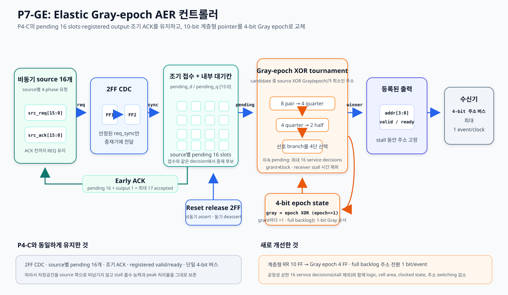
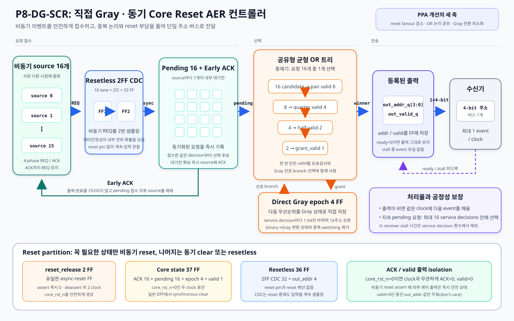
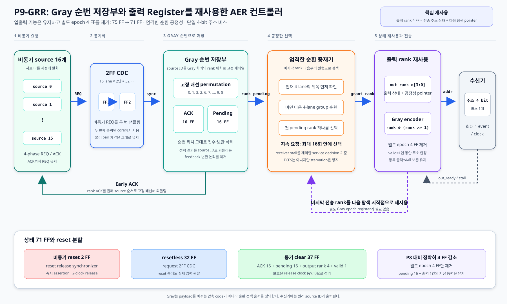
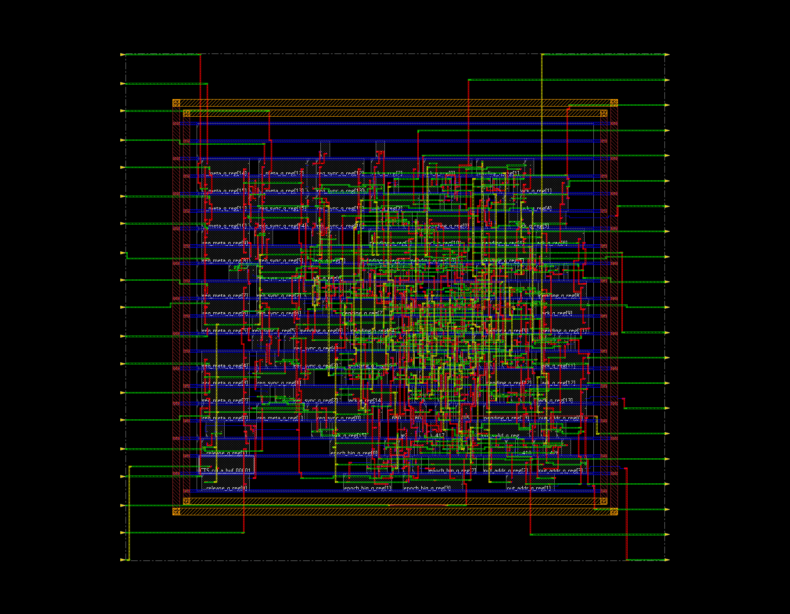
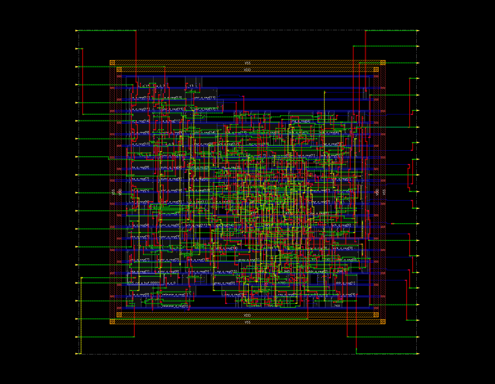
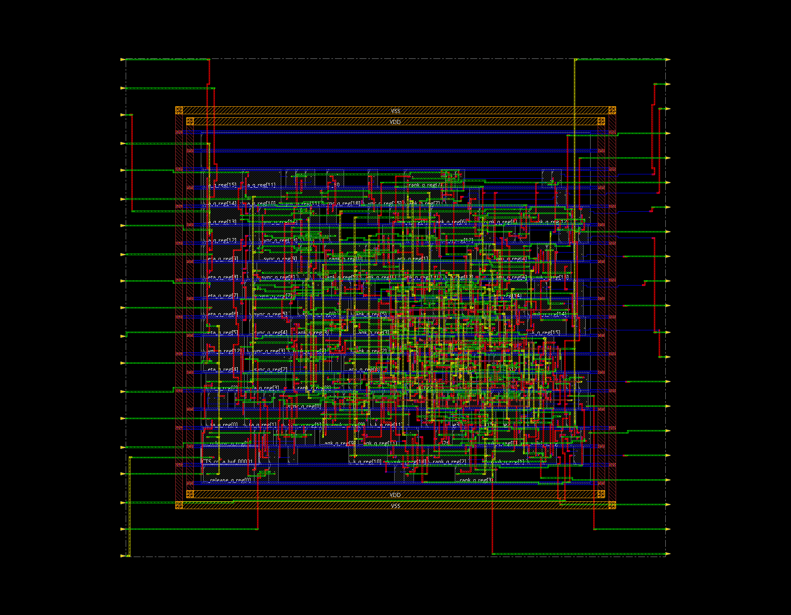
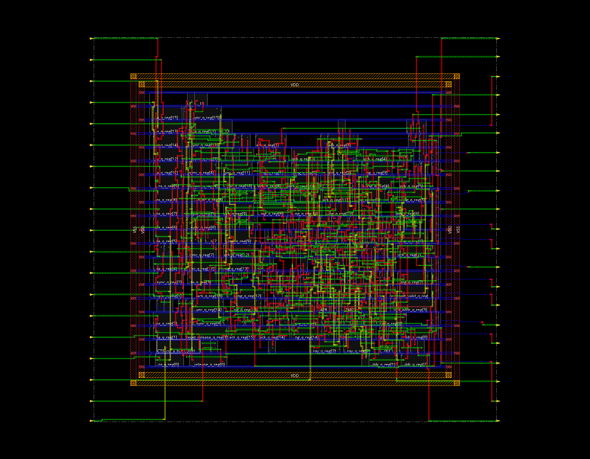

# Bio-mimic Neuron용 AER 컨트롤러 설계 보고서

## I. 설계 개요

### 1. 설계 요지

뉴런 회로는 자극을 받은 시점에 발화 이벤트를 만든다. 여러 뉴런의 출력을 각각 별도의 데이터선으로 전달하면 뉴런 수가 증가할수록 배선과 출력 핀도 함께 증가한다. AER(Address-Event Representation)은 이를 줄이기 위해 발화한 뉴런의 번호만 하나의 공용 주소 버스로 전달하는 통신 방식이다.

본 설계는 16개 뉴런의 비동기 발화 요청을 입력으로 받고, 선택한 뉴런의 번호를 하나의 4-bit 주소 버스로 출력한다. 여러 뉴런이 동시에 발화하면 컨트롤러가 전송 순서를 정하고, 수신기가 잠시 멈추면 이미 접수한 이벤트를 내부에 보관한다.

연구는 먼저 공통 clock 없이 요청과 응답만으로 동작하는 전통적 AER 구조를 T0-PPA로 구현하는 것에서 시작하였다. 전통 구조의 fixed priority, 내부 대기 공간 부재, 수신기 정체의 직접 전파와 비동기 중재 조건을 실제 RTL·합성·배치 결과로 확인하였다. 이후 비동기 요청을 동기식 회로로 안전하게 가져오고, 이벤트를 내부에 저장하며, 모든 뉴런에 처리 기회를 주는 P4-C를 구현하였다.

P7-GE는 P4-C의 입력·출력 규격, 이벤트 저장 능력과 최대 처리율을 유지하면서 10-bit 순번 상태를 4-bit Gray epoch로 줄였다. P8-DG-SCR은 여기서 기능을 더 줄이지 않고 Gray 상태, 선택 tree와 reset 배포 구조를 함께 다시 설계했다. 현재 주 설계 P9-GRR은 ACK와 pending을 Gray 순번으로 저장하고 출력 rank register를 다음 공정성 pointer로 재사용해 상태를 75 FF에서 71 FF로 줄였다. 서버 제공 FPR 180 nm reference kit에서 같은 경계탐색 절차로 hold를 각각 재최적화한 P8-DG-SCR(0.021 ns) 대비 post-route 셀 면적 5.10%, 기본 활동률 전력 2.55%, 동일 workload mapped-SAIF 전력 2.98%를 줄였고 clock-tree·timing·DRC·연결 검사를 통과했다.

### 2. 설계 목표와 범위

설계 목표는 다음과 같다.

1. 16개 비동기 뉴런 요청을 입력으로 받는다.
2. 발화한 뉴런의 원래 번호를 하나의 4-bit 주소 버스로 출력한다.
3. 수신기가 멈추거나 여러 요청이 겹쳐도 명시한 요청 유지 규약 안에서 이벤트를 보존한다.
4. 특정 뉴런이 계속 밀려나는 starvation을 방지한다.
5. 수신기가 준비되어 있고 대기 이벤트가 남아 있으면 clock마다 이벤트 하나를 전달한다.
6. 전통적 구조와 개선 구조를 합성 가능한 RTL로 구현하고 기능·등가성·timing·area·power를 검증한다.
7. 주최측 공식 공정 확정 전에는 서버 제공 FPR 180 nm reference kit에서 동일 조건의 잠정 PPA를 비교하고, 최종 개선본의 실제 배치·배선 결과를 확보한다.

합성 대상은 AER 컨트롤러다. 뉴런 source와 receiver는 검증을 위한 testbench model이며, 뉴런의 막전위 계산이나 2차 과제의 좌표·방향·공간 메모리 연산은 본 컨트롤러에 포함하지 않는다.

현재 완료 범위는 디지털 코어의 RTL, 기능 시뮬레이션, 논리 합성, 180 nm 배치·배선과 timing 분석이다. 입출력 pad ring, package, 제조용 최종 DRC/LVS, 실제 제작과 실리콘 측정은 포함하지 않는다.

### 3. 설계 발전 과정

각 단계에서는 문제와 개선 효과를 분리하기 위해 구조를 순차적으로 바꾸었다.

| 단계 | 해결한 문제 | 남은 문제 또는 다음 개선점 |
|---|---|---|
| T0-PPA | 공통 clock 없는 전통적 4-phase AER를 물리 비교 가능한 형태로 구현 | fixed priority, source별 pending 없음, 수신기 정체 직접 전파 |
| P4-C | 2FF 동기화, source별 pending, 조기 ACK, 공정한 순환 선택, registered output 확보 | 중재 순번을 저장하는 10-bit 상태와 주소 전환 비용 |
| P7-GE | 중재 상태를 4 bit로 줄이고 Gray 순서 선택 tree 적용 | 75개 상태 전체에 비동기 reset이 연결되고 일부 유효성 계산이 중복됨 |
| P8-DG-SCR | Direct Gray 상태, 공유 OR tree, 벡터 요청 접수와 reset partition 적용 | FCFS가 아니며 실제 발화 timestamp는 전송하지 않음 |
| P9-GRR | ACK·pending을 Gray rank 순서로 저장하고 출력 rank를 중재 pointer로 재사용해 71 FF 달성 | FCFS·timestamp 기능은 추가하지 않았으며 16-source 고정 RTL을 확장할 때 재검증 필요 |

P3 등 중간 설계의 세부 결과는 `results/`에 보존하였다. 본 보고서에서는 전통적 동작을 보여주는 T0-PPA, 기능 기반을 만든 P4-C, 공정한 Gray 중재를 완성한 P7-GE, reset 비용을 줄인 P8-DG-SCR과 출력 상태까지 재사용한 P9-GRR을 중심으로 설명한다.

## II. 설계기술 설명서

### 1. AER의 동작 원리

AER은 모든 뉴런의 내부 값을 계속 전송하지 않는다. 이벤트가 발생한 순간에 발화한 뉴런의 식별 번호만 주소 버스에 실어 보낸다.

예를 들어 5번 뉴런이 발화하면 다음 과정이 진행된다.

```text
5번 뉴런이 요청을 발생
    → 컨트롤러가 요청을 접수
    → 여러 대기 요청 중 5번을 선택
    → 주소 버스에 5를 출력
    → 수신기가 5번 뉴런의 이벤트로 처리
```

16개 source는 0부터 15까지의 번호로 구분되므로 필요한 최소 주소 폭은 `ceil(log2(16)) = 4 bit`다. 16개의 전용 데이터 경로 대신 주소 경로 하나를 공유하므로 출력 배선을 줄일 수 있다. 반면 여러 뉴런이 동시에 발화하면 버스를 사용할 순서를 결정하는 중재기와 대기 이벤트를 보관하는 구조가 필요하다.

본 설계의 전송 word에는 source ID만 들어간다. 발화 크기, 막전위와 원래 발화 시각을 나타내는 timestamp는 포함하지 않는다. 수신기는 출력 transaction이 발생한 시각을 볼 수 있지만, 이 시각에는 controller 내부의 동기화와 대기·중재 시간이 포함된다. 따라서 출력 시각만으로 원래 발화 시각을 복원할 수 없다.

### 2. 전통형과 개선형의 인터페이스

서로 다른 단계의 ACK를 같은 의미로 해석하면 안 된다. T0-PPA와 P7-GE/P8-DG-SCR/P9-GRR은 source 쪽 요청 규약을 공유하지만 receiver 쪽 출력 규약은 다르다.

#### 2.1 Source와 controller 사이

| 신호 | T0-PPA에서의 의미 | P7-GE/P8-DG-SCR/P9-GRR에서의 의미 |
|---|---|---|
| `src_req[15:0]` | 각 뉴런이 이벤트 발생을 알리는 요청 | 각 뉴런이 이벤트 발생을 알리는 비동기 요청 |
| `src_ack[15:0]` | Receiver가 선택 주소를 받은 뒤 source로 반환되는 완료 응답 | Event가 pending 또는 output register에 접수됐다는 조기 응답 |

Source는 `src_req`를 1로 올린 뒤 `src_ack=1`을 확인할 때까지 요청을 유지한다. ACK를 확인하면 요청을 0으로 내리고, controller가 ACK를 0으로 내린 뒤 다음 이벤트를 요청한다. Source당 한 번에 요청 하나만 존재한다는 계약이다.

두 설계는 `REQ 상승 → ACK 상승 → REQ 하강 → ACK 하강`이라는 source-side 신호 순서는 공유하지만 ACK의 완료 지점은 다르다. T0-PPA의 ACK는 receiver 수신 완료를 포함하고, P7-GE의 ACK는 controller 내부 접수 완료를 뜻한다.

P7-GE의 `src_ack`는 receiver가 이벤트를 소비했다는 뜻이 아니다. 동기화된 요청이 source별 대기칸에 저장되거나, 같은 처리 결정에서 곧바로 output register에 실리면 ACK가 올라간다. 실제 출력 완료는 `out_valid && out_ready`일 때 성립한다.

#### 2.2 T0-PPA와 receiver 사이

T0-PPA는 `aer_addr`, `aer_req`, `aer_ack`를 사용하는 active-high 4-phase handshake로 receiver와 통신한다.

1. Controller가 주소를 먼저 안정시킨 뒤 `aer_req`를 1로 올린다.
2. Receiver가 주소를 읽고 `aer_ack`를 1로 올린다.
3. Controller가 응답을 확인하고 `aer_req`를 0으로 내린다.
4. Receiver가 `aer_ack`를 0으로 내려 idle 상태로 돌아간다.


주소는 receiver가 ACK를 올릴 때까지 변하면 안 된다. 데이터인 주소가 먼저 안정되고 제어 신호가 나중에 도착해야 하는 조건을 bundled-data timing이라고 한다.

#### 2.3 P7-GE/P8-DG-SCR/P9-GRR과 receiver 사이

P7-GE, P8-DG-SCR과 P9-GRR은 동기식 후단 모듈에 연결하기 위해 `out_addr`, `out_valid`, `out_ready`를 사용한다. Controller가 유효한 주소를 제시하면 `out_valid=1`이 되고, receiver가 받을 준비가 되면 `out_ready=1`이 된다. 두 신호가 함께 1인 clock edge에서 이벤트 하나가 전달된다.

Receiver가 준비되지 않으면 P7-GE는 `out_valid`와 `out_addr`를 그대로 유지한다. Receiver가 계속 준비되어 있고 내부에 대기 이벤트가 남아 있으면 매 clock마다 현재 이벤트를 넘기면서 다음 이벤트를 output register에 채울 수 있다.

### 3. 전통적 비동기 기준 설계 T0-PPA

#### 3.1 구조와 동작

T0-PPA에는 전체 회로를 진행시키는 global clock이 없다. Source 요청이 들어오면 번호가 가장 작은 요청을 선택하고, 선택 주소를 latch에 보관한 뒤 receiver와 4-phase handshake를 수행한다.


초기 T0는 교차 결합 NOR 되먹임으로 주소와 busy 상태를 저장했다. 이 구조는 논리적으로 상태를 기억하지만 일반 디지털 합성 도구는 조합 feedback loop로 판단해 경로를 끊거나 최적화할 수 있다. 유한 gate delay를 반영한 시험에서도 주소가 잠시 흔들리는 문제가 확인됐다.

T0-PPA는 저장부를 180 nm library에서 특성이 제공되는 `TLATRX1` 투명 latch 5개로 교체하였다. 주소가 안정되기 전에 request가 먼저 올라가지 않도록 `DLY4X1` delay cell 6개도 물리적으로 보존했다. 이 변경으로 합성 도구가 임의로 loop를 끊지 않아도 되는 구조를 만들었다.

#### 3.2 Bundled-data 시간 조건

Post-route에서 가장 느린 주소 경로는 1.915 ns, 가장 빠른 request capture 제어 경로는 2.591 ns였다.

```text
relative timing margin
  = 가장 빠른 control 도착 - 가장 느린 address 도착
  = 2.591 ns - 1.915 ns
  = +0.676 ns
```

따라서 측정한 corner에서는 주소가 제어보다 0.676 ns 먼저 안정됐다. 이 결과는 명시한 relative-timing 조건을 만족한다는 뜻이며, 모든 비동기 입력 조합의 아날로그 준안정성을 해결했다는 뜻은 아니다.

#### 3.3 전통 구조에서 확인한 한계

- **고정 우선순위:** 낮은 번호가 계속 요청하면 높은 번호 source가 계속 밀릴 수 있다.
- **Source별 pending/FIFO 부재:** 선택되지 않은 source는 요청을 계속 유지해야 하며 짧은 pulse는 보존하지 못한다.
- **직접적인 backpressure:** Receiver ACK가 늦어지면 controller와 source까지 모두 기다린다.
- **Return-to-zero 시간:** 매 event마다 request와 acknowledge를 0으로 돌려야 한다.
- **비동기 중재 조건:** 현재 library에는 characterized MUTEX가 없다. Grant를 정하는 aperture 동안 request set이 안정적이라는 동작 조건이 필요하다.

T0-PPA의 latch는 주소와 현재 handshake 상태를 기억하지만, 여러 source의 이벤트를 미리 접수하는 source별 pending storage는 아니다.

### 4. P7-GE가 완성한 공정한 Gray 중재 흐름

P7-GE는 비동기 source와 동기식 후단 사이에 놓이는 혼합형 AER 컨트롤러다. Source는 원하는 시점에 요청하지만, controller 내부에서는 동기화된 요청만 clock에 맞춰 저장하고 선택한다.

```text
비동기 뉴런 요청
    → 2단 동기화
    → source별 대기칸에 접수
    → 다음 전송 source 선택
    → output register에 주소 저장
    → valid/ready로 후단에 전달
```



각 블록은 다음 문제를 해결한다.

| 블록 | 해결하는 문제 |
|---|---|
| 2FF synchronizer | clock과 관계없이 바뀌는 요청을 내부 동기식 회로에서 사용 |
| `pending[15:0]` | 동시 요청과 receiver stall 중 이벤트를 source별로 기억 |
| Early ACK | Receiver가 막혀도 controller에 저장된 source를 먼저 재무장 |
| Gray-epoch 중재기 | 적은 상태로 모든 지속 요청에 처리 기회 제공 |
| Registered output | Receiver stall 동안 주소와 valid를 안정적으로 유지 |
| Reset synchronizer | Reset은 즉시 시작하되 내부 해제는 clock edge에 맞춤 |

### 5. 비동기 요청의 동기화

뉴런 요청은 controller clock edge 근처에서도 변할 수 있다. 이 신호를 바로 중재 논리에 사용하면 첫 플립플롭이 0과 1 사이에서 결정을 늦추는 준안정 상태에 들어갈 수 있다.

P7-GE는 각 요청을 두 개의 플립플롭에 차례로 통과시킨다. 첫 번째 플립플롭은 비동기 전이를 받아들이고, 두 번째 플립플롭의 출력만 controller 상태 계산에 사용한다. RTL의 `ASYNC_REG` 속성은 Vivado가 사용하지만 현재 Cadence Genus는 이를 무시한다. 따라서 최종 P8 Cadence flow에서는 mapped-cell preserve, Innovus physical group과 pair max-delay를 별도로 적용한다.

이 구조는 일반적인 CDC(clock-domain crossing) 위험을 낮추는 표준적인 동기화 방식이다. 수행한 phase sweep은 여러 clock 상대 시점에서 held request가 한 번씩 접수되는지를 확인한 디지털 시험이다. 실제 실리콘 MTBF를 측정하거나 준안정성이 절대 발생하지 않음을 증명하는 시험은 아니다.

### 6. 이벤트 보관과 조기 ACK

동기화된 요청이 보이면 해당 source의 `pending` bit를 1로 만든다. 이 bit는 “이 source의 이벤트 하나가 controller 안에서 전송을 기다리고 있다”는 뜻이다.

P7-GE는 source별 pending 16개와 주소 하나를 보관하는 registered output 한 칸을 가진다. 따라서 controller가 접수했지만 아직 receiver가 소비하지 않은 이벤트는 최대 17개까지 존재할 수 있다. 이는 저장 용량이며, 한 clock에 여러 이벤트를 보내는 bandwidth가 아니다. 출력 버스는 한 개이므로 최고 처리율은 1 event/clock이다.

이벤트가 pending에 기록되거나 같은 처리 결정에서 곧바로 output register에 실리면 source ACK를 올린다. Receiver 전송보다 먼저 응답하므로 이를 early ACK라고 한다. Source는 ACK를 받은 뒤 4-phase 절차를 끝내고 다음 요청을 준비할 수 있다.

한 source의 pending에는 이벤트 하나만 저장된다. 같은 source의 다음 이벤트는 이전 요청과 ACK가 모두 0으로 돌아온 뒤에만 제시해야 한다. Source가 ACK 전에 요청을 내리거나, 재무장되기 전에 새 이벤트로 덮어쓰는 동작은 보장하지 않는다.

P4-C와 P7-GE는 새 요청을 `pending_d=1`로 만드는 계산 결과를 같은 decision의 중재 후보로 사용한다. Pending register에 기록한 뒤 다음 clock까지 기다리지 않고 즉시 후보에 포함시키는 이 방법을 pending next-state cut-through라고 한다. 출력 자체는 여전히 register를 거치므로 receiver stall 동안 안정적으로 유지된다.

### 7. Gray-epoch 중재 구조

#### 7.1 P4-C 중재기의 비용

P4-C는 16개 source를 네 개씩 네 그룹으로 나눈 계층형 round-robin을 사용한다. 어느 그룹을 먼저 볼지 기억하는 2-bit 상태와 각 그룹 내부의 다음 위치를 기억하는 8-bit 상태가 필요하므로 총 10 bit의 중재 상태를 저장한다.

P7-GE는 저장부와 출력부를 바꾸지 않고 이 중재 상태와 선택 논리만 개선한다. 다음 처리 기준을 4-bit 숫자 하나로 표현해 상태 bit를 10개에서 4개로 줄인다.

#### 7.2 Epoch와 Gray 순서

4-bit 내부 순번을 epoch라고 한다. Epoch는 원래 이벤트의 timestamp가 아니라, 중재기가 다음에 어느 주소를 우선할지 나타내는 차례표다. Event가 output register에 새로 실리는 service decision마다 1씩 증가하며 0부터 15까지 순환한다.

현재 epoch를 Gray code로 바꾸면 다음 주소 순서가 된다.

```text
0, 1, 3, 2, 6, 7, 5, 4, 12, 13, 15, 14, 10, 11, 9, 8
```

Gray code는 이웃한 값 사이에서 한 bit만 달라지도록 배열한 code다. 모든 source가 계속 pending인 full-backlog 조건에서는 현재 Gray 값과 같은 source가 항상 존재하므로 P7-GE가 위 순서를 그대로 출력한다. 주소를 새 code로 인코딩하는 것이 아니라 원래 source ID를 선택하는 순서를 정하는 것이므로 decoder는 필요하지 않다.

Sparse traffic에서는 Gray 순서의 다음 source가 비어 있을 수 있다. 이때는 비어 있는 source를 건너뛰므로 연속 출력 주소가 항상 한 bit만 바뀌는 것은 아니다.

#### 7.3 XOR tournament 선택 tree

P7-GE는 대기 source 주소와 현재 Gray 선호값을 XOR하고, 이 4-bit XOR 결과를 unsigned 숫자로 보았을 때 가장 작은 source를 선택한다. 이는 XOR 결과의 1 개수를 세는 Hamming distance 비교가 아니다.

회로는 16개 후보를 한 번에 길게 비교하지 않는다. 먼저 각 주소 쌍에 pending이 있는지 확인하고, 네 주소 단위와 여덟 주소 단위로 묶는다. 가장 선호하는 절반에 후보가 있으면 그쪽을 선택하고, 비어 있으면 반대쪽으로 이동한다. 이 판단을 주소 bit 네 단계에 걸쳐 반복해 실제 대기 source 하나를 찾는다. 토너먼트 대진표처럼 후보 범위를 줄이는 조합논리 tree이므로 XOR tournament라고 부른다.

#### 7.4 공정성 상한

각 source 주소는 16개의 Gray epoch 중 한 번씩 정확한 선호값이 된다. Source `i`가 계속 pending이면 `Gray(epoch)=i`인 차례에 XOR 결과가 0이 되어 반드시 선택된다.

따라서 지속 pending source는 receiver stall을 제외한 최대 16회의 service decision 안에 처리된다. 이 값은 16 clock이나 고정된 실제 시간을 뜻하지 않는다. `out_ready=0`이어도 비어 있던 output register에는 이벤트 하나를 미리 실을 수 있지만, register가 찬 뒤에는 receiver가 현재 이벤트를 소비할 때까지 추가 service decision이 진행되지 않는다. 또한 이 정책은 starvation을 막지만 실제 요청 도착 순서를 보존하는 FCFS는 아니다.

### 8. 출력과 reset 구조

선택한 source 주소는 4-bit output register에 저장된다. `out_valid=1`인 동안 receiver가 `out_ready=0`이면 주소와 valid는 바뀌지 않는다. Receiver가 준비된 clock edge에서 현재 이벤트가 전달되며, 같은 edge에서 다음 pending event를 output register에 채울 수 있어 full backlog에서 1 event/clock을 유지한다.

Reset은 외부에서 0으로 내려가면 비동기적으로 즉시 assert된다. 해제는 2단 reset synchronizer를 거쳐 두 clock 뒤에 내부 회로로 전달된다. 최종 RTL은 `ROBUST_RESET=1`을 기본값으로 사용한다. `ROBUST_RESET=0`은 reset synchronizer의 PPA 비용을 분리하기 위한 실험형이며 최종 설계가 아니다.

### 9. P7-GE의 설계 차별점

P7-GE는 저장 용량이나 출력 버스를 줄여 면적을 낮춘 구조가 아니다. P4-C와 다음 조건을 그대로 유지한다.

- 16개 비동기 source와 4-bit 출력 버스 1개
- Source별 pending 16개와 registered output 1개
- Source-side 4-phase handshake와 early ACK
- 2FF CDC
- Receiver-facing registered valid/ready
- Full backlog에서 1 event/clock 최대 처리율

두 설계는 입력 CDC, pending 용량, output 구조와 workload 계약을 동일하게 유지한다. P7-GE는 중재 상태와 선택 tree를 주로 변경하고, 최종 robust형에는 P4-C에 없던 reset-release synchronizer 2 FF를 추가했다. 제시한 PPA는 이 reset 비용까지 포함한 순개선 결과다.

### 10. P8 단계 제안 구조 P8-DG-SCR

P8-DG-SCR은 P7-GE의 이벤트 전송 기능을 그대로 사용한다. Source별 2FF CDC, pending 16개, registered output 한 칸, early ACK, 4-bit 버스 한 개, 최대 1 event/clock과 최대 16 service decisions의 공정성 상한은 변하지 않는다. 개선 대상은 이벤트 수가 아니라 같은 기능을 구현하는 내부 상태와 배선 비용이다.



#### 10.1 Direct Gray 상태와 공유 선택 tree

P7-GE는 4-bit binary epoch를 저장하고 조합 XOR로 Gray preference를 만들었다. P8은 다음 Gray 값을 상태로 직접 저장한다. Service decision마다 epoch bit 하나만 바뀌며 full-backlog 출력 순서는 P7과 같다.

16개 candidate의 유효성은 `pair 8개 → quarter 4개 → half 2개 → grant 1개`의 균형 OR tree 한 번으로 계산한다. 각 선택 단계가 source 요청을 다시 OR하지 않고 같은 중간 결과를 공유한다. 새 요청 접수도 source별 반복 조건 대신 `accept_mask` 벡터식으로 정리했다.

#### 10.2 Reset partition

P8도 총 상태 수는 75 FF다. 그러나 모든 FF에 같은 비동기 reset을 배포하지 않고 다음처럼 역할을 나눈다.

| Reset 분류 | 상태 | 수량 | 동작 |
|---|---|---:|---|
| 비동기 reset | `reset_release_q[1:0]` | 2 | Assertion을 즉시 받고 release를 clock 두 번에 동기화 |
| resetless | Request synchronizer 32 + output address 4 | 36 | Reset 중 입력을 계속 샘플; valid=0일 때 주소는 무효 |
| 동기 clear | ACK 16 + pending 16 + Gray epoch 4 + valid 1 | 37 | 두 release edge 동안 0으로 정리 |

외부 reset이 assertion되면 `core_rst_n` isolation이 ACK와 valid를 clock 없이 즉시 0으로 만든다. Deassertion 직후에는 isolation을 풀지 않는다. 첫 번째와 두 번째 clock edge에서 동기-clear 상태를 정리한 뒤에만 정상 출력을 허용한다. 따라서 reset release 뒤 clock 두 번이 공급된다는 전제가 필요하다.

Clock이 멈춘 상태, ACK와 stalled valid가 활성인 transaction 중간, reset 중 request가 high인 조건을 RTL과 gate simulation으로 시험했다. Assertion 직후 safe-low, 두 release edge 전 stale state 차단, 재시작 후 요청의 정확한 1회 접수와 전송을 모두 확인했다.

### 11. P9-GRR: Gray-rank register reuse

P9-GRR은 P8의 2FF CDC, source별 pending 16개, early ACK, registered output 한 칸, 단일 4-bit 버스와 최대 1 event/clock을 유지한다. 바꾼 부분은 요청을 내부에 배열하는 순서와 공정성 상태의 저장 위치다.



#### 11.1 Gray 주소의 차례 번호를 내부 기준으로 사용

P8의 full-backlog 선택 순서는 다음 reflected Gray 순서다.

```text
rank:       0, 1, 2, 3, 4, 5, 6, 7, 8, 9, 10, 11, 12, 13, 14, 15
source ID:  0, 1, 3, 2, 6, 7, 5, 4, 12, 13, 15, 14, 10, 11, 9, 8
```

P9-GRR은 동기화된 request를 위 rank 순서로 고정 재배열하고 ACK와 pending도 같은 위치에 저장한다. 이 permutation은 동작 중 계산하는 encoder가 아니라 source 선과 rank 저장 위치를 고정 연결한 배선이다. 중재기가 rank 하나를 선택하면 동일한 위치의 pending bit를 바로 지울 수 있어, 선택 결과를 source ID로 되돌리던 feedback 변환이 필요 없다. ACK 출력은 반대 방향의 고정 배선으로 원래 source에 돌아간다.

#### 11.2 출력 rank를 공정성 pointer로 재사용

엄격한 순환 중재기는 마지막으로 처리한 rank의 바로 다음 위치부터 원형으로 pending을 검색한다. P9-GRR의 `out_rank_q[3:0]`는 현재 registered output을 표현하는 동시에 다음 탐색의 마지막 처리 위치가 된다. 외부 `out_addr`에는 `out_rank_q XOR (out_rank_q >> 1)`을 적용해 원래 source ID를 제시한다.

P8은 출력 주소 4 FF와 별도 Gray epoch 4 FF를 사용했지만 P9-GRR은 rank 4 FF 하나가 두 역할을 맡는다. 전체 상태는 다음과 같이 75 FF에서 71 FF로 줄어든다.

| 상태 분류 | 수량 | 역할 |
|---|---:|---|
| Reset release synchronizer | 2 FF | 비동기 assertion, 2-clock synchronous release |
| Request synchronizer | 32 FF | 비동기 source 요청의 2FF CDC |
| ACK + pending | 32 FF | 16개 source의 handshake 상태와 내부 대기칸 |
| Output rank + valid | 5 FF | 등록 출력이며 rank 4 FF는 공정성 pointer도 겸함 |
| **합계** | **71 FF** | P8의 별도 epoch 4 FF 제거 |

줄어든 것은 중복 순번 상태뿐이다. Source별 pending 16개와 output register 한 칸의 저장 능력, early ACK와 수신기 stall 중 출력 보존은 유지된다. 계속 pending인 source는 receiver stall을 제외한 최대 16회의 service decision 안에 선택된다. 다만 실제 도착 순서를 보존하는 FCFS가 아니며 timestamp를 payload에 싣지 않는다.

## III. 검증 및 구현 결과

### 1. 검증 조건

기능 시험과 물리 구현 시험의 목적을 구분하였다.

#### 1.1 기능 시험

- 16 sources, source당 한 번에 요청 하나
- Source는 ACK가 올라올 때까지 request 유지
- 단일 요청, 동시 요청, 반복 burst, receiver stall, 포화 입력, hotspot, reset 포함
- Scoreboard로 요청 source와 출력 주소를 비교
- Stall 중 `out_valid`와 `out_addr`가 유지되는지 assertion으로 확인
- Pass marker와 event accounting으로 성공 판정

#### 1.2 P4-C와 P7-GE의 공정 비교

ACK 속도에 따라 다음 request 도착 시간이 바뀌지 않도록 source 바깥에 동일한 demand FIFO를 두었다. P4-C와 P7-GE에 같은 101개 입력 이벤트와 같은 도착 시각을 제공하고 다음 시간을 분리해 측정했다.

- Demand가 source request로 제시되기 전 외부 대기
- Request부터 controller ACK까지의 source 보유 시간
- ACK부터 최종 `valid && ready` 출력까지의 내부 대기
- 최초 demand부터 최종 출력까지의 end-to-end 시간

#### 1.3 ASIC 물리 조건

- 서버 제공 FPR 180 nm digital reference 표준셀. 주최측 공식 공정으로 확정된 값은 아님
- Genus 합성: clock period 10 ns, I/O delay 1 ns, explicit clock uncertainty 없음
- Innovus: clock period 10 ns, clock uncertainty 0.2 ns
- Metal1-Metal6
- Core target utilization 60%
- P4-C와 P7-GE에 동일한 floorplanning 방식(aspect ratio 1.0, target utilization 60%, margin 20 µm), power-ring 규칙과 timing 제약 적용. 실제 core 크기는 각 netlist의 셀 면적에 따라 산정
- Post-route setup/hold, recovery/removal, power, DRC와 connectivity 확인

### 2. 기능 및 공정성 검증

| 검증 항목 | 결과 | 이 결과가 의미하는 것 |
|---|---:|---|
| 종합 기능 시험 | 139/139, 오류 0 | 해당 시험에서 유실·중복 없이 전달 |
| CDC phase sweep RTL | 192/192, 오류 0 | 여러 clock 상대 시점에서 held request를 한 번씩 접수 |
| CDC phase sweep gate | 192/192, 오류 0 | 합성 netlist에서도 동일한 디지털 요청 규약 유지 |
| 16개 source 동시 대기 순서 | 16개 Gray 주소 일치 | 모든 source를 한 번씩 선택하고 예상 순서 유지 |
| 64개 대기 요청 조합 | 64/64, 오류 0 | 일부 source만 기다릴 때도 선택 결과 일치 |
| 가장 불리한 지속 요청 | 16 service decisions | Starvation 상한 확인 |
| 수신기 정지 중 출력 유지 | 오류 0 | Receiver 정지 중 valid와 address 유지 |

Vivado FPGA 합성 sanity check에서 최종 robust형은 92 LUT와 75 FF를 사용했고, 10 ns 조건의 register-to-register slack은 +4.238 ns였다. Reset synchronizer를 제거한 비교형은 91 LUT와 73 FF였지만 reset 해제 안정성을 포함하지 않으므로 최종 설계로 사용하지 않는다. ASIC PPA 판단은 이후의 Genus와 Innovus 결과를 기준으로 한다.

Broad regression의 평균 지연은 P4-C 15.741 cycles, P7-GE 15.582 cycles였고 최대 지연은 두 설계 모두 28 cycles였다. 이 시험에서는 각 source가 ACK를 받은 뒤 다음 요청을 만들기 때문에 중재 정책에 따라 입력 시점도 일부 달라질 수 있다. 실제 도착 시점을 고정한 직접 비교는 다음 절의 fixed-demand 시험을 주 기준으로 사용한다.

### 3. 동일 입력 workload 비교

| 항목 | P4-C | P7-GE | 해석 |
|---|---:|---:|---|
| 전달 이벤트 / 오류 | 101 / 0 | 101 / 0 | 두 설계 모두 유실·중복 없음 |
| 포화 구간 첫 출력-마지막 출력 시간 | 630 ns | 630 ns | 1 event/clock 최대 처리율 동일 |
| 수신기 정지 해제 전 ACK | 5 | 5 | 시험에서 관찰한 early-ACK 동작 동일 |
| Stall 해제 시 아직 제시되지 않은 demand | 0 | 0 | 입력 저장 위치와 source decoupling 동일 |
| 포화 구간 입력 도착-최종 출력 평균 | 354 ns | 354 ns | 해당 workload의 end-to-end 평균 동일 |
| 전체 출력 주소 bit 전환 | 174 | **106** | 해당 trace에서 39.08% 감소 |
| 64-event 포화 구간 주소 bit 전환 | 118 | **63** | P7-GE는 인접 전송당 1 bit 전환 |

이 시험에서 같은 것은 입력 source, 이벤트 수와 demand 도착 시각이다. P4-C와 P7-GE의 출력 순서는 중재 정책 때문에 다르다. P7-GE는 출력 순서를 Gray 형태로 재배열해 이 workload의 주소 전환을 39.08% 줄였다. 모든 sparse workload에서 같은 감소율을 보장하는 값은 아니며, 주소 toggle 감소가 곧 전체 칩 전력 39.08% 감소를 뜻하지도 않는다.

### 4. Genus 논리 합성과 Conformal 등가성

| 항목 | P4-C | P7-GE | 변화 |
|---|---:|---:|---:|
| 표준셀 수 | 308 | **236** | -23.38% |
| 셀 면적 | 8,568.807 µm² | **7,248.226 µm²** | -15.41% |
| 가장 긴 data path | 2.990 ns | **2.508 ns** | -16.12% |
| Setup slack | +6.853 ns | **+7.268 ns** | +0.415 ns |
| Vectorless power | 1.165790 mW | **0.887720 mW** | -23.85% |

P7-GE는 reset synchronizer 2 FF를 포함한 robust형으로 합성했다. 중재 상태가 10 bit에서 4 bit로 줄었고, 후보 선택 회로도 더 작게 매핑되어 sequential cell뿐 아니라 조합 셀과 가장 긴 계산 경로가 함께 감소했다.

Conformal 논리 등가성 검사(LEC)에서는 primary output 21개와 state point 75개, 총 96개 비교점이 모두 equivalent였다. Nonequivalent, abort, unknown point는 0이었다. 이는 RTL이 표현한 출력과 상태 전이가 Genus netlist에도 보존됐다는 뜻이다.

### 5. Innovus 180 nm 배치·배선

| 항목 | P4-C | P7-GE | 변화 |
|---|---:|---:|---:|
| Core 크기 | 123.420 × 115.920 µm | **114.180 × 105.840 µm** | 축소 |
| 배치 후 셀 수 | 362 | **292** | -19.34% |
| 셀 면적 | 9,353.837 µm² | **8,063.194 µm²** | -13.80% |
| Setup slack | +3.547 ns | **+4.350 ns** | +0.803 ns |
| Hold slack | +0.004 ns | **+0.006 ns** | +0.002 ns |
| Post-route vectorless power | 0.96067953 mW | **0.85619239 mW** | -10.88% |
| DRC / connectivity | 0 / 0 | **0 / 0** | 통과 |

Setup은 다음 clock edge 전에 데이터가 도착해야 하는 조건이고, hold는 같은 edge 직후 데이터가 너무 빨리 바뀌지 않아야 하는 조건이다. 두 값이 모두 양수이므로 10 ns 목표에서 배치·배선 후 timing 조건을 만족했다.

Robust reset의 내부 해제 경로도 별도로 확인했다. Recovery slack은 +8.366 ns, removal slack은 +0.340 ns로 모두 양수였다.

DRC 0은 사용한 Innovus rule deck에서 신호 배선 위반을 찾지 못했다는 뜻이고, connectivity 0은 끊기거나 잘못 연결된 regular net이 없다는 뜻이다. 이는 core P&R 검사를 통과했다는 근거이며 foundry sign-off와 실리콘 동작을 대신하지 않는다.

### 6. 실제 배치·배선 화면

아래 화면은 도식화한 예상도가 아니다. P7-GE의 최종 post-route database를 Innovus에서 복원한 뒤 `gui_dump_picture`로 직접 출력했다.



화면 가운데의 작은 사각형은 표준 논리 셀이고, 여러 색의 선은 power ring과 Metal1-Metal6 신호 배선이다. 외곽으로 이어지는 선은 controller의 입력과 출력 pin으로 연결된다.

전통적 baseline T0-PPA도 동일 공정 library를 사용해 배치·배선했다.


### 7. T0-PPA의 물리 결과와 해석

| 항목 | T0-PPA 결과 | 의미 |
|---|---:|---|
| Xcelium event accounting | 139/139, 오류 0 | 명시한 request-stability 조건의 기능 동작 |
| 경합 digital stress | 84 trials, 오류 0 | 유실 없이 처리 |
| 첫 선택이 도착순서와 달라진 시험 | 42/84 | Fixed priority가 실제 도착 순서를 보존하지 않음 |
| Conformal LEC | 26/26 equivalent | RTL과 합성 netlist 논리 보존 |
| Post-route cells | 100 | Latch 5개와 delay cell 6개 포함 |
| Cell area | 1,397.088 µm² | Core logic cell 합계 |
| Default-activity power | 0.03483881 mW | Clock이 없는 전통 구조의 도구 추정 |
| Bundled-data margin | +0.676 ns | 측정 corner에서 주소가 control보다 먼저 안정 |
| DRC / connectivity | 0 / 0 | Core 배선·연결 검사 통과 |

T0-PPA는 P7-GE보다 훨씬 작고 vectorless power도 낮다. 그러나 T0-PPA에는 2FF CDC, source별 pending 16개, registered output, starvation 상한과 1 event/clock 동기식 출력이 없다. 또한 T0-PPA는 self-timed relative timing으로 평가하고 P7-GE는 10 ns clock STA로 평가한다. 따라서 두 값을 동일 기능 회로의 직접적인 PPA 우열로 해석하지 않는다. T0-PPA는 전통 구조의 최소 비용과 한계를 보여주는 기준이다.

### 8. Power 결과의 범위

본문의 주 비교값은 P4-C와 P7-GE에 같은 기본 활동률을 적용한 Genus 및 Innovus vectorless power다. 이는 동일 물리 복잡도를 비교하는 도구 추정치이며 실제 실리콘 전력이나 spike당 energy 측정값이 아니다.

동일한 101-event fixed-demand workload에서 신호 전환을 기록한 VCD(Value Change Dump)를 각 DUT boundary에서 별도로 생성해 Genus에 적용했다. P4-C는 1.048950 mW, P7-GE는 0.686120 mW로 계산됐다. 그러나 두 설계의 내부 signal과 출력 순서, simulation 종료 시각이 같지 않다. 합성 회로의 sequential signal 가운데 VCD 활동값이 연결된 비율(annotation coverage)도 P4-C 82.75%, P7-GE 100%로 다르다. 따라서 명목 감소율 34.59%는 실제 입력 전환을 반영한 보조 관찰로만 제시하며 sign-off 전력 개선 수치로 사용하지 않는다.

P9 후보 비교에서는 동일 101-event workload의 switching activity를 mapped netlist와 post-route database에 연결한 SAIF 추정도 추가했다. Vectorless power는 trace 없이 도구의 기본 활동률을 사용하고, mapped-SAIF power는 해당 workload에서 관찰한 실제 전환을 연결한다. 후자가 이 시험에는 더 구체적이지만 실제 ECG/SNN spike 분포, pad·receiver load, silicon power나 energy/event 측정을 대신하지 않는다.

### 9. 제외한 실험 구조

P7-GE-FT는 receiver가 준비된 경우 중재 결과를 output register를 거치지 않고 직접 보여주는 fall-through 구조다. 기능 시험에서는 no-stall latency가 1 cycle 감소했고, stall 안정성과 1 event/clock 처리율도 유지했다.

그러나 10 ns interface 조건에서 register-to-output data path가 8.942 ns, slack이 -2.380 ns로 측정됐다. 내부 register 경로가 통과하더라도 출력 setup 조건을 만족하지 못하므로 최종 설계로 채택하지 않았다. 빠른 기능 결과보다 물리 timing closure를 우선한 결정이다.

### 10. P8-DG-SCR 기능·reset 검증

P8은 P7과 동일한 broad, fairness, CDC와 fixed-demand 시험을 수행했다.

| 검증 항목 | RTL | 합성 gate | Cadence Xcelium |
|---|---:|---:|---:|
| Broad event accounting | 139/139, 오류 0 | 139/139, 오류 0 | 139/139, 오류 0 |
| CDC phase sweep | 192/192, 오류 0 | 192/192, 오류 0 | 192/192, 오류 0 |
| Random pending mask | 64/64, 오류 0 | 64/64, 오류 0 | 64/64, 오류 0 |
| 최악 지속 요청 위치 | 16 service decisions | 16 service decisions | 16 service decisions |
| Clockless·mid-phase reset | 통과 | 통과 | 통과 |

동일 101-event fixed-demand workload에서 P7과 P8은 이벤트 101개, 오류 0, 포화 출력 span 630 ns, 평균 demand-to-output 354 ns, stall 해제 전 ACK 5개와 주소 bit 전환 106회를 동일하게 기록했다. P8의 PPA 이득은 출력 순서나 저장 능력을 줄인 결과가 아니다.

### 11. P8-DG-SCR Genus·LEC 결과

| 항목 | P7-GE | P8-DG-SCR | 변화 |
|---|---:|---:|---:|
| 표준셀 수 | 236 | **232** | -1.70% |
| 셀 면적 | 7,248.226 µm² | **6,383.362 µm²** | **-11.93%** |
| 가장 긴 data path | **2.508 ns** | 3.130 ns | +0.622 ns |
| Setup slack | **+7.268 ns** | +6.657 ns | -0.611 ns |
| Vectorless power | 0.887720 mW | **0.848839 mW** | -4.38% |
| 동일 101-event VCD power(보조 관찰) | 0.686263 mW | **0.620896 mW** | **-9.525%** |

합성 면적 감소의 주원인은 reset partition이다. 두 설계 모두 상태 FF는 75개지만 sequential cell area가 5,255.712에서 4,144.694 µm²로 감소했다. 반면 조합·inverter·buffer 면적은 1,992.514에서 2,238.667 µm²로 증가했다. 따라서 shared tree와 vector 접수식이 RTL의 중복 표현을 정리했다는 사실과, mapped 조합 면적이 줄었다는 주장은 구분한다.

두 VCD run은 RTLStim2Gate mapping을 적용해 STIM-0551 경고를 제거했고 sequential output과 RTL driver-net 주석률은 모두 100%였다. 그러나 전체 gate driver-net Asserted 비율은 P7 37.10%, P8 51.21%로 달랐다. 따라서 0.686263/0.620896 mW와 -9.525%는 같은 workload의 방향성 보조 관찰이며 clean matched-coverage 또는 sign-off 전력 근거가 아니다.

Conformal LEC에서는 P8의 상태점 75개가 모두 equivalent였다. Nonequivalent, abort와 unknown point는 0이었다. Resetless 상태의 초기값을 0으로 강제하지 않았으며 reset warm-up 계약은 별도 simulation으로 확인했다.

### 12. P8-DG-SCR Innovus 배치·배선

| 항목 | P7-GE | P8-DG-SCR | 변화 |
|---|---:|---:|---:|
| Core 크기 | 114.180 × 105.840 µm | **105.600 × 100.800 µm** | 축소 |
| Post-route instance | **292** | 313 | +7.19% |
| 셀 면적 | 8,063.194 µm² | **7,657.373 µm²** | **-5.03%** |
| Core setup slack | **+4.350 ns** | +3.235 ns | -1.115 ns |
| CDC max-delay slack | 별도 제약 없음 | **+0.201 ns** | 0.9 ns 제약 통과 |
| Hold slack | +0.006 ns | **+0.028 ns** | +0.022 ns |
| Recovery slack | +8.366 ns | **+9.104 ns** | +0.738 ns |
| Removal slack | **+0.340 ns** | +0.043 ns | -0.297 ns |
| Post-route vectorless power | 0.85619239 mW | **0.81695915 mW** | **-4.58%** |
| DRC / connectivity | 0 / 0 | **0 / 0** | 통과 |

P8의 instance 수는 CDC max-delay와 hold를 동시에 닫기 위한 buffer 때문에 증가했지만, resetless/synchronous-clear FF가 더 작은 셀로 mapping돼 총 cell area는 5.03% 감소했다. 셀 개수와 셀 면적을 같은 지표로 해석하지 않는다.

첫 P8 Innovus run은 전용 CTS buffer가 없어 0.314 pF root load가 0.312 pF 제한을 0.002 pF 초과했으므로 폐기했다. 최종 run은 P7과 같은 `CLKBUFX20` driver를 사용하고 clock-tree max-capacitance·resistance·length·fanout·slew 위반이 모두 0이다. 또한 Cadence가 RTL의 `ASYNC_REG` 표기를 무시하므로 mapped-cell preserve, 17개 physical group과 request pair 0.9 ns max-delay를 적용했다. 이 물리 제약과 hold buffer 비용을 모두 포함한 최종 면적·전력 감소율은 5.03%, 4.58%다.

Setup, hold, recovery와 removal slack은 모두 양수다. P8은 면적과 전력을 줄였지만 P7보다 setup과 removal 여유가 작으므로 공식 공정으로 이관할 때 같은 검사를 다시 수행해야 한다.

아래 화면은 P8의 최종 post-route database를 Innovus에서 복원해 직접 출력한 결과다.



### 13. P8 후보 탐색과 최종 선택

P8-DG-T, split-reset P8-DG-PR, 2-XOR preference P8-X2와 output-pointer 재사용 P8-GR을 모두 구현했다. P8-GR은 71 FF까지 줄었지만 순환 검색 논리 비용 때문에 Genus 면적 6,606.230 µm², VCD power 0.642428 mW였다. P8-DG-PR도 6,579.619 µm²와 0.632877 mW로 P8-DG-SCR보다 불리했다.

P8-DG-SCR은 후보 중 가장 작은 Genus 면적 6,383.362 µm²를 얻었다. RTLStim2Gate VCD 보조 관찰값은 0.620896 mW였지만 driver-net coverage 차이가 남아 단독 우승 근거로 사용하지 않는다. 기능·공정성·reset·LEC와 수정된 Innovus 물리 조건까지 통과한 결과로 최종안을 확정한다.

### 14. P9-GRR 검증과 post-route Pareto

P9-GRR은 구조를 바꾼 뒤 selector 전체 입력 공간과 실제 controller 동작을 함께 확인했다.

| 검증 항목 | 결과 | 의미 |
|---|---:|---|
| RTL / gate broad regression | 각각 139/139, 오류 0 | 시험 범위에서 유실·중복 없음 |
| Selector 전수 검사 | 16×65,536 = 1,048,576, 오류 0 | 모든 마지막 rank와 pending mask 조합 확인 |
| Full-backlog 출력 | Gray 16주소 순서 일치 | 모든 source를 한 번씩 처리 |
| 최악 지속 요청 | 16 service decisions | Strict cyclic fairness 상한 확인 |
| RTL / gate CDC phase | 각각 192/192, 오류 0 | Held-request 디지털 규약 유지 |
| Reset / restart | RTL·gate 통과 | Isolation과 2-clock release 계약 유지 |
| Conformal LEC | Output 21 + state 71 equivalent | RTL과 mapped netlist의 상태 전이 보존 |

같은 FPR 180 nm 잠정 물리 조건에서 hold-target을 sweep한 뒤 P9-GRR은 `holdTargetSlack=0.020 ns`, P9-OHT는 `0.012 ns` 설정의 clean run을 선택했다. P9-OHT는 P8의 75 FF 상태를 유지하면서 top-down one-hot 선택 tree를 사용한 timing·vectorless-power 지향 대안이다.

| Post-route 항목 | P8-DG-SCR / 0.021 | P9-GRR / 0.020 | P9-OHT / 0.012 |
|---|---:|---:|---:|
| Instances | 297 | **281** | 290 |
| Cell area | 7,364.650 µm² | **6,988.766 µm²** | 7,291.469 µm² |
| Vectorless power | 0.79657531 mW | 0.77624020 mW | **0.77267187 mW** |
| 동일 workload mapped-SAIF power | 0.59663396 mW | **0.57886987 mW** | 0.58959029 mW |
| Core setup slack | +3.278 ns | +4.810 ns | **+6.201 ns** |
| Overall / CDC setup slack | +0.200 ns | +0.159 ns | **+0.300 ns** |
| Hold / CDC hold slack | +0.009 ns | +0.012 ns | +0.010 ns |
| DRC / connectivity | 0 / 0 | **0 / 0** | **0 / 0** |
| Clock-tree violation | 0 | **0** | **0** |

P9-GRR은 최적화한 P8보다 instance를 5.39%, cell area를 5.10%, vectorless power를 2.55%, mapped-SAIF power를 2.98% 줄이면서 core setup 여유를 1.532 ns 늘렸다. P9-OHT는 GRR보다 vectorless power가 0.46% 낮고 core setup 여유가 1.391 ns 크다. 반대로 GRR은 OHT보다 면적이 4.15% 작고 동일 workload mapped-SAIF power가 1.82% 낮다.

다음 두 화면은 도식화한 예상도가 아니라 각 최종 post-route database를 Innovus에서 복원한 뒤 `gui_dump_picture`로 직접 출력한 배치·배선 결과다.

**P9-GRR / hold target 0.020 ns**



**P9-OHT / hold target 0.012 ns**



따라서 두 후보는 어느 조건에서도 한쪽이 다른 쪽을 모두 이기는 관계가 아니다. P9-OHT는 timing과 기본 활동률 전력을 우선할 때의 Pareto 대안으로 보존한다. P9-GRR은 상태 하한에 가까운 71 FF, 가장 작은 post-route 면적과 더 낮은 관찰 workload 전력을 함께 달성했으므로 현재 주 설계로 선택한다. Mapped-SAIF 결과도 도구 추정이며 다른 spike 분포에서 같은 순위를 보장하지 않는다.

## IV. 제품 및 기술 요약

### 1. 설계 목표 대비 결과

| 목표 | 최종 결과 | 판정과 해석 |
|---|---|---|
| 비동기 source 요청 접수 | Source별 2FF synchronizer, RTL/gate CDC 각 192/192 통과 | 디지털 요청 유지 규약 달성 |
| 동시 이벤트 보관 | Pending 16개 + registered output 1개 | 접수됐지만 아직 전송하지 않은 이벤트 최대 17개 |
| Starvation 방지 | 지속 pending source 최대 16 service decisions | Receiver stall 시간 제외 조건으로 달성 |
| 최대 처리율 | Full backlog, `out_ready=1`에서 1 event/clock | 단일 4-bit 버스 유지 |
| P8 대비 P9-GRR PPA 개선 | Post-route area -5.10%, vectorless -2.55%, mapped-SAIF -2.98% | 양쪽 모두 hold 최적화한 동일 저장 능력·버스 수·처리율에서 달성 |
| Timing closure | Core setup +4.810 ns, CDC setup +0.159 ns, hold +0.012 ns | 10 ns 및 CDC 물리 제약 달성 |
| Reset release | Clockless·mid-transaction reset/restart RTL·gate 통과 | Async assertion과 2-clock release 계약 확인 |
| 논리·물리 검증 | LEC state 71/71, DRC/connectivity 0/0 | Core 수준 검증 완료 |

### 2. 창의성

일반적인 개선은 FIFO나 출력 lane을 늘려 처리량을 높일 수 있지만 그만큼 면적과 배선이 증가한다. P8-DG-SCR은 P7의 저장 용량, 버스 수, 출력 순서와 처리율을 바꾸지 않고 **상태가 꼭 어떤 reset을 필요로 하는지**를 다시 정의했다.

비동기 reset을 75개 FF 전체에 일괄 배포하지 않고 즉시 반응해야 하는 release 2FF, reset 중 입력을 관찰하는 resetless 36FF, 보호 구간에 clock으로 정리하는 core 37FF로 나눴다. Direct Gray와 공유 OR tree를 결합한 전체 구조를 여러 ablation과 비교해 실제 표준셀 Pareto를 고른 점이 핵심 창의성이다. 최종 mapped 면적 감소는 reset partition의 sequential cell 절감이 지배했으며 조합 면적은 오히려 증가했다.

P9-GRR은 여기서 **공정성 순번과 출력 주소 상태를 반드시 따로 저장해야 하는가**를 다시 질문했다. Request·ACK·pending의 저장 위치 자체를 Gray rank 순서로 고정해 변환을 배선으로 흡수하고, 출력 rank 4 FF를 마지막 처리 pointer로 재사용했다. 별도 epoch 4 FF만 제거하므로 저장 능력과 인터페이스를 희생하지 않는다. 또한 GRR과 OHT를 vectorless 한 수치만으로 고르지 않고 면적·timing·mapped-SAIF를 함께 본 Pareto로 남겼다.

### 3. 기술성

현재 P9-GRR은 다음 기술을 하나의 합성 가능한 RTL에 결합한다.

- 비동기 입력을 위한 source별 2FF CDC
- Source별 1-bit pending과 early ACK
- Pending next-state cut-through
- ACK와 pending의 고정 Gray-rank 배열
- 4×4 grouped strict cyclic selector와 최대 16-decision 공정성 상한
- Output rank register의 전송 상태·공정성 pointer 이중 사용
- 출력단 3-XOR Gray encoder로 원래 source ID 복원
- Registered valid/ready output
- Async assertion, 2-clock synchronous release와 output isolation
- 2 async-reset FF + 32 resetless FF + 37 synchronous-clear FF의 reset partition

P8까지의 기반 기능은 Vivado gate simulation과 Cadence Xcelium에서도 확인했다. P9의 상태 재사용 변경은 RTL·gate regression, selector 전수 검사, Genus, Conformal과 Innovus로 이어지는 단계에서 다시 검증하였다.

### 4. 완성도

최종 P9-GRR은 RTL·gate의 139-event broad regression, CDC 192-point phase sweep, full-backlog 순서, 1,048,576개 selector 조합, worst-position fairness와 clockless/mid-phase reset 시험을 통과했다. Genus netlist의 output 21개와 상태점 71개가 모두 equivalent였고 Innovus post-route에서 core setup +4.810 ns, CDC setup +0.159 ns와 hold +0.012 ns를 만족했다. Clock-tree·DRC·connectivity 오류는 0이며 재현 script와 도구 결과를 보존하였다.

전력 결과는 도구 추정임을 분리해 기술했고, timing을 만족하지 못한 fall-through 구조는 기능상 이점이 있어도 최종안에서 제외했다. 달성한 결과와 아직 필요한 실리콘·traffic 기반 검증을 구분하였다.

### 5. 2차 설계과제에서의 재사용

P9-GRR은 특정 응용 계산을 수행하는 회로가 아니라 여러 비동기 event를 하나의 `source_id + valid/ready` 주소 스트림으로 만드는 독립 전단 IP다.

```text
뉴런 또는 센서 이벤트
    → P9-GRR 이벤트 동기화·저장·중재
    → 원래 source ID 출력
    → 좌표 변환, N×M 메모리 또는 후속 연산
```

Gray code는 출력 payload가 아니라 선택 순서에만 사용되므로 후단에 decoder를 추가할 필요가 없다. 재사용 범위는 비동기 이벤트의 동기화·보관·중재와 주소 스트림 생성까지이며, 좌표 변환·메모리 접근·막전위 갱신·SNN 연산·분류 기능은 2차 과제의 후단에서 구현해야 한다. 현재 RTL은 16 sources와 4-bit 주소로 고정되어 있다. 다른 규모의 시스템에서는 parameterized RTL로 수정한 뒤 공정성, CDC와 PPA를 다시 검증해야 한다. 또한 원래 발화 순서나 정확한 시간 차가 필요한 응용에는 timestamp 또는 순서 보존 queue를 별도로 추가해야 한다.

### 6. 완료 범위와 남은 한계

- T0-PPA는 grant capture 구간의 request stability가 필요하며 arbitrary near-simultaneous edge의 metastability sign-off를 완료하지 않았다.
- P9-GRR의 CDC phase sweep은 디지털 protocol sampling 시험이며 실리콘 MTBF 측정이 아니다.
- Event 보존은 source가 ACK까지 request를 유지하고 source당 한 번에 요청 하나만 제시하는 계약 안에서 성립한다.
- P9-GRR은 FCFS가 아니며 original event timestamp를 전송하지 않는다.
- Reset release 뒤 정상 동작 전까지 clock 두 번이 공급돼야 한다.
- Recovery/removal slack은 STA의 reset 입력 도착 가정에서 계산한 값이며 임의 위상의 비동기 deassertion 전체를 증명하지 않는다. 공식 공정에서 RDC와 실리콘 조건을 다시 확인해야 한다.
- Post-route vectorless와 mapped-SAIF power는 모두 도구 추정이며 실제 spike workload의 silicon energy/event가 아니다.
- Pad ring, package, GDS, foundry sign-off DRC/LVS, silicon fabrication과 측정은 아직 수행하지 않았다.
- 180 nm 결과는 서버 reference kit의 잠정 비교이며 공식 공정 확정 뒤 P8, P9-GRR과 P9-OHT를 같은 조건에서 함께 재실행해야 한다.

### 7. 결론

T0-PPA는 공통 clock 없이 요청과 응답으로 동작하는 전통적 AER를 characterized latch와 delay cell로 구현하였다. 이를 통해 fixed priority, source별 pending 부재, return-to-zero와 비동기 중재 조건을 물리 비교 가능한 baseline으로 고정하였다.

P4-C는 비동기 요청 동기화, source별 이벤트 보관, early ACK, 공정한 선택과 1 event/clock 출력을 제공하였다. P7-GE는 중재 상태를 4-bit Gray epoch로 줄여 공정성과 주소 전환 절감을 달성했다. P8-DG-SCR은 같은 P7 기능과 출력 순서를 유지한 채 Direct Gray, 공유 선택 tree와 reset partition을 결합했다. P9-GRR은 ACK·pending을 Gray rank로 배열하고 출력 rank를 공정성 pointer로 재사용해 별도 epoch 4 FF를 제거했다.

서버 제공 FPR 180 nm reference kit에서 P9-GRR은 같은 경계탐색 절차로 hold를 재최적화한 P8(0.021 ns)보다 post-route instance를 5.39%, 셀 면적을 5.10%, vectorless power를 2.55%, 동일 workload mapped-SAIF power를 2.98% 줄였다. Core setup +4.810 ns, CDC setup +0.159 ns와 hold +0.012 ns로 timing을 통과했으며 clock-tree·DRC·connectivity 위반은 0이었다. P9-OHT는 vectorless power 0.77267187 mW와 core setup +6.201 ns로 다른 Pareto점을 제공하지만 면적과 mapped-SAIF power는 GRR보다 컸다. 기능, gate, CDC, reset, LEC와 물리 검증을 모두 통과한 P9-GRR을 현재 주 AER 컨트롤러로 채택하고 P8을 직전 기준점, OHT를 timing·vectorless-power 지향 대안으로 보존한다. 모든 180 nm 수치는 주최측 공식 공정 확정 전의 잠정 비교다.

### 8. 주요 근거 파일

- P9-GRR RTL: [`rtl/experiments/aer_pending_gray_rank_reuse_sync_core_reset.sv`](../rtl/experiments/aer_pending_gray_rank_reuse_sync_core_reset.sv)
- P9-GRR 구조 SVG: [`docs/architecture/aer_p9_grr_structure.svg`](../docs/architecture/aer_p9_grr_structure.svg)
- P9 상태 압축·물리 탐색: [`results/P9_STATE_COMPRESSION_EXPLORATION_2026-08-21.md`](../results/P9_STATE_COMPRESSION_EXPLORATION_2026-08-21.md)
- P9 hold/PPA 전체 sweep: [`results/P9_PHYSICAL_HOLD_PARETO_SWEEP_2026-08-21.md`](../results/P9_PHYSICAL_HOLD_PARETO_SWEEP_2026-08-21.md)
- P9 최종 Cadence 원시 보고서: [`reports/p9_final/`](p9_final/)
- P9-GRR Cadence 재현 절차: [`scripts/cadence/P9GRR_FLOW_NOTES.md`](../scripts/cadence/P9GRR_FLOW_NOTES.md)
- P8-DG-SCR RTL: [`rtl/improved/aer_pending_direct_gray_sync_core_reset.sv`](../rtl/improved/aer_pending_direct_gray_sync_core_reset.sv)
- T0-PPA RTL: [`rtl/traditional_async/aer_traditional_latch_paa.sv`](../rtl/traditional_async/aer_traditional_latch_paa.sv)
- P8-DG-SCR 상세 결과: [`results/P8_DG_SCR_2026-08-21.md`](../results/P8_DG_SCR_2026-08-21.md)
- P8-DG-SCR 증거 manifest: [`results/P8_DG_SCR_MANIFEST_2026-08-21.md`](../results/P8_DG_SCR_MANIFEST_2026-08-21.md)
- P8-DG-SCR 180 nm 요약: [`reports/p8_dg_scr/cadence/pnr_180nm/SUMMARY.txt`](p8_dg_scr/cadence/pnr_180nm/SUMMARY.txt)
- P8 후보 탐색: [`results/P8_EPOCH_PARETO_EXPLORATION_2026-08-21.md`](../results/P8_EPOCH_PARETO_EXPLORATION_2026-08-21.md)
- P7-GE 상세 결과: [`results/P7_PENDING_GRAY_EPOCH_2026-08-20.md`](../results/P7_PENDING_GRAY_EPOCH_2026-08-20.md)
- P7-GE 증거 manifest: [`results/P7_PENDING_GRAY_EPOCH_MANIFEST_2026-08-20.md`](../results/P7_PENDING_GRAY_EPOCH_MANIFEST_2026-08-20.md)
- P7-GE 180 nm 요약: [`reports/pending_gray_epoch/cadence/pnr_180nm/SUMMARY.txt`](pending_gray_epoch/cadence/pnr_180nm/SUMMARY.txt)
- T0-PPA 상세 결과: [`results/T0_PAA_TRADITIONAL_AER_2026-08-19.md`](../results/T0_PAA_TRADITIONAL_AER_2026-08-19.md)
- P4-C 상세 결과: [`results/P4_CUTTHROUGH_AER_2026-08-20.md`](../results/P4_CUTTHROUGH_AER_2026-08-20.md)
- 동일 workload 비교 TB: [`tb/aer_contract_fairness_tb.sv`](../tb/aer_contract_fairness_tb.sv)
- P8 Cadence 재현 절차: [`scripts/cadence/P8DGSCR_FLOW_NOTES.md`](../scripts/cadence/P8DGSCR_FLOW_NOTES.md)
