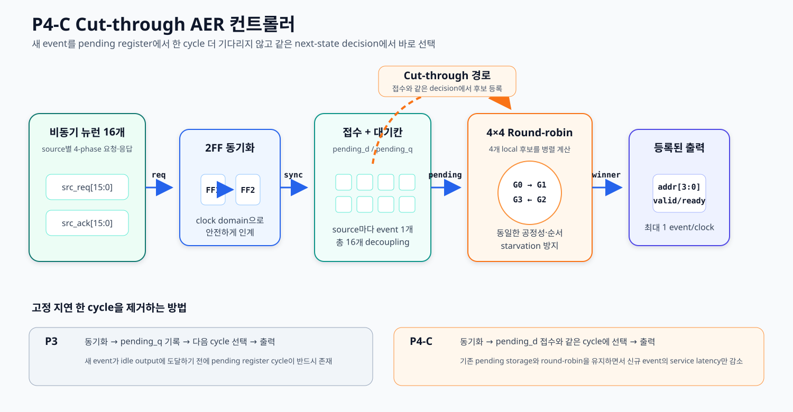
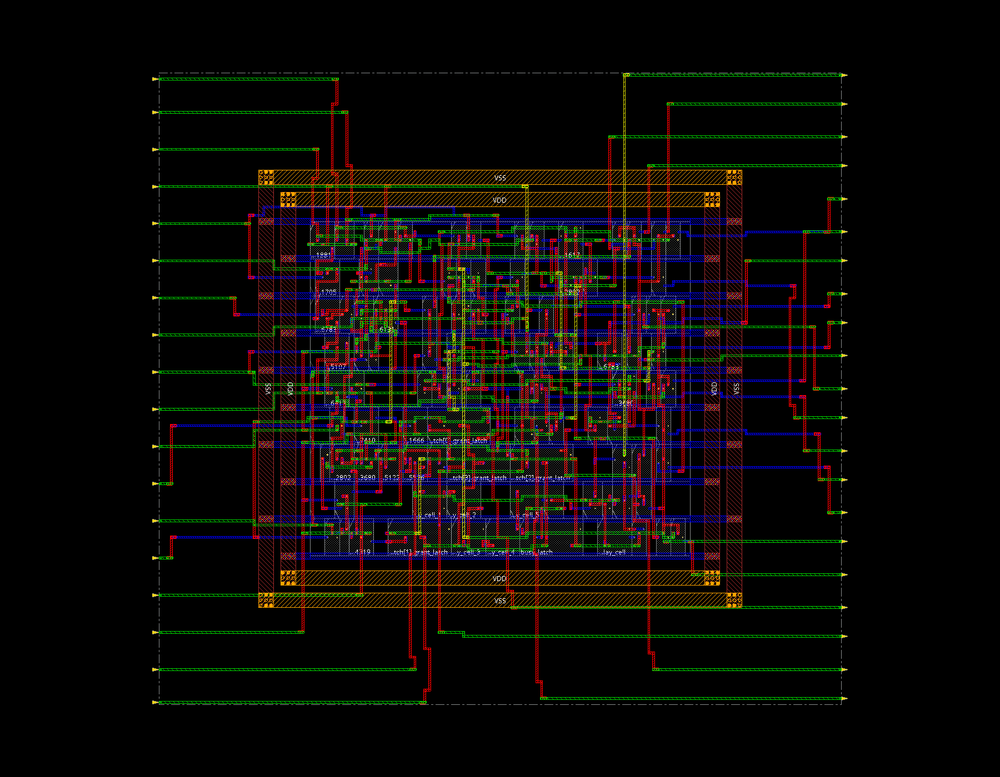
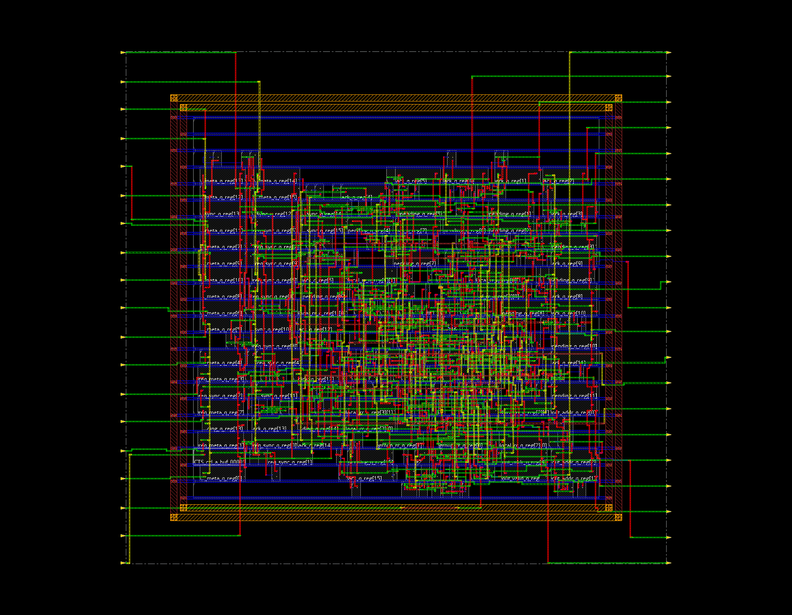

# Bio-mimic Neuron용 AER 컨트롤러 설계 보고서

## 1. 연구 목적

뉴런 회로는 자극을 받는 순간마다 발화 이벤트를 만든다. 여러 뉴런이 동시에 동작하더라도 각 뉴런에 전용 데이터선을 연결하면 회로 면적과 배선 수가 빠르게 증가한다.

AER(Address-Event Representation)은 발화한 뉴런의 **번호만 주소로 변환해 하나의 공용 통로로 전달**하는 방식이다. 본 설계에서는 16개 뉴런을 사용하므로 주소는 4-bit면 충분하다.

본 연구의 목표는 다음과 같다.

1. 공통 clock 없이 동작하는 전통적 AER 컨트롤러 T0-PPA를 직접 구현한다.
2. 기능, 합성 등가성, bundled-data relative timing과 180 nm 물리 구현을 검증하고 유효 조건을 명시한다.
3. 요청 손실, 불공정성, return-to-zero overhead를 보완하고 신규 event의 고정 대기까지 제거한 P4-C를 설계한다.
4. T0-PPA와 P4-C를 같은 TSMC 180 nm core flow로 배치·배선하여 정량 비교한다.

T0-PPA와 P4-C는 모두 16개의 입력과 **4-bit 출력 버스 1개**를 사용한다. 따라서 P4-C의 성능 향상은 출력 통로를 추가한 결과가 아니라 컨트롤러 내부 service path를 개선한 결과다.

## 2. AER의 기본 동작

### 2.1 주소로 이벤트를 표현하는 원리

AER(Address-Event Representation)은 event-driven 회로에서 널리 사용하는 통신 표현이다. 각 뉴런의 값을 매 주기 읽는 대신, spike가 발생했을 때 해당 source의 식별 번호를 주소 버스에 실어 보낸다.

예를 들어 5번 뉴런이 발화하면 컨트롤러는 `주소 5`를 수신기로 보낸다. 수신기는 주소를 보고 5번 뉴런에서 이벤트가 발생했음을 알아낸다. 이때 주소는 spike의 크기나 membrane potential 값이 아니라 **이벤트가 발생한 위치 또는 source ID**를 뜻한다. 이벤트의 시간 정보는 별도 timestamp가 아니라 transaction이 실제로 일어난 시점에 암묵적으로 포함된다.

AER의 확장 규격은 주소 외에 polarity, event type, timestamp 또는 payload를 추가할 수 있다. 그러나 본 과제의 기본 전송 word는 source address만 포함한다. 즉, 뉴런의 막전위 계산을 수행하는 datapath가 아니라 여러 뉴런의 spike 주소를 공유 link로 운반하는 interconnect와 controller가 설계 대상이다.

```text
5번 뉴런 발화
    → 5번 뉴런이 전송 요청
    → AER 컨트롤러가 주소 5를 선택
    → 수신기가 주소 5를 읽음
    → 전송 완료 응답
```

source 수가 `N`개일 때 필요한 최소 주소 폭은 `ceil(log2(N))`이다. 본 설계의 `N=16`에서는 4-bit로 0번부터 15번까지 구분할 수 있다. 16개의 독립 데이터 경로를 만드는 대신 주소 경로 하나를 공유하므로 배선과 출력 핀을 줄일 수 있다.

그 대신 두 개 이상의 뉴런이 동시에 발화하면 한 주소 버스에 모두 실을 수 없다. 따라서 AER 컨트롤러에는 다음 기능이 필요하다.

- **요청 수집:** 어떤 source에서 이벤트가 발생했는지 확인
- **중재(arbitration):** 동시에 들어온 요청의 전송 순서를 결정
- **주소 인코딩:** 선택된 source를 4-bit 이진 주소로 변환
- **주소 유지:** 수신기가 읽을 때까지 주소가 변하지 않도록 고정
- **완료 통보:** 이벤트가 접수됐음을 source에 알려 다음 이벤트를 허용

### 2.2 인터페이스 신호

| 신호 | 방향 | 기능 |
|---|---|---|
| `src_req[15:0]` | 뉴런 → 컨트롤러 | 각 뉴런이 이벤트 발생을 알리는 요청 |
| `src_ack[15:0]` | 컨트롤러 → 뉴런 | 선택된 이벤트가 컨트롤러 또는 수신기까지 접수됐다는 응답 |
| `aer_addr[3:0]` | 컨트롤러 → 수신기 | 현재 전송 중인 source ID |
| `aer_req` | 컨트롤러 → 수신기 | 주소가 유효하므로 capture할 수 있다는 요청 |
| `aer_ack` | 수신기 → 컨트롤러 | 주소를 정상적으로 capture했다는 응답 |

T0에서는 source와 컨트롤러 사이, 컨트롤러와 수신기 사이에 각각 요청·응답 관계가 존재한다. 컨트롤러는 두 인터페이스를 연결하여 수신 완료 사실을 선택된 source에 돌려준다.

### 2.3 전통적 4단계 요청·응답

전통적 비동기 AER은 송신기와 수신기가 같은 clock을 공유하지 않아도 동작할 수 있다. 대신 `REQ`와 `ACK`의 상태 변화를 사용해 transaction 시작과 종료를 합의한다. 신호를 모두 0으로 되돌린 뒤 다음 transaction을 시작하므로 4-phase return-to-zero protocol이라고 부른다.

본 설계는 active-high 규약을 사용하며 idle 상태는 `aer_req=0, aer_ack=0`이다.

1. **Request assert:** 컨트롤러가 `aer_addr`를 먼저 안정시킨 뒤 `aer_req`를 0에서 1로 바꾼다. 수신 완료 전까지 주소는 유지되어야 한다.
2. **Acknowledge assert:** 수신기가 `aer_req=1`을 감지해 주소를 capture한 다음 `aer_ack`를 0에서 1로 바꾼다. 이 전이는 현재 주소의 수신 완료를 의미한다.
3. **Request release:** 컨트롤러가 `aer_ack=1`을 확인한 뒤 `aer_req`를 1에서 0으로 내린다. T0-PPA는 내부 grant를 유지해 transaction 중 주소 전이를 막는다.
4. **Acknowledge release:** 수신기가 `aer_req=0`을 확인한 뒤 `aer_ack`를 1에서 0으로 내린다. 두 신호가 모두 0이 되면 link가 idle로 복귀한다.


### 2.4 프로토콜이 올바르게 동작하기 위한 조건

4-phase handshake는 단순히 신호를 네 번 바꾸는 것만으로 완성되지 않는다. 다음 조건을 함께 지켜야 한다.

- source는 `src_ack`를 확인할 때까지 `src_req`를 유지해야 한다. 짧은 pulse만 보내면 컨트롤러가 놓칠 수 있다.
- 컨트롤러는 `aer_addr`가 안정된 뒤에만 `aer_req`를 올려야 하며, 수신기가 capture하기 전에는 주소를 변경하면 안 된다. 주소와 요청의 상대 시간을 보장하는 이 규칙을 bundled-data constraint라고 한다.
- 수신기는 주소를 실제로 capture한 뒤에만 `aer_ack`를 올려야 한다.
- 같은 source는 이전 요청·응답이 idle로 복귀하기 전에 다음 이벤트를 덮어쓰면 안 된다.
- 여러 source가 거의 동시에 요청하면 arbiter는 최종적으로 하나만 선택해야 한다. 이 중재 과정은 handshake와 별개로 metastability 안전성이 필요하다.

이 방식은 고정 clock 주기 대신 상대 회로의 실제 완료 신호를 기다리는 self-timed 동작이다. 수신기가 느리면 `ACK`를 늦게 올리므로 송신기도 기다리며, 이 지연 자체가 backpressure로 작동한다. 따라서 기능적으로는 빠른 회로와 느린 회로를 자연스럽게 연결할 수 있다.

반면 한 이벤트마다 `REQ↑ → ACK↑ → REQ↓ → ACK↓` 네 번의 전이가 필요하다. 다음 이벤트는 link가 idle로 돌아온 뒤에야 시작할 수 있으므로 연속 traffic에서는 return-to-zero 시간이 처리율을 제한한다. 또한 handshake가 transaction의 완료를 보장한다고 해서 동시 요청을 선택하는 arbiter까지 자동으로 안전해지는 것은 아니다.

## 3. T0-PPA: 물리 비교 가능한 전통적 비동기 baseline

### 3.1 전통적 구조의 유지

T0-PPA는 전체 회로를 움직이는 global clock을 사용하지 않는다. 입력 요청과 수신기 응답의 전이가 상태를 진행시키며 다음 특성을 유지한다.

- 16 source와 4-bit 공유 주소 bus 1개
- source 0이 최고인 fixed-priority arbitration
- source별 FIFO 또는 pending storage 없음
- receiver-facing active-high 4-phase return-to-zero handshake
- 한 source당 outstanding event 최대 1개


### 3.2 초기 T0의 문제와 T0-PPA의 수정

초기 structural T0는 교차 결합 NOR gate로 busy와 grant를 저장했다. 기능 RTL에서는 139개 이벤트를 전달했지만 Genus는 이를 sequential storage가 아닌 combinational feedback loop로 판단해 7개의 loop breaker를 삽입했고, Xcelium finite-delay simulation에서는 transaction 중 주소가 흔들렸다.

T0-PPA는 handshake 방식과 fixed priority는 바꾸지 않고 저장 구현만 다음과 같이 물리 library에 맞췄다.

- `TLATRX1`/`TLATNRX1` characterized latch 5개: grant address 4-bit와 busy 1-bit 저장
- `DLY4X1` characterized delay cell 5개: priority data가 settle된 뒤 busy capture 시작
- 추가 `DLY4X1` 1개: grant latch가 닫힌 뒤 `aer_req` assertion
- Genus와 Innovus에서 delay cell을 dont-touch로 보호

이 구조는 일반 gate를 교차 연결해 저장소를 흉내 낸 것이 아니라 Liberty에 setup, hold, pulse-width, power와 PVT arc가 정의된 실제 latch macro를 사용한다. 따라서 synthesis와 physical tool이 상태 경계를 인식하며 loop breaker가 필요하지 않다.

### 3.3 Bundled-data relative timing

전통적 bundled-data AER에서는 주소 data path가 request control path보다 먼저 안정되어야 한다. T0-PPA는 post-route RC를 반영한 뒤 가장 불리한 조합을 비교했다.

| 경로 | 측정값 |
|---|---:|
| source request → grant latch D, latest slow | 1.915 ns |
| source request → busy latch D, earliest fast | 2.591 ns |
| conservative relative margin | **+0.676 ns** |
| busy latch Q → `aer_req`, earliest fast | 0.380 ns |

가장 느린 주소 계산이 끝난 뒤 최소 0.676 ns가 지나 capture control이 도착하며, 그 뒤에도 busy latch와 request delay stage가 남는다. 따라서 명시한 PVT 범위에서 주소가 먼저 안정되고 요청이 나중에 올라가는 순서를 만족한다.

### 3.4 기능·등가성·물리 검증

| 시험 | 결과 | 해석 |
|---|---:|---|
| Xcelium main workload | 139 / 139, error 0 | event loss·duplicate 없음 |
| 경합 stress | 84 trials, error 0 | X 전파·short pulse·event loss 없음 |
| first-winner shift | 42 / 84 | 먼저 도착한 요청보다 낮은 source 번호가 선택될 수 있음 |
| Conformal LEC | 26 / 26 equivalent | RTL 21 outputs와 5 state points 모두 합성 netlist와 등가 |
| Genus loop breaker | 0 | latch가 정상 sequential cell로 인식됨 |
| Innovus route DRC / connectivity | 0 / 0 | 배선과 연결 검사 통과 |

경합 시험의 winner shift는 오류가 아니라 fixed priority가 FCFS가 아님을 보여준다. 이 결과는 digital model에서 deterministic selection을 확인한 것이며 analog metastability MTBF를 증명하지 않는다.

### 3.5 T0-PPA의 유효 범위

T0-PPA의 PPA는 다음 operating contract에서 유효하다.

1. source는 `src_ack`까지 `src_req`를 유지한다.
2. request set은 delayed grant-capture aperture 동안 안정되어야 한다.
3. receiver는 주소 capture 후 `aer_ack`를 올린다.

현재 library에 characterized MUTEX가 없으므로 arbitrary near-simultaneous request edge에 대한 metastability-safe arbitration은 주장하지 않는다. 이 한계는 숨기거나 동기식으로 대체하지 않고 전통 baseline의 개선 대상에 남긴다.

그럼에도 T0-PPA는 기능, RTL↔netlist 등가성, latch/delay physical mapping, post-route relative timing, DRC와 connectivity를 완료했으므로 **조건이 명시된 전통적 AER PPA 비교 기준**으로 사용할 수 있다.

## 4. P4-C: Cut-through 안정성·공정성·latency 개선안

P4-C는 뉴런이 원하는 순간에 요청한다는 특성은 그대로 받아들인다. 요청을 컨트롤러 안으로 들여온 뒤에는 clock에 맞춰 저장·선택하므로 **외부는 비동기 요청, 내부는 검증 가능한 동기식 회로**인 혼합 구조다. P3에서 검증한 CDC·pending·hierarchical round-robin·elastic output을 유지하면서 신규 event service path만 단축한다.



### 4.1 비동기 요청을 안전하게 받는 입구

뉴런 요청은 내부 clock과 관계없는 순간에 바뀐다. 이 신호를 바로 계산에 사용하면 0인지 1인지 잠시 결정되지 않는 상태가 생길 수 있다.

P4-C는 각 요청을 플립플롭 두 개에 차례로 통과시킨다. 첫 번째 단계에서 불안정 가능성을 받아내고, 두 번째 단계의 안정된 값만 컨트롤러가 사용한다. 전문 용어로는 2단 동기화기(2FF synchronizer)라고 한다.

### 4.2 뉴런마다 이벤트 하나를 보관

각 뉴런에 1-bit 대기칸을 둔다. 요청이 들어오면 해당 칸을 1로 만들어 “이 뉴런의 이벤트가 기다리고 있음”을 기억한다.

수신기가 잠시 멈추거나 여러 뉴런이 동시에 요청해도 각 뉴런의 첫 이벤트는 대기칸에 남는다. 이미 칸이 차 있으면 뉴런에 완료 응답을 보내지 않아 다음 이벤트가 덮어쓰는 것을 막는다.

전체 저장 용량은 뉴런 16개 × 1개로 총 16개 이벤트다. 같은 뉴런에서 매우 빠르게 연속 발생하는 두 번째 이벤트는 첫 번째 칸이 비워질 때까지 기다려야 한다.

### 4.3 모든 뉴런에 차례가 돌아가는 선택 방식

T0-PPA는 항상 0번부터 확인했지만 P4-C는 마지막으로 처리한 위치의 다음부터 확인한다. 한 번 선택된 위치는 다음 차례에 뒤로 밀리므로 특정 뉴런이 통로를 계속 독점하기 어렵다. 이를 순환 우선순위 방식(round-robin)이라고 한다.

16개를 한 번에 길게 비교하면 회로가 느리고 커질 수 있다. P4-C는 다음 두 단계로 나누었다.

1. 4개 뉴런으로 이루어진 그룹 네 개에서 각각 후보를 고른다.
2. 후보가 있는 그룹들 사이에서 최종 그룹 하나를 고른다.

네 그룹의 후보 찾기는 동시에 진행된다. 따라서 16개를 처음부터 끝까지 순서대로 훑는 구조보다 논리 경로가 짧다.

### 4.4 수신기가 준비되면 매 clock 연속 전송

P4-C의 출력에는 주소 하나를 보관하는 대기칸이 있다. 수신기가 준비됐다는 신호를 보내면 현재 주소를 넘기면서 바로 다음 주소를 채울 수 있다.

전통적 4단계 방식처럼 매 이벤트마다 요청과 응답을 0으로 되돌리는 빈 시간이 없으므로, 보낼 이벤트가 계속 있고 수신기가 준비된 상태에서는 **매 clock마다 이벤트 하나**를 전달한다.

### 4.5 Pending next-state cut-through

P3는 동기화된 요청을 `pending_q` register에 기록한 뒤 다음 cycle arbitration에서 사용했다. P4-C는 요청을 접수해 `pending_d=1`로 만드는 같은 next-state decision에서 `pending_d`를 local arbiter 입력으로 사용한다.

```text
P3   : sync request → pending_q 기록 → 다음 cycle arbitration → output
P4-C : sync request → pending_d 접수와 같은 decision에서 arbitration → output
```

출력이 비어 있으면 source acknowledge와 output registration이 같은 clock edge에 완료된다. 별도 bypass FIFO나 두 번째 bus를 추가하지 않고 이미 존재하는 pending next-state를 재사용하므로 event capacity와 peak throughput은 그대로 유지하면서 service latency만 줄인다.

## 5. 검증 방법

기능만 맞는지 보는 시험과 실제 칩으로 구현 가능한지 보는 시험을 구분했다.

### 5.1 기능 검증

- 139개 이벤트가 요청·접수·출력 과정에서 빠지거나 중복되는지 확인
- 여러 뉴런이 동시에 요청하는 상황 확인
- 수신기가 중간에 멈추는 상황 확인
- 요청이 clock 직전과 직후에 들어오는 192가지 시점 변화 확인
- 16개 뉴런이 동시에 기다릴 때 처리 순서 확인

### 5.2 논리 합성과 물리 설계

- Vivado: RTL 기능, 합성 후 기능, FPGA 자원과 동작 시간 확인
- Cadence Xcelium: 별도의 시뮬레이터에서 기능 재확인
- Cadence Genus: RTL을 TSMC 180 nm 표준 논리 셀로 변환
- Cadence Innovus: 셀 배치, clock 배선, 신호 배선, 배선 저항·용량 추출
- 배치·배선 후 동작 시간, 전력, 배선 오류와 연결 오류 확인

## 6. P4-C 기능 검증 결과

| 항목 | 결과 | 의미 |
|---|---:|---|
| 요청한 이벤트 | 139개 | 시험이 컨트롤러에 보낸 총 이벤트 |
| 출력된 이벤트 | 139개 | 손실과 중복 없이 모두 전달 |
| 기능 오류 | 0개 | 주소와 전송 횟수 일치 |
| 요청 시점 변화 시험 | 192 / 192 통과 | clock과 다른 시점의 요청도 한 번씩 처리 |
| 동시 요청 순서 시험 | 16 / 16 통과 | 16개 뉴런 모두 처리 |
| 최고 처리율 | clock당 1개 | 수신기가 준비된 상태 |
| 평균 대기 시간 | 15.741 clock | P3 대비 4.70% 감소 |
| 최대 대기 시간 | 28 clock | P3 대비 3.45% 감소 |
| 반복 요청이 많았던 15번 뉴런 | 최대 3 clock | P3 대비 25% 감소 |
| cut-through 동작 | ACK와 output 등록 0-cycle 차이 | 별도 pending register cycle 제거 |
| Conformal LEC | 100 / 100 equivalent | 21 outputs와 79 state points 일치 |

이 시험은 P4-C가 설계한 디지털 규칙에 따라 이벤트를 한 번씩 처리하면서 P3의 고정 service latency를 줄였음을 보여준다. 다만 192회 시험만으로 실제 실리콘의 준안정성 발생 확률을 직접 증명하는 것은 아니다.

## 7. TSMC 180 nm 물리 설계 결과

T0-PPA와 P4-C 모두 Artisan TSMC 0.18 µm, 1.8 V 표준 셀, Metal1~Metal6, 60% target utilization과 동일한 core ring 조건을 사용했다. T0-PPA는 self-timed relative timing, P4-C는 10 ns clock setup/hold STA로 평가했다.

### 7.1 T0-PPA post-route 결과

| 항목 | 결과 | 설명 |
|---|---:|---|
| die / core | 92.400 × 85.680 / 51.480 × 45.360 µm | core-only floorplan |
| post-route cells | 100개 | latch 5개와 delay cell 6개 포함 |
| cell area | 1,397.088 µm² | 입출력 pad 제외 |
| placement density | 59.82% | 동일 target utilization |
| routing overflow | 0.00% | routing resource 초과 없음 |
| post-route power | 0.03483881 mW | slow 1.62 V, default activity |
| bundled-data margin | +0.676 ns | slow data 대 fast control 보수 비교 |
| extracted SPEF nets | 120개 | post-route coupled RC |
| route DRC / connectivity | 0 / 0 | 배선·연결 검사 통과 |



### 7.2 P4-C 논리 합성 결과

| 항목 | 결과 | 설명 |
|---|---:|---|
| 표준 셀 수 | 308개 | 배치 전 Genus 결과 |
| 셀 면적 합계 | 8,568.807 µm² | P3 대비 1.23% 감소 |
| 가장 긴 계산 경로 | 2.990 ns | P3 대비 4.53% 감소 |
| 시간 여유 | 6.853 ns | 10 ns 목표에서 남은 여유 |
| 추정 전력 | 1.16579 mW | 기본 신호 활동률 사용, P3 대비 2.72% 증가 |

### 7.3 P4-C 배치·배선 결과

| 항목 | 결과 | 설명 |
|---|---:|---|
| 칩 내부 영역 | 123.420 × 115.920 µm | 논리 셀이 배치되는 core 크기 |
| 전체 외곽 크기 | 164.340 × 156.240 µm | 입출력 패드는 포함하지 않은 설계 외곽 |
| 배치 후 셀 수 | 362개 | hold margin 확보용 buffer 포함 |
| 셀 면적 합계 | 9,353.837 µm² | P3 대비 4.15% 증가 |
| 셀 배치 밀도 | 65.38% | core 중 셀이 차지한 비율 |
| 배선 혼잡 초과 | 0.00% | 도구가 보고한 배선 용량 초과 없음 |
| 느린 조건 시간 여유 | +3.547 ns | P3 대비 13.29% 증가 |
| 빠른 조건 시간 여유 | +0.004 ns | hold target을 만족한 최소 양수 margin |
| 배치 후 추정 전력 | 0.960680 mW | P3 대비 3.87% 증가, default activity |
| 배선 오류 | 0개 | Innovus 배선 규칙 검사 |
| 연결 오류 | 0개 | 끊기거나 잘못 연결된 신호 없음 |

### 7.4 P4-C Innovus 실제 화면

아래 이미지는 도식화한 예상도가 아니다. P4-C의 최종 배치·배선 데이터베이스를 Cadence Innovus에서 복원한 뒤 `gui_dump_picture` 기능으로 직접 출력했다.



화면 가운데 모여 있는 작은 사각형들이 표준 논리 셀이다. 가로와 세로로 지나가는 여러 색의 선은 전원망과 Metal1~Metal6 신호 배선이며, 외곽으로 뻗은 선은 모듈 입출력 연결이다.

이 결과는 RTL 코드가 논리식으로만 존재하는 단계를 넘어, **실제 공정의 셀 크기와 배선 규칙을 적용해 칩 내부에 배치할 수 있는 단계**까지 진행됐음을 뜻한다.

## 8. T0-PPA와 P4-C 비교

| 비교 항목 | T0-PPA 전통적 비동기 구조 | P4-C 개선 구조 |
|---|---|---|
| 외부 뉴런 요청 | 비동기 | 비동기 |
| 컨트롤러 내부 | 요청·응답 변화로 직접 동작 | clock에 맞춰 저장·처리 |
| 동시 요청 선택 | 항상 작은 번호 우선 | 처리 순번을 돌려가며 선택 |
| 이벤트 저장 | 없음 | 뉴런마다 1개 |
| 출력 방식 | 매번 4단계 신호 복귀 | 준비/유효 신호로 연속 전달 |
| 출력 버스 | 4-bit 1개 | 4-bit 1개 |
| 합성 기능 보존 | Conformal 26/26 equivalent | Conformal 100/100 equivalent |
| 물리 timing 기준 | bundled-data margin +0.676 ns | setup +3.547 ns, hold +0.004 ns |
| 최고 처리율 표현 | self-timed, receiver 응답 의존 | ready 시 clock당 1개 |
| post-route cells | 100 | 362 |
| post-route cell area | 1,397.088 µm² | 9,353.837 µm² |
| post-route default power | 0.03483881 mW | 0.960680 mW |
| 180 nm DRC / connectivity | 0 / 0 | 0 / 0 |

P4-C는 T0-PPA보다 많은 cell과 area를 사용한다. 그 비용으로 **비동기 요청을 내부 clock domain으로 넘기는 입구, 16-event decoupling storage, starvation을 막는 순환 중재, bubble 없는 출력과 same-decision cut-through**를 제공한다.

두 power 값은 같은 slow/default-activity 조건의 tool estimate이므로 물리 복잡도 비교에는 참고할 수 있지만 실제 spike traffic의 energy/event 차이로 단정하지 않는다. 또한 T0-PPA에는 global clock이 없으므로 P4-C의 Fmax와 동일한 축으로 비교하지 않고 handshake cycle time과 receiver 조건을 함께 제시해야 한다.

### 8.1 P3에서 P4-C로 추가 개선된 부분

| 항목 | P3 | P4-C | 변화 |
|---|---:|---:|---:|
| average latency | 16.517 cycles | 15.741 cycles | -4.70% |
| maximum latency | 29 cycles | 28 cycles | -3.45% |
| source 15 hotspot | 4 cycles | 3 cycles | -25.00% |
| Genus data path | 3.132 ns | 2.990 ns | -4.53% |
| post-route area | 8,981.280 µm² | 9,353.837 µm² | +4.15% |
| post-route power | 0.924919 mW | 0.960680 mW | +3.87% |
| post-route setup slack | +3.131 ns | +3.547 ns | +13.29% |

P4-C의 개선은 peak bandwidth를 늘린 결과가 아니다. 동일한 1 event/clock에서 event가 arbitration 후보가 되기까지의 고정 대기를 제거한 결과다.

## 9. 2차 과제 연계

P4-C가 출력하는 4-bit 주소는 “어느 뉴런이 발화했는가”를 나타낸다. 2차 과제에서는 이 주소를 다음과 같이 확장할 수 있다.

```text
뉴런 주소
  → 센서 위의 위치 (x, y)로 변환
  → 이동 방향 또는 경계 방향 계산
  → N×M 공간 기억 장치의 해당 위치 갱신
```

P4-C의 역할은 여러 뉴런에서 발생한 이벤트를 손실 없이 한 줄로 정리해 다음 단계에 공급하는 것이다. 주소를 좌표나 방향으로 바꾸는 계산은 P4-C 뒤에 연결되는 별도 모듈이 담당한다.

## 10. 결론

T0-PPA는 공통 clock 없이 요청과 응답만으로 진행하는 전통적 AER를 characterized latch와 delay cell로 구현했다. 139개 event accounting, 26개 LEC compare point, post-route bundled-data margin +0.676 ns, DRC와 connectivity 0을 확보해 명시한 request-stability contract 안에서 유효한 물리 비교 기준을 만들었다.

P4-C는 비동기 요청을 두 단계로 안정화하고, 뉴런마다 이벤트 하나를 기억하며, 모든 뉴런에 차례가 돌아가는 선택 방식을 사용한다. 신규 event는 pending next-state에 접수되는 같은 decision에서 선택될 수 있고, 수신기가 준비된 동안에는 하나의 4-bit 버스로 매 clock마다 이벤트 하나를 전송한다.

P4-C 기능 시험에서는 139개 이벤트를 손실과 중복 없이 전달했고 192가지 요청 시점 시험을 모두 통과했다. P3보다 평균 latency 4.70%, 최대 latency 3.45%, hotspot latency 25%를 줄였으며, post-route area와 power 증가는 4.15%와 3.87%로 제한했다. TSMC 180 nm에서도 setup/hold·DRC·connectivity를 모두 만족했으므로 P4-C를 본 과제의 최종 AER 컨트롤러로 채택한다.

## 11. 완료 범위와 한계

완료한 범위는 RTL 설계, 기능 시뮬레이션, 논리 합성, TSMC 180 nm 표준 셀 배치·배선과 배치 후 동작 시간 분석이다.

T0-PPA는 request set이 grant-capture aperture 동안 안정되어 있다는 조건이 필요하며, characterized MUTEX가 없으므로 임의의 near-simultaneous edge에 대한 metastability signoff는 완료하지 않았다. 이것은 baseline의 비교 조건이자 P4-C에서 clock-domain crossing 구조를 선택한 이유다.

다음 항목은 아직 수행하지 않았다.

- 실제 반도체 제작과 실리콘 측정
- 입출력 패드와 패드 링 설계
- 반도체 패키지 설계
- 제조용 최종 GDS 출력과 foundry signoff DRC/LVS
- 실제 뉴런 발화 파형을 사용한 배치 후 전력 측정
- 배치 후 gate-level 기능 시뮬레이션

또한 P4-C의 순환 선택은 모든 뉴런에 처리 기회를 주지만, 요청이 들어온 실제 시간 순서를 완벽히 보존하는 선착순 방식은 아니다. 같은 뉴런의 대기칸에는 이벤트 하나만 저장되므로 더 큰 burst를 처리하려면 추가 저장 공간이 필요하다.

## 12. 주요 근거 파일

- T0-PPA RTL: [`rtl/traditional_async/aer_traditional_latch_paa.sv`](../rtl/traditional_async/aer_traditional_latch_paa.sv)
- T0-PPA 검증 결과: [`results/T0_PAA_TRADITIONAL_AER_2026-08-19.md`](../results/T0_PAA_TRADITIONAL_AER_2026-08-19.md)
- T0-PAA 180 nm 요약: [`reports/traditional_latch_paa/cadence/pnr_180nm/SUMMARY.txt`](traditional_latch_paa/cadence/pnr_180nm/SUMMARY.txt)
- T0-PAA 증거 목록: [`results/T0_PAA_MANIFEST_2026-08-19.md`](../results/T0_PAA_MANIFEST_2026-08-19.md)
- P4-C RTL: [`rtl/improved/aer_improved_cutthrough.sv`](../rtl/improved/aer_improved_cutthrough.sv)
- P4-C 기능 및 비교 결과: [`results/P4_CUTTHROUGH_AER_2026-08-20.md`](../results/P4_CUTTHROUGH_AER_2026-08-20.md)
- P4-C 180 nm 요약: [`reports/improved_cutthrough/cadence/pnr_180nm/SUMMARY.txt`](improved_cutthrough/cadence/pnr_180nm/SUMMARY.txt)
- P4-C 증거 목록: [`results/P4_CUTTHROUGH_MANIFEST_2026-08-20.md`](../results/P4_CUTTHROUGH_MANIFEST_2026-08-20.md)
- Innovus 화면 추출 스크립트: [`scripts/cadence/p4c_innovus_capture.tcl`](../scripts/cadence/p4c_innovus_capture.tcl)
